- Start Date: 2023-03-29
- RFC Type: feature
- RFC PR: <link>
- RFC Status: draft

# Summary

This RFC proposes a new tracing model for Sentry's performance product to better
address future product improvements.  The goal of this model is to allow
**storing entire traces witohut gaps**, support **dynamic sampling**, **indexing
of spans** and to **extract metrics from spans pre-sampling**.  This is an
evolution of the current transaction based approach.

# Motivation

Today Sentry has a strong concept of a "transaction" which appears in multiple parts of the
product.  It is both the transport of span data, the billable entity and the only indexed
part of the product experience.  This means that spans that exist outside of the transaction
cannot be represented and it also means that spans within a transaction are not indexed itself.

The existing model has worked well for us to get started with evolving the Sentry errors
product to capture performance traces, but it has restricted out ability to evolve the product
forward.  It has created some restrictions on the SDK technology side (from high
memory pressure, payload size limits) and also has promoted a separate of transaction to
span on the API layer which is untypical for tracing products.  It also has meant that Sentry
has challenges with accepting traces coming directly from an OpenTelemetry exporter as the
transaction concept is not a concept that OpenTelemetry has.

We want to set a future direction that enables more flexible product choices and that we can
move towards from our existing tracing model.  The goals are:

* Support capturing entire traces
* Have a data model story that allows us higher compatibility with Open Telemetry.  Specifically
  we want a model that would permit us to ingest Open Telemetry data right from an exporter
* Have a clear story for indexing and extracing metrics on a per-span level
* Unified spans and transactions from an SDK perspective
* Enable a path that allows clients to send 100% of spans outwards at least to a local aggregator,
  preferrably a remote relay
* To better and directly support dynamic sampling in the core tracing model

We want to lay out a better path forward that 

* capture entire traces
* browser tabs = a trace
* index and extract metrics on a span level
* clients send 100% of metrics
* dynamic sampling narrows in on traces

# Terms

The new tracing model is an extension to our existing tracing model.  As such we try go adhere
to some of the existing terms.  Note that this document is intentionally glossing over some of
the details to better describe the desired end result.  Individual RFCs will have to be written
to narrow down on specific schema definitions.

## Session

A session is an optional concept when talking about user actors on the system.  A
session outlives one or more traces and is exclusively used when talking about human
interactions with a system.

## Trace

A trace has no end.  It bundles spans together, some of those spans are organized
into segments (marked in red in the graph).  The user experience does not center
around a trace, which really is an internal way to bundle things together but it
narrows down on segments within the trace.

```mermaid
gantt
    title Example Starfish Trace
    dateFormat x
    axisFormat %S.%L

    section Frontend
    /checkout                                        :crit, 0, 1500ms
    GET /api/session                                 :150, 170ms
    POST /api/analytics                              :190, 70ms
    GET /api/checkout/state                          :200, 500ms
    GET /api/checkout/cart                           :1100, 140ms
    <App/>                                           :1300, 180ms
    POST /api/analytics                              :done, 1450, 70ms
    GET /assistent/poll                              :done, 1450, 120ms
    POST /api/analytics                              :done, 1580, 70ms

    section API Service
    /api/checkout/state                              :crit, 240, 440ms
    cache.get session#58;[redacted]                  :360, 10ms
    db.query select from session                     :370, 20ms
    db.query select from user                        :390, 20ms
    db.query select from checkout                    :410, 20ms
    http.request GET http#58;//payments/poll  :450, 210ms
    thread.spawn refresh-checkout-cache              :done, 670, 220ms

    section Payment Service
    /poll                                            :crit, 470, 180ms
    db.query select from payment                     :490, 30ms
    db.query update payment                          :530, 60ms
```

## Span

Spans are very similar to how the function today, but they get elevated to a more significant
level.  They largely follow the general semantics in the wider tracing eco system.  To drive
our product ideas we are going to ensure that the quality of the spans is high and that they
provide at least the following pieces of information:

* `op`: defines the core operation that the span represents (eg: `db.query`)
* `description`: the most significant description of what this operation is (eg: the database query).
  The description also gets processed and cleaned in the process.
* `trace_id`: a span relates to one trace by ID
* `parent_id`: a span optionally points back to a parent trace which could be from a different
  service
* `segment_id`: a span that is part of a segment, always refers back to it.
* `tags`: a key/value pair of arbitrary tags that are set per-span.  Conceptionally however spans
  also inherit the tags of the segments they are contained in.

Spans always belong to a trace, but not all spans belong to a segment. A span not belonging to a
segment are referred to as "detached" spans, spans that belong to a segment are "attached" spans.

## Transaction

Previously transaction referred to the container that held spans.  In the future a "transaction"
refers to the name of a specific type of segment level span that describes a meaningful activity
that starts with a request, and results in some meaningful response.  By definition a span that
holds a transaction tag becomes a "segment".  Other than that, it's just a regular span.

## Segment

A segment is a special type of span that is the "logical" activity in a service.  For instance a
segment can be the endpoint implementation of an API request, it could be a task that is processed
by a task worker, it could be the navigation a user performs in a UI or a screen transition.
Conceptionally segments fall into two categories: "transactions" which are quite mechanical and
clearly defined operations and "interactions" which are user triggered operations.  The difference
is that an "interaction" has a human user as an actor in it, that might influence it, whereas a
"transaction" is unlikely to be interrupted once started.  A user for instance is quite likely to
navigate again even before the previous interaction finished, whereas a task is more likely than no
to conclude, even if what triggered the task is no longer interested in it's result.

The primary user experience in the product can narrow down on certain segments and make the trace
explorable via that segment.

# Drawbacks

Why should we not do this? What are the drawbacks of this RFC or a particular option if
multiple options are presented.

# Unresolved questions

- What parts of the design do you expect to resolve through this RFC?
- What issues are out of scope for this RFC but are known?
