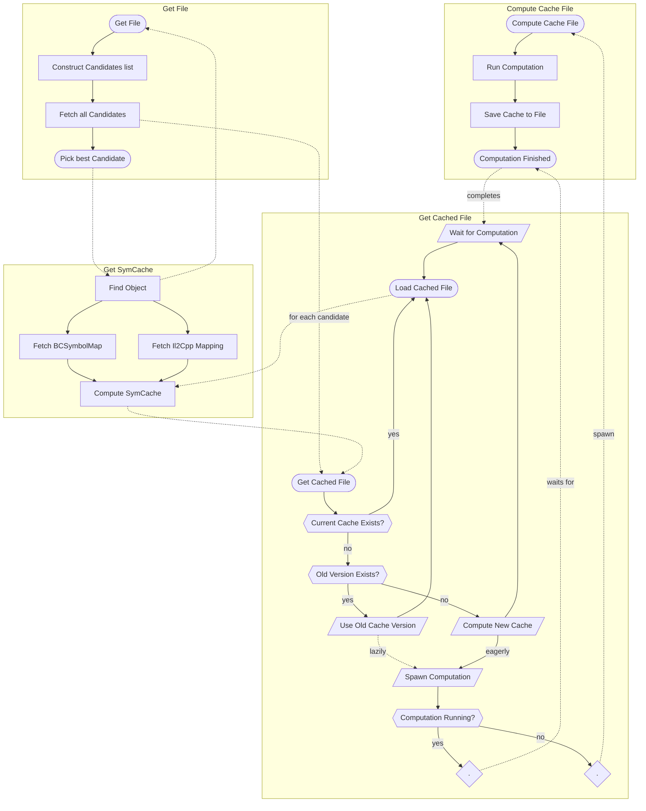

- Start Date: 2022-09-01
- RFC Type: informational
- RFC PR: https://github.com/getsentry/rfcs/pull/5

# Summary

This is a detailed description of the internal caching architecture of symbolicator.

# Motivation

We want to have a place where the high level infrastructure is written down in detail.
It should have a description of the intended workflow and the requirements that the solution should satisfy.

# Background

This document should inform any future changes to the underlying code, which right now is a bit convoluted.

# Supporting Data

We have seen that having long-lived caches is crucial to the performance and stability of our symbolication pipeline.
There were incidents related to not having enough caches available.

On the other hand we want to be confident to roll out changes that refresh caches in a timely fashion.

# Current architecture

The following diagram should highlight the current architecture for fetching files and computing caches based on those,
as well as highlight all the control flow related to request coalescing.

# Drawbacks of current Design

There is currently one main drawback in particular related to "lazy cache computation": The lazy computations have a
concurrency limit, but no queue. This currently works well to limit the impact of cache refreshes on the infrastructure,
but it can potentially lead to very long tails until a refresh was fully rolled out.

This also has customer visible impact, as we cannot say for certain when a targeted fix was indeed rolled out.
