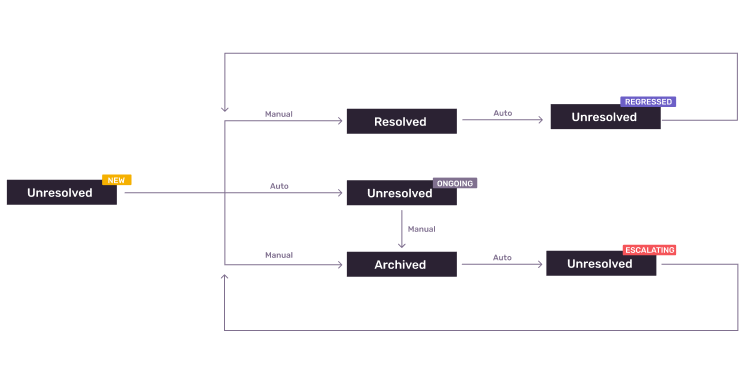

# Issue States RFC

- Start Date: 2023-03-16
- RFC Type: informational
- RFC PR: https://github.com/getsentry/rfcs/pull/80
- RFC Status: draft

## Summary

🎯 Simplify the triage process by allowing users to easily find relevant Issues in their Issue list

## Motivation

Our current set of issue states and how their flow works make it hard to triage.

There are various problems with the issue life-cycle today:

1. Customers struggle to find new and regressed issues that they care about
    1. Customers keep seeing old, ongoing issues
    2. The Issue Stream demands a significant amount of manual work to get to an actionable list
2. Customers have to do a lot of mental math to understand if an issue just got worse
    1. The Escalating issues project partially solves this problem

We want to create a curated solution that notifies developers about relevant issues in a timely manner. This means building a solution that shows developers new issues and regressions as they occur.

The states and filters we want to improve in this story are meant to be stepping stones that Sentry can use to create a notification and UX experience that provides better signal value.

Additionally automatic state transitions from *New* to *Ongoing* issues becomes important for customers that see a lot of new issues everyday

## What we are planning to change

We're going to add the Ongoing substate and add some automation to move issues between states.

The issue properties will transition as follow:

Here's an overview of the work:

### New substates to be added & transitions

- Notes:
  - Check out the [issue transitions table](https://www.notion.so/Improve-Issue-States-and-Filters-1c58cf36ea38459fbc2db26ca0b03675) for all details
  - New → Ongoing (After 3 days)
  - Regressed → Ongoing (After 7 days)
  - Escalating (new substatus) and Archived (new status) will be added as part of the Escalating project
  - When substate changes occur, track in GroupHistory and show in the Activities details
  - There is no *unignored* label after these changes, if an ignored issues becomes unresolved again due to spike detection or because the issue hit a user-defined threshold then it gets the *escalating* property
- Related work:
  - Add Ongoing substate to `[GroupInboxReason](https://github.com/getsentry/sentry/blob/661d7234b93f8164cdcf147fd2b31c31039ed34b/src/sentry/models/groupinbox.py#L28-L33)`
  - Create daily periodic task to update the status of new tasks into ongoing (after 7 days)
    - For every every org, query PG for `New` Groups that were created in the last 24 hours and update the substate to `Ongoing`
    - Eventually, this task will also be used as part of Escalating V2 in order to transition from `Ongoing` to `Archived-until-escalating`

### Issue Stream changes

- `is:` changes
  - Notes:
    - All existing is searched will continue to work
    - Remove `ignored` from the list of allowed values
      - Perhaps support it but do not show it as list of allowed values
    - Add the following new values:
      - `new`, `regression`, `archived`, `ongoing`, `escalating`(done in Escalating project)
  - Related work
    - The API we hit for is searches is this ([example call](https://sentry.sentry.io/api/0/organizations/sentry/issues/?collapse=stats&expand=owners&expand=inbox&limit=25&project=1&query=is%3Aunresolved&shortIdLookup=1&sort=freq&statsPeriod=14d)).
    - Change [OrganizationGroupIndexEndpoint](https://github.com/getsentry/sentry/blob/master/src/sentry/api/endpoints/organization_group_index.py) to support new `is:` values

- Remove Mark Reviewed button
  - Mark as Reviewed currently removes the New-Regression-Unignored label
  - There will be few more places to remove it from but most of them can be seen [here](https://github.com/search?q=repo%3Agetsentry%2Fsentry%20Mark%20Reviewed&type=code).

### Finer grain ignore options analytics

- We currently track how often [the Ignore button is pressed](https://analytics.amplitude.com/sentry/chart/new/xfw2nkw) every day without notes as to what specific options.
- We can either extend the Amplitude query or we can create a query to show the count for each (e.g. `select count(*) from sentry_groupsnooze where until is not null;`)
- It would be great to see what options people used before and what options they will use once we switch them over

## Drawbacks

- We may envision a specific approach to triaging and may not work the *many* ways customers may do triaging
- Educational aspect to new workflows

## Unresolved questions

- What parts of the design do you expect to resolve through this RFC?
- What issues are out of scope for this RFC but are known?
