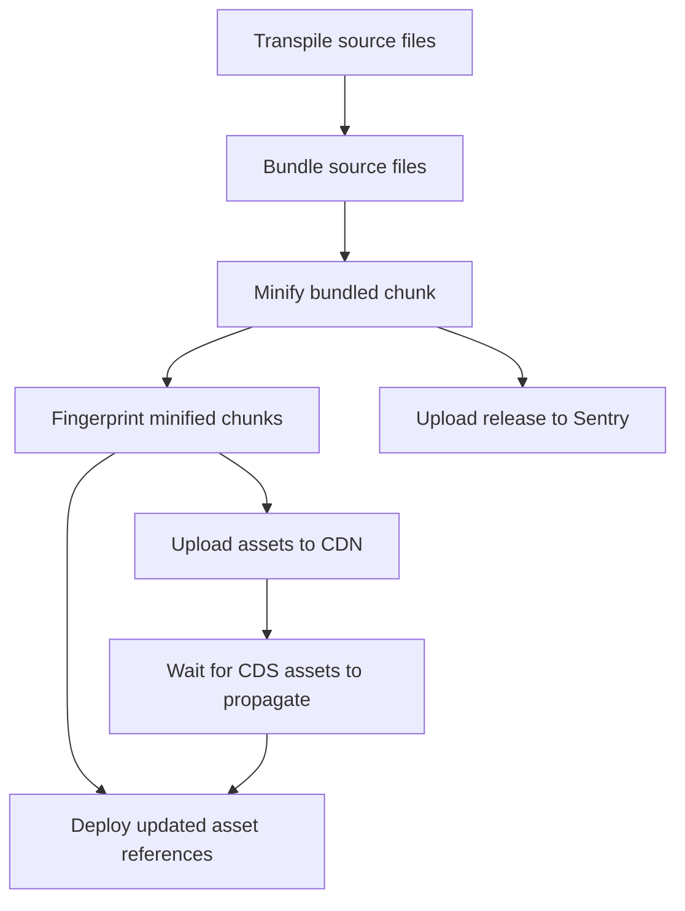

- Start Date: 2023-03-21
- RFC Type: initiative
- RFC PR: https://github.com/getsentry/rfcs/pull/81
- RFC Status: draft

# Summary / Motivation

We want to make processing / SourceMap-ing of JavaScript stack traces more reliable.
To achieve this, we want to uniquely identify a (minified / deployed) JavaScript file using a `DebugId`.
The same `DebugId` also uniquely identifies the corresponding SourceMap.
That way it should be possible to _reliably_ look up the SourceMap corresponding to
a JavaScript file.

# Background

It is currently not possible to _reliably_ find the associated SourceMap for a
JavaScript file.

A JavaScript stack trace only points to the (minified / transformed) source file
by its URL, such as `https://example.com/file.min.js`, or `/path/to/local/file.min.js`.

The corresponding SourceMap is often referenced using a `sourceMappingURL` comment
at the end of that file. It is also possible to have a "hidden" SourceMap that is
not referenced in such a way, but is typically found by its filename `{js_filename}.map`.

However it is not guaranteed that the SourceMap found in such a way actually
corresponds to the JavaScript file in which the error happened.

A classical example is caching.

1. An end-user is loading version `1` of `https://example.com/file.min.js`.
2. A new app version `2` is deployed.
3. The user experiences an error.
4. The SourceMap at `https://example.com/file.min.js.map` (version `2`) at this point in time does not correspond to
   the code the user was running.

This problem is even worse at Sentry scale, as at any point in time, errors can come in that happened with arbitrary
versions of the deployed code, sometimes even involving multiple files which might be out-of-sync with each other.

To work around this problem, Sentry has used the combination of `release` and optional `dist`, together with matching
paths to better associate JavaScript files from one release with SourceMaps uploaded to Sentry.

However this solution is still not reliable, as mentioned above, even two files loaded in the end-users browser can
belong to a different release, due to caching or other reasons.

Using a `DebugId`, which uniquely associates the JavaScript file and its corresponding SourceMap, should make source-mapping
a lot more reliable.

# Supporting Data

TODO: please fill in the gaps here!

Sentry has used the `release (+ dist) + abs_path` solution for quite some time and found it inadequate.
A lot of events are not being resolved correctly due to these mismatches, and problems with source-mapping are very
common in customer-support interactions. Up to X% of customer-support questions are related to SourceMaps.

On the other hand, using a `DebugId` for symbolication of Native crashes and stack traces is working reliably both in
Sentry and in the wider native ecosystem. The Native and C# community has the concept of _Symbol Servers_, which can
serve any debug file based on its `DebugId`, which allows reliable symbolication for any release, at any point in time.

## Real-world example

Anecdotally, Sentry itself has recently experienced a hard-to-diagnose problem with SourceMap processing.
The root of the problem was with path-matching, which becomes unnecessary using `DebugId`s.

The file `https://s1.sentry-cdn.com/_static/dist/sentry/chunks/app_views_issueDetails_index_tsx.fd0d65cc90b6c116f093.js`
appeared as part of an `Error` stack trace. After stripping the domain name prefix, the path that is searched for
was `~/_static/dist/sentry/chunks/app_views_issueDetails_index_tsx.fd0d65cc90b6c116f093.js`. However, due to a
misconfiguration, all the uploaded files had a wrong path associated with them, in this particular case it was
`~/chunks/app_views_issueDetails_index_tsx.fd0d65cc90b6c116f093.js`. With these paths not matching, Sentry was unable
to correctly process this file, as no minified file or SourceMap was found with that path.

This is a prime example that would be solved by `DebugId`s.

# Options Considered

To make `DebugId` work, we need to generate one, and associate it to both the JavaScript file, and its corresponding
SourceMap.

## The `DebugId` format

The `DebugId` should have the same format as a standard UUI, specifically:
It should be a 128 bit (16 byte), formatted to a string using base-16 hex encoding like so:

`XXXXXXXX-XXXX-XXXX-XXXX-XXXXXXXXXXXX`

## How to generate `DebugId`s?

There is two options of choosing a `DebugId`: Making it completely random, or make it reproducible / deterministic, derived
from the build.

Different approaches and examples are shown below, but in summary, we would like the `DebugId` to be reproducible and
deterministic for a build. Building the exact same project and original code should always result in the same assets.
This means the same minified JS files (with embedded `DebugId`), and the same SourceMap file.

As long as the `DebugId` is deterministic, it does not matter how it is being derived. Different tools will use different
methods. And a `DebugId` may differ from one tool to the next, just as the exact output files may differ between tools,
and even tool versions.

### Based on JavaScript Content-hash

This creates a new `DebugId` by hashing the contents of the (minified) JavaScript file.

**pros**

- Is fully reproducible. The same JavaScript file will always have the same `DebugId`.
- Works well with existing caching solutions.

**cons**

- Increases overhead in server-side SourceMap processing, as one file can potentially be included in multiple _bundles_.
  See [_What is an `ArtifactBundle`_](#what-is-an-artifactbundle) below.
- A difference in a source file might not be reflected in the JavaScript file. An example of this might be changes to
  whitespace, comments, or code that was dead-code-eliminated by bundlers.

### Based on SourceMap Content-hash

This creates a new `DebugId` by hashing the contents of the SourceMap file. The reasoning for this is primarily
motivated by a drawback of the previous option.
It is possible that non-essential changes to the source file, such as whitespace or comments, will be completely
removed by a minifier, and will result in an identical minified output file.
These changes would however create different mappings in the SourceMap file, making it possible to resolve to the
correct original source.

It is also possible to use a combined content-hash of both the (minified) JavaScript file, and its corresponding SourceMap.

**pros**

- Generates a new `DebugId` for changes to source files that would otherwise not lead to changes in the (minified) JavaScript file.
- SourceMap processing will always resolve back to the original source code.

**cons**

- Does lead to slightly more cache invalidation.

### Random `DebugId`

This option would create a new random `DebugId` for each file, on each build.

**pros**

- Simpler server-side SourceMap processing, as one `DebugId` is only included in a single _bundle_, and that one bundle
  can serve multiple stack frames for multiple files of the same build.

**cons**

- Completely breaks the concept of _caching_, as every file is unique for every build.

### Example

Consider the following two files:

```js
// File A

/* with some added comment*/
export function anExportedFunction() {
  return anInternalInlinedFunction();
}

function anInternalInlinedFunction() {
  window.foo = "side effect";
}
```

```js
// File B

function aCompletelyDifferentFunction() {
  // that has its own comments and everything
  window.foo = "side effect";
}

function deadCodeThatsEliminated() {}

export function anExportedFunction() {
  return aCompletelyDifferentFunction();
}
```

Both of these files will generate the exact same minified file using `terser`,
which will completely inline simple tail calls, and eliminate dead code:

<!-- prettier-ignore -->
```js
export function anExportedFunction(){window.foo="side effect"}
```

(Unfortunately, the https://try.terser.org/ REPL does not allow hotlinking, but you can try this for yourself.)

It is not even necessary that all these functions are defined in the same file. They might have been combined from
several files using a bundler like `rollup`:
[REPL example](https://rollupjs.org/repl/?version=3.20.2&shareable=JTdCJTIyZXhhbXBsZSUyMiUzQW51bGwlMkMlMjJtb2R1bGVzJTIyJTNBJTVCJTdCJTIyY29kZSUyMiUzQSUyMmltcG9ydCUyMCU3QiUyMGFDb21wbGV0ZWx5RGlmZmVyZW50RnVuY3Rpb24lMjAlN0QlMjBmcm9tJTIwJy4lMkZmb28uanMnJTNCJTVDbiU1Q24lMkYqJTIwd2l0aCUyMHNvbWUlMjBhZGRlZCUyMGNvbW1lbnQqJTJGJTVDbmV4cG9ydCUyMGZ1bmN0aW9uJTIwYW5FeHBvcnRlZEZ1bmN0aW9uKCklMjAlN0IlNUNuJTIwJTIwcmV0dXJuJTIwYUNvbXBsZXRlbHlEaWZmZXJlbnRGdW5jdGlvbigpJTNCJTVDbiU3RCUyMiUyQyUyMmlzRW50cnklMjIlM0F0cnVlJTJDJTIybmFtZSUyMiUzQSUyMm1haW4uanMlMjIlN0QlMkMlN0IlMjJjb2RlJTIyJTNBJTIyZXhwb3J0JTIwZnVuY3Rpb24lMjBhQ29tcGxldGVseURpZmZlcmVudEZ1bmN0aW9uKCklMjAlN0IlNUNuJTIwJTIwJTJGJTJGJTIwdGhhdCUyMGhhcyUyMGl0cyUyMG93biUyMGNvbW1lbnRzJTIwYW5kJTIwZXZlcnl0aGluZyU1Q24lMjAlMjB3aW5kb3cuZm9vJTIwJTNEJTIwJTVDJTIyc2lkZSUyMGVmZmVjdCU1QyUyMiUzQiU1Q24lN0QlNUNuJTVDbmZ1bmN0aW9uJTIwZGVhZENvZGVUaGF0c0VsaW1pbmF0ZWQoKSUyMCU3QiU3RCUyMiUyQyUyMmlzRW50cnklMjIlM0FmYWxzZSUyQyUyMm5hbWUlMjIlM0ElMjJmb28uanMlMjIlN0QlNUQlMkMlMjJvcHRpb25zJTIyJTNBJTdCJTIyb3V0cHV0JTIyJTNBJTdCJTIyZm9ybWF0JTIyJTNBJTIyZXMlMjIlN0QlMkMlMjJ0cmVlc2hha2UlMjIlM0F0cnVlJTdEJTdE)

As these examples show, vastly different code can produce the exact same minified output. However when doing SourceMap
processing, we want to link back to the original code in every one of these cases.

## How to inject the `DebugId` into the JavaScript file?

### `//# debugId` comment

We propose to add a new magic comment to the end of JavaScript files similar to the existing `//# sourceMappingURL`
comment. It should be at the end of the file, preferable as the line right before the `sourceMappingURL`, as the
second line from the bottom

It should look like this:

```js
someRandomJSCode();
//# debugId=XXXXXXXX-XXXX-XXXX-XXXX-XXXXXXXXXXXX
//# sourceMappingURL=file.min.js.map
```

### Runtime Detection / Resolution of `DebugId`

In a shiny utopian future, Browsers would directly expose builtin APIs to programmatically access each frame of an `Error`s stack.
This might include the absolute path, the line and column number, and the `DebugId`.
Though the reality of today is that each browser has its own text-based `Error.stack` format, which might even give
completely different line and column numbers across the different browsers.
No programmatic API exists today, and might never exist. At the very least, widespread support for this is years away.

It is therefore necessary to extract this `DebugId` through other means.

#### Reading the `//# debugId` comment when capturing Errors

Current JavaScript stack traces include the absolute path (called `abs_path`) of each stack frame. It should be possible
to load and inspect that file at runtime whenever an error happens.

An example of this might look like this:

```js
// cached in the SDK:
const RESOLVED_FRAMES = new Map();
async function attachDebugMeta(event) {
  for (const { abs_path } of allStackFrames(event)) {
    if (!RESOLVED_FRAMES.has(abs_path)) {
      const rawSource = await fetch(abs_path).then((res) => res.text());
      RESOLVED_FRAMES.set(abs_path, extractDebugIdFromSource(rawSource));
    }
  }

  event.debug_meta = resolvedFramesToImages(RESOLVED_FRAMES);
}
```

**pros**

- Does not require injecting any _code_ into the JavaScript files.

**cons**

- Needs `async` code to resolve `DebugId`s, and might incur some async fetching / IO when capturing an Error.
- Though any source referenced from the stack trace via `abs_path` is likely in the browser cache already.

#### Add the `DebugId` to a global at load time

One solution here is to inject a small snippet of JS which will be executed when the JavaScript file is loaded, and adds
the `DebugId` to a global map.

An example snippet is here:

<!-- prettier-ignore -->
```js
!function(){try{var e="undefined"!=typeof window?window:"undefined"!=typeof global?global:"undefined"!=typeof self?self:{},n=(new Error).stack;n&&(e._sentryDebugIds=e._sentryDebugIds||{},e._sentryDebugIds[n]="XXXXXXXX-XXXX-XXXX-XXXX-XXXXXXXXXXXX")}catch(e){}}()
```

This snippet adds a complete `Error.stack` to a global called `_sentryDebugIds`.
Further post-processing at time of capturing an `Error` is required to extract the `abs_path` from that captured stack.

**pros**

- Does not require any async fetching at time of capturing an `Error`.

**cons**

- It does however require parsing of the `Error.stack`s in `_sentryDebugIds` at time of capturing the `Error`.
- However this should be cached and only happen once.

An alternative implementation might use the [`import.meta.url`](https://developer.mozilla.org/en-US/docs/Web/JavaScript/Reference/Operators/import.meta)
property. This would avoid capturing and post-processing an `Error.stack`, but does require usage of ECMAScript Modules.

<!-- prettier-ignore -->
```js
((globalThis._sentryDebugIds=globalThis._sentryDebugIds||{})[import.meta.url]="XXXXXXXX-XXXX-XXXX-XXXX-XXXXXXXXXXXX");
```

**pros**

- More compact snippet.
- No post-processing required.

**cons**

- Depends on usage of ECMAScript Modules.

## When to inject the `DebugId` into the JavaScript file?

Deploying JavaScript applications can range from a simple _copy files via ftp_
to a complex workflow like the following:



In this example, assets are _fingerprinted_, and after being fully propagated
through a global CDN, they are starting to be referenced from the backend
service via HTML.

_Fingerprinting_ in this case means creating a unique content-hash which is then
used in various of ways:

- As part of the filename, to give each file a unique and stable filename.
- Use the derived hash for [Subresource Integrity (SRI)](https://developer.mozilla.org/en-US/docs/Web/Security/Subresource_Integrity).

An example may look like this, for a CDN-deployed and fingerprinted reference
to [katex](https://katex.org/docs/browser.html#starter-template):

```html
<script
  defer
  src="https://cdn.jsdelivr.net/npm/katex@0.16.4/dist/katex.min.js"
  integrity="sha384-PwRUT/YqbnEjkZO0zZxNqcxACrXe+j766U2amXcgMg5457rve2Y7I6ZJSm2A0mS4"
  crossorigin="anonymous"
></script>
```

Not only is the deployment pipeline very complex, it can also involve a variety of tools with varying degree of
integration between them.
The example `<script>` tag shown above might be generated as part of one integrated JS bundler tool, or it might be
generated by a Rust or python backend, based on a supplied JSON file, which might look like this:

```json
{
  "assets": {
    "assert_id": {
      "filename": "my_asset.abcdefg.min.js",
      "integrity": "sha384-VWXYZ"
    }
  }
}
```

The checksums themselves might be directly output by a JS bundler tool, or they might be generated by a completely
different tool at another stage of the build pipeline.

Each application and build pipeline is unique, and there is an ever growing multitude of tools.
_Insert joke about a new JS bundler being created each week here._

It is therefore important that whatever comments and/or code we end up injecting into the final JavaScript assets is
being injected at the right point in this pipeline. Ideally it would be injected **before** fingerprinting happens, and
**before** any content-hash based naming happens.

As most JavaScript bundlers support automatic bundle-splitting, and will insert dynamic `import` or `require` statements
referencing those chunks by (fingerprinted) filename, a deep integration into those various bundlers might be needed.

### Injection via `sentry-cli inject`

With this, injection would happen with a new command, `sentry-cli inject`. It will be the responsibility of the developer
to call this at the appropriate time depending on their unique build pipeline.

**pros**

- Gives full control for build pipelines that involve a heterogenous set of tools and stages.

**cons**

- Requires manually using this command.
- Does not work with bundlers that integrate fingerprinting.

### Injection at `sentry-cli upload` time

In this scenario, injection happens at the time of `sentry-cli upload`, and will also modify the files at that time.

**pros**

- Makes sure that assets uploaded to Sentry have a `DebugId`.
- No additional command and invocation needed.

**cons**

- Violates expectations of file immutability and integrity.
- Does not work with bundlers that integrate fingerprinting.
- Does not work in build pipelines where `sentry-cli upload` is not in the main deployment path.

### Injection via bundler plugins

Here, we would build `DebugId` injection right into the various JavaScript bundlers.
We should validate the core ideas using third-party plugins at first, and then strive for inclusion in the
upstream bundlers directly.

Each bundler is unique though, and has different hooks at different stages of its internal pipeline. Some bundlers
might not have the necessary hooks at the necessary stage at all.

#### Rollup

Rollup has a very comprehensive plugin system, with good documentation about the various hooks and the internal pipeline:
https://rollupjs.org/plugin-development/#output-generation-hooks

According to the above diagram, the appropriate plugin hook to use might be the
[`renderChunk`](https://rollupjs.org/plugin-development/#renderchunk) hook, which allows
access and modification of a chunks `code` and `map` (SourceMap) output.
This hook runs before the `augmentChunkHash` and `generateBundle` hooks which are responsible for fingerprinting and
generating the _final_ output for each chunk.

TODO: further investigation and experimentation for this is needed

#### Webpack

Webpack documentation for plugin hooks is not as extensive, and there is no broad overview of the internal pipeline and
phases. There is a general overview of all the `Compilation` hooks though:
https://webpack.js.org/api/compilation-hooks/

It might be possible to use the [`processAssets`](https://webpack.js.org/api/compilation-hooks/#processassets) hook
for this purpose. Documentation mentions the `PROCESS_ASSETS_STAGE_DEV_TOOLING` phase which is responsible for
extracting SourceMaps, or the `PROCESS_ASSETS_STAGE_OPTIMIZE_HASH` which looks to be responsible for generating the
final fingerprint of an asset.

TODO: further investigation and experimentation for this is needed

#### TODO: other popular bundlers and build tools

#### Implementation in bundlers directly

As the examples above show, existing bundler hooks might not be appropriate for `DebugId` injection.
Not all the bundlers offer appropriate hooks, and even if those do exist, using a plugin creates another problem:
The combination of different plugins might also mean that the order in which these plugins are invoked is not reliable,
and might depend on user configuration.

## Injecting the `DebugId` into the SourceMap

This is a less controversial part, as SourceMaps are in general not distributed to production, and are less likely to
be fingerprinted or integrity-checked. They are also plain JSON, making it trivial to inject additional fields.
We propose to add a new JSON field to the root of the SourceMap object called `debugId`.
This new field should encode the `DebugId` as a plain string.

As part of the original problem was matching files based on their paths, that same problem also applies to the `"sources"`
referenced from the SourceMap. The source file references in `"sources"` are relative to the path of the SourceMap.
However this concept would just not exist anymore when using `DebugId`s. The SourceMaps **must** therefore inline all
their `"sourcesContent"`.

Additionally, to simplify `DebugId` generation, and to reduce implementation complexity, we strongly encourage to use
"flat" SourceMaps, as opposed to "indexed" SourceMaps, which themselves contain other nested SourceMaps.

# Drawbacks

The main drawback is that this might feel like an invasive change to the JavaScript ecosystem. It is a huge implementation
burden, and might not be received positively by neither customers nor the wider JS tools ecosystem.

Especially injecting a piece of JavaScript into every production asset might alienate some users.

The effectiveness and success of this initiative needs to be proved out first, and is not guaranteed.

# Unresolved questions

- ~~Why do we call the new SourceMap field `debug_id` and not `debugId`?
  All existing fields in SourceMaps are camelCase, and so is the general convention in the JS ecosystem.~~

# Implementation

- TODO: link to some implementation breadcrumbs and PRs.
- TODO: change the existing SourceMap implementation to use a camelCased `debugId` instead of the snake_cased `debug_id` field.
- TODO: make the injected `DebugId`s deterministic / reproducible.
- TODO: experiment with bundler plugins.

---

# Appendix

## What is an `ArtifactBundle`

Sentry bundles up all the assets of one release / build into a so-called `ArtifactBundle` (also called `SourceBundle`, or `ReleaseBundle`).

This is a special ZIP file which includes all the minified / production JavaScript files, their corresponding SourceMap,
and the original source files as referenced by the SourceMaps in whatever format (TypeScript or other).

It also has a `manifest.json`, which has more metadata per file, like the type of a file, its `DebugId`, and an optional
`SourceMap` reference from minified files to their SourceMap.

**pros**

- Customers naturally think in _releases_, so having one archive per release is good.
- Only needing to download / cache / process a single file for one release can be more efficient.

**cons**

- Does not work well with content-hash based `DebugId`s, as one `DebugId` can appear in a multitude of archives.
  Picking the one archive that covers all needed files is non-trivial.
- Feels like a workaround for inefficiencies in other parts of the processing pipeline when dealing with more smaller files.
