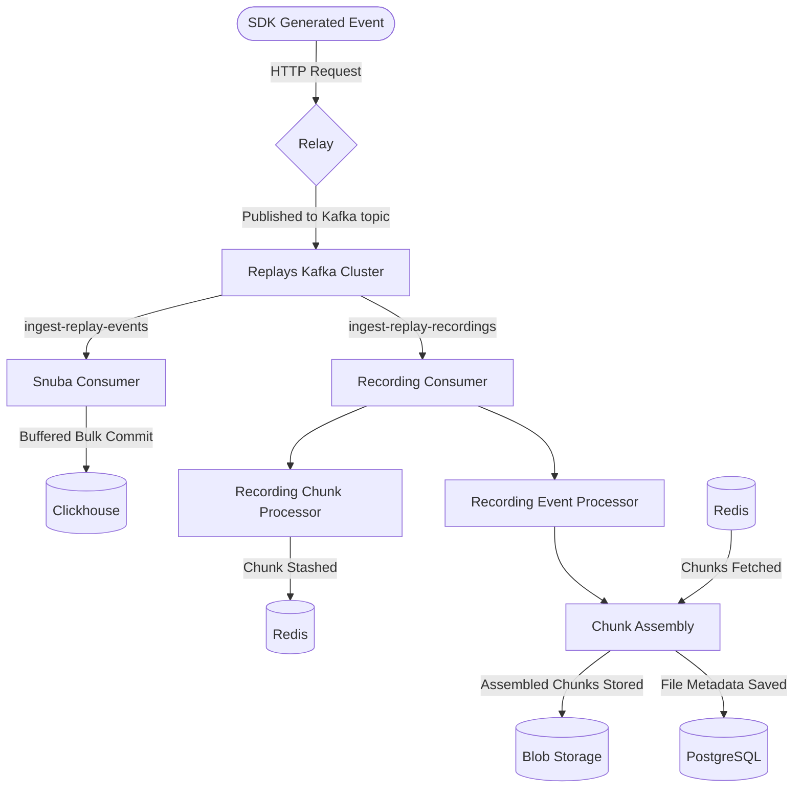
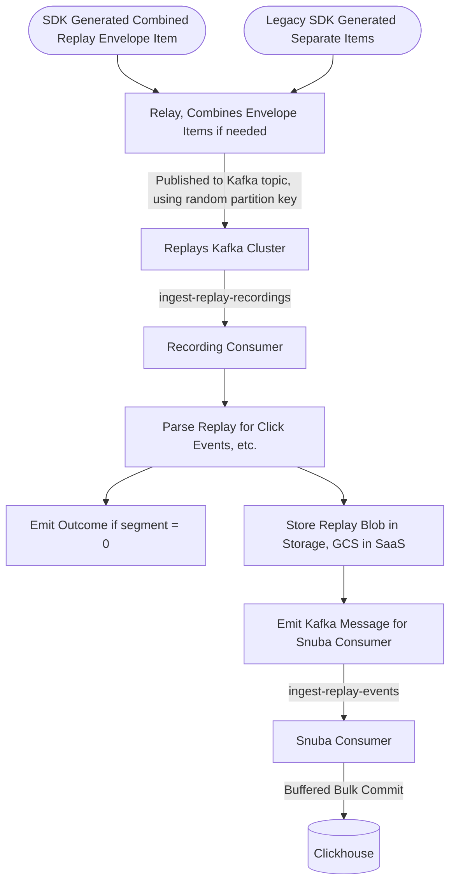

- Start Date: 2023-03-24
- RFC Type: informational
- RFC PR: https://github.com/getsentry/rfcs/pull/82
- RFC Status: draft

# Summary

Right now Session Replays data is sent from the SDK via two envelope item types:

ReplayEvent and ReplayRecording.

- ReplayEvent contains indexable metadata that is stored in our clickhouse table.
- ReplayRecording contains a large, usually compressed blob that is written to our Filestore (GCS as of now)

These are always sent in the same envelope by the sdk. We'd like to combine these two envelope item types into one.

We'd first write a compatibility layer in relay that takes the old format and converts them into a single item type.
We'd then modify the sentry-sdk to send combined item types going forward

# Motivation

## The Current Flow:



We'd like to combine these envelope payloads into one for the following reasons:

- Now that we're decompressing, parsing, and indexing data in the recording, the delineation between the two events no longer makes sense.
- Right now there exists a race condition between ReplayEvent and ReplayRecording -- if a ReplayEvent makes it to clickhouse and is stored before the ReplayRecording, it can result in a bad user experience as a user can navigate to the replay, but the replay's blobs may not be stored yet. We'd like to change it so the snuba writes happen _downstream_ from the recording consumer, as we don't want to make a replay available for search until it's corresponding recording blob has been stored.
- Right now our rate limits are separated per Itemtype. It would be less confusing if the rate limit applied to a single event type.
- It is very hard to do telemetry on the recordings consumer now as we do not have SDK version. combining the envelopes allows us to have metadata in our recordings consumer in an easily accessible way.

# Options Considered

New Proposed Flow:



### Relay Changes:

1. Create a new ItemType `CombinedReplayRecordingEvent`
2. in `processor.rs` https://github.com/getsentry/relay/blob/606166fca57a84ca1b9240253013871d13827de3/relay-server/src/actors/processor.rs#L1134, replace the `process_replays` function that will combine the envelope items if its the old format using `take_item_by` and `add_item` Envelope functions, or leave them if its the new format. This function would then process the two items and set the item payload.
3. We can begin rejecting replay segments over 10 megabytes, which will allow us to not need chunking in our recording consumer.

- The combined Payload will have the format of

```
ReplayEventJSON\nCompressedReplayRecording
```

That the downstream consumer can easily parse by splitting on newline.

### Replay Recording Consumer Changes

1. Create a new ReplayRecording consumer that can run along-side the existing consumer, as there will be a change-over period
2. This consumer will do all the same things as the previous recordings consumer with the addition of:
   - emitting a JSON event to the snuba-replay-events kafka topic

# Drawbacks

This is a decent chunk of engineering work.

# Unresolved questions

- Is there a better format for the combined envelope item type? If we split on \n, this means the replay_event should never have a newline in it. I believe this is acceptable, but is there a better format for sending a combined JSON / binary piece of data?
    - We will be using msgpack to serialize the replay_event and recording bytes into a structured payload.
- If rate limits are applied before processing, it seems like we'll need to add a new rate limit for this combined item. This should be okay, anything else to think about here?
    - We will be adding the new rate limit for the combined item.
