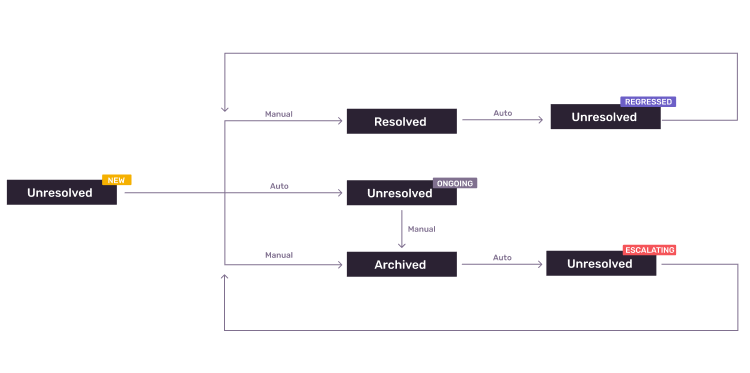

- Start Date: 2023-05-23
- RFC Type: decision
- RFC PR: https://github.com/getsentry/rfcs/pull/95
- RFC Status: draft

# Summary

We need to decide how to handle the Issue States and Escalating Forecasts for Merged issues.

## What is Merged Issues

If you have similar-looking Error Issues that have not been grouped together automatically and you want to reduce noise, you can do so by merging them. A user can also un-merge the issues. 

Sentry does not infer any new grouping rules from how you merge issues. Future events will be added to the merged set of issues by the same criteria as they would've been added to the individual issues that are now in the merged set.

## What is Issue States & Escalating Forecasts

When a user Archives (until escalating) an issue, we generate a forecast using the past 7 day's event volume. If the event volume exceeds the forecasted value, then we mark the issue as Escalating and surface it in the Issue Stream.

# Motivation

1. We need a plan on how to combine/split the Issue States and Escalating Forecasts when we merge/un-merge issues.

# Background

The reason this decision or document is required. This section might not always exist.

Code where we handle merge: https://github.com/getsentry/sentry/blob/master/src/sentry/issues/merge.py#L19

Code where we handle un-merge: https://github.com/getsentry/sentry/blob/master/src/sentry/tasks/unmerge.py#L465

Snuba records which Issues are merged. The primary Issue is the one that has the most events. The other Issues will get merged into the primary Issue. 

# Proposed Option

## What should we do with the GroupStatus, GroupInboxReason and the EscalatingForecasts?

### Merge

We should delete the individual Issues EscalatingForecasts and create a new forecast for the combined Issue. On merge, we should inherit on the GroupStatus and GroupInboxReason of the primary Issue.

### Un-Merge

We should delete the merged Issue's EscalatingForecasts and create a new forecast for the separated Issues. On un-merge, we should assign the GroupStatus and GroupInboxReason of the merged Issue to the separated Issues.

## Auto-Archive

After an issue has been in the `Unresolved(ongoing)` state for 14 days, it will be automatically moved to the `Archived(until_escalating)` state. 

### Merge

Since we are inheriting the GroupStatus of the primary Issue, we can use its' time in `Unresolved(ongoing)` state for the Auto-Archive feature.

### Un-Merge

On un-merge, the GroupStatus of the separated Issues will be of the merged Issue. We should start a new timer for the newly split Issues, but maintain the timer for the primary Issue (the Issue that accumulates all the other Issues).

# Drawbacks

Why should we not do this? What are the drawbacks of this RFC or a particular option if
multiple options are presented.

We need to determine how often events are getting merged and un-merged by users. A high volume could lead to high load to Snuba when we generate new Escalating Forecasts for the newly merged/un-merged Issues.

# Unresolved questions