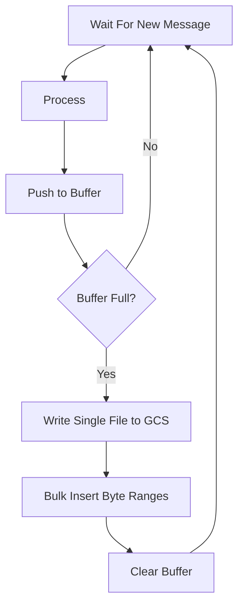

- Start Date: 2023-05-24
- RFC Type: decision
- RFC PR: https://github.com/getsentry/rfcs/pull/98
- RFC Status: draft

# Summary

Recording data is sent in segments. Currently each segment is written to its own file. Writing files is the most expensive component of our GCS usage. It is also the most expensive component, in terms of time, in our processing pipeline. By merging many segment files together into a single file we can minimize our costs and maximize our Kafka consumer's throughput.

# Motivation

1. Minimize costs.
2. Improve throughput.

# Background

This document exists to inform all relevant stakeholders of our proposal and seek feedback prior to implementation.

# Supporting Data

Google Cloud Storage lists the costs for writing and storing data as two separate categories. Writing a file costs $0.005 per 1000 files. Storing that file costs $0.02 per gigabyte. For the average file this works out to: $0.000000012 for storage and $0.00000005 for the write.

In practical terms, this means 75% of our spend is allocated to writing new files.

# Proposal

First, a new table called "recording_byte_range" with the following structure is created:

| replay_id | segment_id | filename | start | stop  |
| --------- | ---------- | -------- | ----- | ----- |
| A         | 0          | file.bin | 0     | 6241  |
| B         | 0          | file.bin | 6242  | 8213  |
| A         | 1          | file.bin | 8214  | 12457 |

This table will need to support, at a minimum, one write per segment. Currently, we recieve ~350 segments per second at peak load.

Second, the Session Replay recording consumer will not _commit_ blob data to GCS for each segment. Instead it will buffer many segments and flush them all together as a single blob to GCS. In this step it will also make a bulk insertion into the database.



Third, when a client requests recording data we will look it up in the "recording_byte_range" table. From it's response, we will issue as many fetch requests as there are rows in the response. These requests may target a single file or many files. The files will be fetched with a special header that instructs the service provider to only respond with a subset of the bytes. Specifically, the bytes that related to our replay.

The response bytes will be decompressed, merged into a single payload, and returned to the user as they are now.

# Drawbacks

- Deleting recording data from a GDPR request, project deletion, or a user delete request will require downloading the file, overwriting the bytes within the deleted range with null bytes (`\x00`) before re-uploading the file.
  - This will reset the retention period.
  - This is an expensive operation and depending on the size of the project being deleted a very time consuming operation.

# Unresolved Questions

1. Can we keep the data in GCS but make it inaccessible?

   - User and project deletes could leave their data orphaned in GCS.
     - We would remove all capability to access it making it functionally deleted.
   - GDPR deletes will likely require overwriting the range but if they're limited in scope that should be acceptable.
     - Single replays, small projects, or if the mechanism is infrequently used should make this a valid deletion mechanism.
     - The data could be encrypted, with its key stored on the metadata row, making it unreadable upon delete.

2. What datastore should we use to store the byte range information?

   - Cassandra, Postgres, AlloyDB?
   - Postgres likely won't be able to keep up long-term.
     - Especially if we write multiple byte ranges per segment.
   - Cassandra could be a good choice but its not clear what operational burden this imposes on SnS and Ops.
   - AlloyDB seems popular among the SnS team and could be a good choice.
     - It can likely interface with the Django ORM. But its not clear to me at the time of writing.
   - Whatever database we use must support deletes.

3. How fast can we encrypt and decrypt each segment?

# Extensions

By extending the schema of the "recording_byte_range" table to include a "type" column we can further reduce the number of bytes returned to the client. The client has different requirements for different sets of data. The player may only need the next `n` seconds worth of data, the console and network tabs may paginate their events, and the timeline will always fetch a simplified view of the entire recording.

With the byte range pattern in place these behaviors are possible and can be exposed to the client. The ultimate outcome of this change is faster loading times and the elimination of browser freezes and crashes from large replays.

This will increase the number of rows written to our database table. We would write four rows whereas with the original proposal we were only writing one. Therefore we should select our database carefully to ensure it can handle this level of write intensity.

# Technical Details

## Storage Service Support

The following sections describe the psuedo-code necessary to fetch a range of bytes from a service provider and also links to the documentation where applicable.

**Google Cloud Storage**

```python
from google.cloud.storage import Blob

blob = Blob(filename, bucket)
blob.download_as_bytes(start=start, end=stop)
```

Source: https://cloud.google.com/python/docs/reference/storage/latest/google.cloud.storage.blob.Blob#google_cloud_storage_blob_Blob_download_as_bytes

**AWS S3**

```python
from boto3 import client

response = client("s3", **auth).get_object(
    Bucket=bucket,
    Key=filename,
    Range=f"bytes={start}-{stop}",
)
response["Body"].read()
```

Source: https://boto3.amazonaws.com/v1/documentation/api/latest/reference/services/s3/client/get_object.html

**Filesystem**

```python
with open(filename, "r") as f:
    f.seek(start)
    f.read((stop - start) + 1)  # Range is inclusive.
```

## Consumer Buffering Mechanics

We will continue our approach of using _at-least once processing_. Each message we receive is guaranteed to be processed to completion regardless of error or interrupt. Duplicate messages are possible under this scheme and must be accounted for in the planning of each component.

**Buffer Location and Behavior**

The buffer is kept as an in-memory list inside the consumer process. For each message we receive we append the message to the buffer. Afterwards, we check if the buffer is full. If it is we flush. Else we wait for another message.

This is a somewhat simplified view of whats happening. In reality we will have time based flushing and a timeout mechanism for message listening. This ensures the buffer does not stay partially full indefinitely.

**Buffer Flush**

On flush the buffer will take every message in the list and merge them together into a single bytes object. This bytes object will then be uploaded to the storage service-provider. Upon successful upload the start and stop byte range values of each message are stored in a database in addition to other metadata such as their replay_id and segment_id. Finally, the last offset is committed to Kafka.

**Handling Consumer Restarts**

If the consumer restarts with a non-empty buffer, the buffer's last item's offset will not be committed. When the consumer resumes it will start processing from the last offset committed (i.e. the last item in the last successfully-flushed-buffer). The buffer will be rebuilt exactly as it was prior to restart.

**Storage Service Failure**

If we can not communicate with the storage provider we have several options.

1. Catch the exception and commit the offset anyway. This means all the segments in the buffer would be lost.
2. Do not catch the exception and let the consumer rebuild the buffer from its last saved offset.
3. Catch the exception and retry.

Option three is the preferred solution but the semantics of the retry behavior can get complicated depending on how the system is constructed. For example, how long do you retry? How do retries affect message processing? Do you communicate with the service provider in a thread? If so how do you manage resources?

A blocking approach is the simplest solution but it does not offer maximum throughput.

**Managing Effects**

With a buffered approach most of the consumer's effects are accomplished in two bulk operations. However, click search, segment-0 outcome tracking, and segment-0 project lookup are not handle-able in this way. We will address each case independently below.

1. Click Tracking.
   - Click events are published to the replay-event Kafka consumer.
   - This publishing step is asynchronous and relies on threading to free up the main process thread.
   - This operation is measured in microseconds and is not anticipated to significantly impact total throughput.
2. Outcome Tracking.
   - Outcome events are published to the outcomes Kafka consumer.
   - This publishing step is asynchronous and relies on threading to free up the main process thread.
   - This operation only occurs for segment-0 events.
   - This operation is measured in microseconds and is not anticipated to significantly impact total throughput.
3. Project lookup.
   - Projects are retrieved by a cache lookup or querying PostgreSQL if it could not be found.
   - This operation typically takes >1ms to complete.
   - This operation only occurs for segment-0 events.
   - Querying this information in a tight loop is not an ideal situation.
     - Forwarding the project_id to a secondary Kafka consumer would free up resources on our main consumer and allow the secondary consumer to optimize for this type of workload.
     - Alternatively, another method for looking up the project's `has_replay` flag could be found.

**Duplicate Message Handling**

1. Google Cloud Storage.
   - Unique filename generation per buffer would mean that a segment could be present in multiple files.
   - This has COGS implications but does not impact our application.
2. "recording_byte_range" table.
   - Duplicate replay, segment ID pairs will be recorded in the table.
   - A reader must either select distinct or group by the replay_id, segment_id pair.
   - Neither row has precendence over the other but the filename value must come from the same row as the start and stop byte range values.
3. Outcome tracking.
   - Duplicate outcomes will be recorded for a given replay.
   - The replay_id functions as an idempotency token in the outcomes consumer and prevents the customer from being charged for the same replay multiple times.
4. Click tracking.
   - Duplicate click events will be inserted for a replay, segment pair.
   - This is an acceptable outcome and will not impact search behavior.

## Security

How do we prevent users from seeing segments that do not belong to them? The short-answer is test coverage. Recording another segment's byte range would be the same as generating the incorrect filename under the current system. These outcomes are prevented with robust test coverage.

In the case of bad byte range math, we do have some implicit protection. Each segment is compressed independently. Fetching a malformed byte range would yield unreadable data. A bad byte range either truncates the compression headers or includes unintelligible bytes at the beginning or end of the sequence. If we manage to decompress a subset of a valid byte range the decompressed output would be malformed JSON and would not be returnable to the user.

Additionally, each segment could be encrypted with an encryption-key that is stored on the row. Requesting an invalid byte range would yield malformed data which could not be decrypted with the encryption-key stored on the row.
