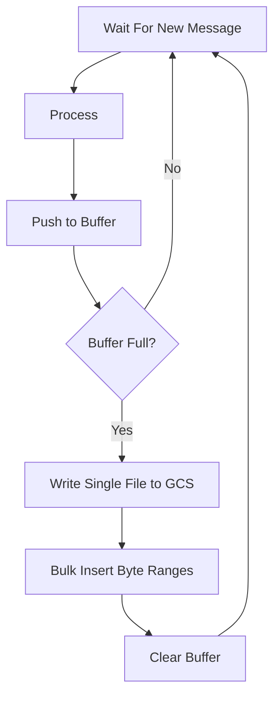

- Start Date: 2023-05-24
- RFC Type: decision
- RFC PR: https://github.com/getsentry/rfcs/pull/98
- RFC Status: draft

# Summary

Recording data is sent in segments. Each segment is written to its own file. Writing files is the most expensive component of our Google Cloud Storage usage. It is also the most expensive component, in terms of time, in our processing pipeline. By merging many segment files together into a single file we can minimize our costs and maximize our processing pipeline's throughput.

# Motivation

1. Minimize costs.
2. Improve throughput.
3. Enable new features in a cost-effective manner.

# Background

This document was originally written to respond to a percieved problem in the Session Replays recording consumer. However, upon exploring these ideas more it was determined that this could be more generally applied to the organization as a whole. For that reason I've made many of the names generic but have also retained many references to Session Replay.

# Supporting Data

Google Cloud Storage lists the costs for writing and storing data as two separate categories. Writing a file costs $0.005 per 1000 files. Storing that file costs $0.02 per gigabyte. For the average Session Replay file (with a retention period of 90 days) this works out to: $0.000000012 for storage and $0.00000005 for the write.

In practical terms, this means 75% of our spend is allocated to writing new files.

# Proposal

First, a new table called "file_part_byte_range" with the following structure is created:

| id  | key | path     | start | stop  | dek      | kek_id |
| --- | --- | -------- | ----- | ----- | -------- | ------ |
| 1   | A:0 | file.bin | 0     | 6241  | Aq3[...] | 1      |
| 2   | B:0 | file.bin | 6242  | 8213  | ppT[...] | 1      |
| 3   | A:1 | file.bin | 8214  | 12457 | 99M[...] | 1      |

- The key field is client generated identifier.
  - It is not unique.
  - The value of the key field should be easily computable by your service.
  - In the case of Session Replay the key could be a concatenation of `replay_id` and `segment_id`.
    - Illustrated above as `replay_id:segment_id`.
    - Alternatively, a true composite key could be stored on a secondary table which contains a reference to the `id` of the `file_part_byte_range` row.
- Path is the location of the blob in our bucket.
- Start and stop are integers which represent the index positions in an inclusive range.
  - This range is a contiguous sequence of related bytes.
  - In other words, the entirety of the file part's encrypted data is contained within the range.
- The "dek" column is the **D**ata **E**ncryption **K**ey.
  - The DEK is the key that was used to encrypt the byte range.
  - The key itself is encrypted by the KEK.
    - **K**ey **E**ncryption **K**ey.
  - Encryption is explored in more detail in the following sections.
- The "kek_id" column contains the ID of the KEK used to encrypt the DEK.
  - This KEK can be fetched from a remote **K**ey **M**anagement **S**ervice or a local database table.

Notice each row in the example above points to the same file but with different start and stop locations. This implies that multiple, independent parts can be present in the same file. A single file can be shared by hundreds of different parts.

Second, the Session Replay recording consumer will not commit blob data to Google Cloud Storage for each segment. Instead it will buffer many segments and flush them together as a single blob to GCS. Next it will make a bulk insertion into the database for tracking.



## Writing

Writing a file part is a four step process.

First, the bytes must be encrypted with a randomly generated DEK. Second, the DEK is encrypted with a KEK. Third, the file is uploaded to the cloud storage provider. Fourth, a metadata row is written to the "file_part_byte_range" containing a key, the containing blob's filepath, start and stop offsets, and the encrypted DEK.

**A Note on Aggregating File Parts**

It is up to the implementer to determine how many parts exist in a file. An implementer may choose to store one part per file or may store an unbounded number of parts per file.

However, if you are using this system, it is recommended that more than one part be stored per file. Otherwise it is more economical to upload the file using simpler, more-direct methods.

## Reading

To read a file part the metadata row in the "file_part_byte_range" table is fetched. Using the filepath, starting byte, and ending byte we fetch the encrypted bytes from remote storage. Now that we have our encrypted bytes we can use the DEK we fetched from the "file_part_byte_range" table to decrypt the blob and return it to the user.

## Deleting

To delete a file part the metadata row in the "file_part_byte_range" table is deleted. With the removal of the DEK, the file part is no longer readable and is considered deleted.

Project deletes, user deletes, GDPR deletes, and user-access TTLs are managed by deleting the metadata row in the "file_part_byte_range" table.

File parts can be grouped into like-retention-periods and deleted manually or automatically after expiry. However, in the case of replays, storage costs are minor. We will retain our encrypted segment data for the maximum retention period of 90 days.

## Key Rotation

If a KEK is compromised and needs to be rotated we will need to follow a four step process. First, we query for every row in the "file_part_byte_range" table whose DEK was encrypted with the old KEK. Second, we will decrypt every DEK with the old KEK. Third, we will encrypt the DEK with a new KEK. Fourth, the old KEK is dropped.

DEKs are more complicated to rotate as it requires modifying the blob. However, because DEKs are unique to a byte range within a single file we have a limited surface area for a compromised key to be exploited. To rotate a DEK first download the blob, second decrypt the byte range with the compromised DEK, third generate a new DEK, fourth encrypt the payload with the new DEK, fifth encrypt the new DEK with any KEK, and sixth upload and re-write the metadata rows with the new offsets.

# Drawbacks

# Questions

1. If KEKs are managed in a remote service how do we manage outages?
   - We manage it in the same way we manage an outage of any other remote service.
     - We will need to backlog or otherwise 400/404.
   - KEKs have the benefit of _probably_ not blocking ingest as the key will be cached for long stretches of time (24 hours) and can be used for longer periods of time if a new key can not be fetched.
2. How will read efficiency be impacted if we rely on a remote service to decrypt blob data?
   - It will have some cost but hopefully that cost is minimized by the constraints of your system.
   - For example, Session Replay fetches multiple segment blobs in a single request. At most we will need to fetch two keys (and in the majority of cases a single key) to decrypt the segments.
   - This key fetching latency is immaterial to the total latency of the request.
3. How will key rotation work in a production system?
   - Hopefully it will be a rare event.
   - KEK rotation will require re-encrypting every DEK encrypted with the KEK (typically everything in a ~24-hour period).
   - DEK rotation will require re-encrypting a sequence of bytes in a blob.

# Extensions

By extending the schema of the "recording_byte_range" table to include a "type" column we can further reduce the number of bytes returned to the client. The client has different requirements for different sets of data. The player may only need the next `n` seconds worth of data, the console and network tabs may paginate their events, and the timeline will always fetch a simplified view of the entire recording.

With the byte range pattern in place these behaviors are possible and can be exposed to the client. The ultimate outcome of this change is faster loading times and the elimination of browser freezes and crashes from large replays.

This will increase the number of rows written to our database table. We would write four rows whereas with the original proposal we were only writing one. Therefore we should select our database carefully to ensure it can handle this level of write intensity.

# Technical Details

## Storage Service Support

The following sections describe the psuedo-code necessary to fetch a range of bytes from a service provider and also links to the documentation where applicable.

**Google Cloud Storage**

```python
from google.cloud.storage import Blob

blob = Blob(filename, bucket)
blob.download_as_bytes(start=start, end=stop)
```

Source: https://cloud.google.com/python/docs/reference/storage/latest/google.cloud.storage.blob.Blob#google_cloud_storage_blob_Blob_download_as_bytes

**AWS S3**

```python
from boto3 import client

response = client("s3", **auth).get_object(
    Bucket=bucket,
    Key=filename,
    Range=f"bytes={start}-{stop}",
)
response["Body"].read()
```

Source: https://boto3.amazonaws.com/v1/documentation/api/latest/reference/services/s3/client/get_object.html

**Filesystem**

```python
with open(filename, "r") as f:
    f.seek(start)
    f.read((stop - start) + 1)  # Range is inclusive.
```

## Consumer Buffering Mechanics

The following section is highly specific to the Session Replay product.

We will continue our approach of using _at-least once processing_. Each message we receive is guaranteed to be processed to completion regardless of error or interrupt. Duplicate messages are possible under this scheme and must be accounted for in the planning of each component.

**Buffer Location and Behavior**

The buffer is kept as an in-memory list inside the consumer process. For each message we receive we append the message to the buffer. Afterwards, we check if the buffer is full. If it is we flush. Else we wait for another message.

This is a somewhat simplified view of whats happening. In reality we will have time based flushing and a timeout mechanism for message listening. This ensures the buffer does not stay partially full indefinitely.

**Buffer Flush**

On flush the buffer will take every message in the list and merge them together into a single bytes object. This bytes object will then be uploaded to the storage service-provider. Upon successful upload the start and stop byte range values of each message are stored in a database in addition to other metadata such as their replay_id and segment_id. Finally, the last offset is committed to Kafka.

**Handling Consumer Restarts**

If the consumer restarts with a non-empty buffer, the buffer's last item's offset will not be committed. When the consumer resumes it will start processing from the last offset committed (i.e. the last item in the last successfully-flushed-buffer). The buffer will be rebuilt exactly as it was prior to restart.

**Storage Service Failure**

If we can not communicate with the storage provider we have several options.

1. Catch the exception and commit the offset anyway. This means all the segments in the buffer would be lost.
2. Do not catch the exception and let the consumer rebuild the buffer from its last saved offset.
3. Catch the exception and retry.

Option three is the preferred solution but the semantics of the retry behavior can get complicated depending on how the system is constructed. For example, how long do you retry? How do retries affect message processing? Do you communicate with the service provider in a thread? If so how do you manage resources?

A blocking approach is the simplest solution but it does not offer maximum throughput.

**Managing Effects**

With a buffered approach most of the consumer's effects are accomplished in two bulk operations. However, click search, segment-0 outcome tracking, and segment-0 project lookup are not handle-able in this way. We will address each case independently below.

1. Click Tracking.
   - Click events are published to the replay-event Kafka consumer.
   - This publishing step is asynchronous and relies on threading to free up the main process thread.
   - This operation is measured in microseconds and is not anticipated to significantly impact total throughput.
2. Outcome Tracking.
   - Outcome events are published to the outcomes Kafka consumer.
   - This publishing step is asynchronous and relies on threading to free up the main process thread.
   - This operation only occurs for segment-0 events.
   - This operation is measured in microseconds and is not anticipated to significantly impact total throughput.
3. Project lookup.
   - Projects are retrieved by a cache lookup or querying PostgreSQL if it could not be found.
   - This operation typically takes >1ms to complete.
   - This operation only occurs for segment-0 events.
   - Querying this information in a tight loop is not an ideal situation.
     - Forwarding the project_id to a secondary Kafka consumer would free up resources on our main consumer and allow the secondary consumer to optimize for this type of workload.
     - Alternatively, another method for looking up the project's `has_replay` flag could be found.

**Duplicate Message Handling**

1. Google Cloud Storage.
   - Unique filename generation per buffer would mean that a segment could be present in multiple files.
   - This has COGS implications but does not impact our application.
2. "recording_byte_range" table.
   - Duplicate replay, segment ID pairs will be recorded in the table.
   - A reader must either select distinct or group by the replay_id, segment_id pair.
   - Neither row has precendence over the other but the filename value must come from the same row as the start and stop byte range values.
3. Outcome tracking.
   - Duplicate outcomes will be recorded for a given replay.
   - The replay_id functions as an idempotency token in the outcomes consumer and prevents the customer from being charged for the same replay multiple times.
4. Click tracking.
   - Duplicate click events will be inserted for a replay, segment pair.
   - This is an acceptable outcome and will not impact search behavior.
