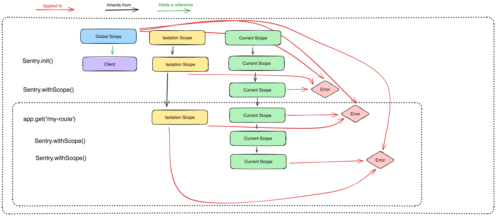

- Start Date: 2023-11-07
- RFC Type: feature
- RFC PR: https://github.com/getsentry/rfcs/pull/122
- RFC Status: draft

# Summary

We want to streamline Hub & Scope usage for the SDK.

# Motivation

Generally, Hubs and Scopes are a very Sentry-specific concept, and can be a bit hard to explain.
Also, how Hub & Scope forking behaves is currently a bit tricky, and does not play well e.g. with how OpenTelemetry contexts work.

This RFC aims to streamline this by merging the concepts of Hub and Scope into a singular Scope concept.

It also proposes the new concepts of global & isolated scopes.

# Background

Hubs and Scopes have been part of the unified SDK API for a long time.
While they have generally served us well, the shortcomings of the current systems have become apparent over time.
Apart from generally being unclear to users - what is applied when, why, how? - there are also problems with the way we currently instruct users to add event data.

# Proposed Solution

Hubs will be removed as a concept for SDK users.
Instead, from a users perspective only Scopes remain, which will become the singular entity to hold context data etc.

Scopes will be _similar_ to how they work today, but not entirely the same.
Scopes can have data (e.g. tags, user, ...) added to them the same way you can do today.
This RFC _does not_ aim to change any of the data that is kept on the scope and is applied to events.

The following APIs will be removed/deprecated:

- `getCurrentHub()`
- `configureScope()` (instead just get the scope and set on it directly)
- Any APIs currently on the Hub only:
  - `hub.pushScope()`
  - `hub.popScope()`
  - `hub.isOlderThan()`
  - `hub.bindClient()`
  - `hub.getStack()`
  - `hub.getStackTop()`
  - `hub.run()` (use `withScope()` instead)

Instead, we will introduce some new APIs:

```ts
// get the current scope. replacement for `getCurrentHub().getScope()`
export function getCurrentScope(): Scope;

// get the current client. May return a NOOP client. Replacement for `getCurrentHub().getClient()`.
export function getClient(): Client;

// make a scope the current scope. Replacement for `makeMain(hub)`
export function setCurrentScope(scope: Scope): void;

// get the current global scope
export function getGlobalScope(): Scope;

// get the curren isolation scope
export function getIsolationScope(): Scope;

// similar to `withScope`, but defines an isolation scope
export function withIsolationScope(
  callback: (scope: Scope) => unknown
): unknown;
```

The following APIs already exist but will behave differently:

- `withScope()` will still work, but it will actually fork an execution context. So this will roughly do the same as doing `hub.run()` today in languages that have that, which forks an execution context.

APIs that are currently on the hub should instead be called directly on the scope (e.g. `scope.captureException()` etc.), or via a global method (e.g. `Sentry.captureException()`).

The current scope may be kept similar to how we currently keep the current hub, but this is SDK specific and not part of this RFC.

## Clients

Instead of a client being optional, there will now _always_ be a client. It may be a Noop Client that does nothing, if `init()` has not been called yet.

A scope has a reference to a client. By default it will reference a noop client. You can bind a client to a scope via `scope.setClient()`.
The client is inherited by forked scopes.

```js
const client1 = new Client();
const scope = new Scope();

scope.getClient(); // <-- returns a noop client by default

scope.setClient(client1);
scope.getClient(); // <-- returns client1
```

The current scope may be kept similar to how we currently keep the current hub, but this is SDK specific and not part of this RFC.

When calling `getCurrentScope()` before a scope was made the current one (=before `Sentry.init` was called), we will return a new scope with a noop client.
A noop client is a regular client that simply does not send anything.

This way, the API for `getClient()` can always return a client, and users do not have to guard against this being undefined all the time.
We may also expose a util like `sentryIsInitialized()` that checks if the current client is a Noop client (which currently you could have checked as `getCurrentHub().getClient() === undefined`).

If you want to have multiple isolated clients, you can achieve this easily with this new setup:

```js
const client1 = new Client(); // DSN 1
const client2 = new Client(); // DSN 2

const scope1 = new Scope();
const scope2 = new Scope();

scope1.setClient(client1);
scope2.setClient(client2);

scope1.captureException(); // <-- isolated from scope2
```

A client continues to be stateless - it holds no reference to any scope. In contrast, each scope _always_ has a client reference (it _may_ reference a Noop client if nothing was initialized yet).

## Scopes

Scopes behave similar to how they behave today.
When a scope is forked via `withScope()`, a new scope is created that inherits all data currently set on the parent scope.

The main change to Scopes is that they do not push/pop anymore, but instead fork an execution context (in languages where this makes sense/is possible).
Basically, `withScope()` should behave like `hub.run()` does today in languages that have execution context forking.

From a users perspective, this should mostly not be noticeable - they can always run `getCurrentScope()` to get the current scope, or `withScope(callback)` to fork a new scope off the current scope.

You can make a scope the current one via `setCurrentScope(scope)`, which should bind the scope to the current execution context (or a global, in SDKs without execution context). This is a replacement for the current APIs like `makeMain(hub)` or `setCurrentHub(hub)`.

You can still clone scopes manually the same way as before, e.g. via `Scope.clone(oldScope)` or a similar API. In contrast to `withScope()`, this will _not_ fork an execution context.

You can update the client of a scope via `scope.setClient(newClient)`. This will not affect any scope that has already been forked off this scope, but any scope forked off _after_ the client was updated will also receive the updated client.

Every scope holds a reference to its client.

## Special Scopes

In addition to the current scope, this RFC introduces two new concepts:

- [Global Scope](#global-scope)
- [Isolation Scope](#isolation-scope)

These scopes will be explained in detail below. They are _additional concepts_ that can be used by SDK internals & power users to make sure data can be assigned to the correct place, without relying on internals about how/when/where a scope or execution context is forked.

The following chart gives an overview of how these scopes work and to which events they would be applied:



### How to store/reference scopes

Similar to how we currently store the current hub, we also need to store the current scope. The exact mechanism to do that is up to the concrete SDK/language. In environments with multiple execution contexts (or thread locals), we should attach the current scope to the execution context (or thread local). In other environments, it may be attached to some global (e.g. in Browser JS). This RFC does not propose to change this, so generally the current scope may be stored the same was as the current hub used to be.

In addition to the current scope, the current [Global Scope](#global-scope) and [Isolation Scope](#isolation-scope) (see below for an in-depth explanation on what these are) also need to be stored. These should be stored _next to_ the current scope. If you have executution context, you may store/access them like this:

```js
const executionContext1 = getExecutionContext();
const { scope, globalScope, isolationScope } = executionContext1.getScopes();
executionContext1.setScopes({ scope, globalScope, isolationScope });
```

In environments where you don't have execution contexts, you may store them in a global place. The exact mechanism to do this is up to the concrete SDK/language.

For each execution context, there will _always_ be exactly one current, global & isolation scope. When the execution context is forked, these are forked along.

### Global Scope

In addition to the current scope, there will also be a new special scope, the **Global Scope**.

When you call `Sentry.init()`, you will immediately have a current scope - an initial scope.
In the current/previous system, if you want to set global data (e.g. tags that should apply to _all_ events),
you have to do this right after calling `Sentry.init()`, on the initial scope, so this data will be correctly inherited by all downstream scopes:

```js
Sentry.init();

// Scope is the initial scope - the scope right after calling init()
cont scope = Sentry.getCurrentHub().getCurrentScope();
scope.setTag('revision', 'abc');
```

This becomes especially tricky if you want to set global scope data based on async processes, or in different files.
The global scope should fix this by making it very clear how to setup data/processors that should apply to _all_ events, no matter where you define them:

```js
Sentry.init();
setupGlobalData();

// Somewhere else
async function setupGlobalData() {
  const revision = await getRevision();
  // No need to worry or care about where this is called, this will _always_ work!
  Sentry.getGlobalScope().setTag("revision", "abc");
}
```

The global scope is _not_ the initial scope, but a separate, special scope. The global scope is different for each client, in order to avoid polluting this on accident when working with multiple completely separate clients.

You can get the current global scope via `getGlobalScope()`. There _may_ be a function `setGlobalScope(scope)` to replace the global scope - or SDKs can decide that there is no need to replace the global scope, you can only mutate it.

If you call `getGlobalScope()` before a client is initialized, we should still get a global scope back (tied to a Noop client). Once an actual client is initialized, the global scope of the noop client should be merged into the new global scope for the new client. This should ensure that even if you call `getGlobalScope().setTag(...)` before the SDK is initialized, no data is lost:

```js
// This global scope has a Noop client, because init was not called yet!
const globalScopeBeforeInit = Sentry.getGlobalScope();
globalScopeBeforeInit.setTag("tag1", "aa");

// When init() is called, we make sure to inherit from the global scope, if data was set before
Sentry.init();

const globalScope = Sentry.getGlobalScope();
// A new scope instance is created as global scope when a client is created & bound to current scope
globalScope !== globalScopeBeforeInit;
// Global scope inherits from globalScopeBeforeInit
globalScope.getTags(); // -> tag1: aa
```

The reason that the global scope is not the same as the initial scope of a client, is that you cannot accidentally mutate it - nothing ever inherits off the global scope.

### How to document global scopes

Global scopes will be documented in a new section under "Enriching Events > Global Data", which will explain how to use `getGlobalScope()` and when/how data added there will be applied.

### Isolation Scope

Furthermore, there are also **Isolation Scopes**.

An isolation scope is similar to a global scope, but tied to a specific section of your app/code that should be isolated.
In a server side language, an isolation scope will commonly be created per request. Each request gets an isolated scope that you can assign data to, which should be applied to all events that are processed in this request. However, an isolation scope is not limited to requests - you could also have an isolation scope for a scheduled job, or for a zone in your UI (in theory).

The isolation scope can be used to e.g. add user or request data that should be applied to any event for the current request (or similar isolation unit). Similar to the global scope, it does not matter where you call it, but you can always be sure that data is correctly attached/available. This can especially be useful when writing hooks or plugins where you may not easily get access to the scope of a request:

```js
fastify.addHook('preValidation', () => {
  // This will be applied to all events in the current request
  getIsolationScope().addEventProcessor(...);
});
```

Similar to the global scope, these are also applied to events. However, isolation scopes can be created, either by us internally (the most common scenario), or also by users. The new APIs for this are:

```js
// Returns the current isolation scope.
export function getIsolationScope(): Scope;

// Create a new isolation scope for this scope
// This will NOT make this scope the isolation scope, but will create a new isolation scope (based on the active isolation scope, if one exists)
scope.isolate();

// Similar to `withScope`, but it forks a new scope AND sets a new isolation scope for this context
export function withIsolationScope(callback: (scope) => void): void;
```

You can fetch the current isolation scope via `getIsolationScope()`. You can define a new isolation scope via `scope.isolate()`, which will define a new isolation scope for this scope, and for all scopes that will be forked off this scope. When a client is created & bound, an isolation scope will immediately be created, similar to the global scope for a client.

An isolation scope is attached to the current execution context, similar to the current scope. There is always exactly one current isolation scope. If you call `getIsolationScope()` before a client has been created, a noop isolation scope is returned, which should be merged in once a client is actually created (same as with the global scope).

Similar to the global scope, an isolation scope is always a separate scope, so nothing will inherit off it - except for a potential superseding isolation scope.
If an isolation scope is created, and there is already an isolation scope in the current execution context, then the new isolation scope should be forked off the previous one (with copy-on-write):

```js
Sentry.init();

// There is always an isolation scope
const initialIsolationScope = Sentry.getIsolationScope();
initialIsolationScope.setTag("tag1", "aa");

// Auto-instrumentation automatically forks an execution context with a new isolation scope
app.get("/my-route", function () {
  const isolationScope = Sentry.getIsolationScope();
  isolationScope !== initialIsolationScope;
  // Isolation scope inherits from previously current isolation scope
  isolationScope.getTags(); // -> tag1: aa
});
```

Note that in environments where you do not have multiple execution contexts (e.g. Browser JS), there is basically only a single isolation scope that is fundamentally the same as the global scope. In these environments, global & isolation scope can be used completely interchangeably. However, for consistency we still have these concepts everywhere - but users do not need to care about them, and we can reflect this in the SDK specific documentation.

### How to document isolation scopes

Isolation scopes will be documented in a new section under "Enriching Events > Per request data" (or similar, based on SDK language & needs), which will explain how to use `getIsolationScope()` and when/how data added there will be applied.

Global methods to set data, like `Sentry.setTag()` or `Sentry.setUser()`, will set on the isolation scope. Only if you want to set on a different scope, you need to manually get it (e.g. `getGlobalScope().setTag()`).

### When to create an isolation scope

For most server-side SDKs, an isolation scope will be created for each request being processed.
Roughly, it will equate to each time we currently fork a hub.

### Examples for isolation scopes

Example for instrumentation that we would write:

```ts
function wrapHttpServerRequest(original: Function): Function {
  // Fork an execution context for this server request, that is isolated
  return Sentry.withIsolatedScope((scope) => {
    // anything in here will have the same isolated scope!
    return original();
  });
}
```

Example for hooking into external auto-instrumentation (e.g. OpenTelemetry):

```ts
let onRequestHook: (span: Span) => void;

// This method is not defined by us, but is some external code
// Here just for demonstration purposes of how that may be implemented
function otelWrapHttpServerRequest(original: Function): Function {
  // Fork an execution context for this server request,
  // but without isolating this!
  return Sentry.withScope((scope) => {
    onRequestHook(trace.getActiveSpan());
    return original();
  });
}

// This would be our custom sentry configuration
onRequestHook = () => {
  const scope = getCurrentScope();
  scope.isolate(); // Add an isolation scope to the already forked scope
};
```

## Applying scopes

Scopes are applied in this order to events:

```ts
class Scope {
  public captureEvent(event: Event, additionalScope?: Scope) {
    // Global scope is always applied first
    const scopeData = getGlobalScope().getScopeData();

    // Apply isolations cope next
    const isolationScope = getIsolationScope();
    merge(scopeData, isolationScope.getScopeData());

    // Now the scope data itself is added
    merge(scopeData, this.getScopeData());

    // If defined, add the captureContext/scope
    // This is e.g. what you pass to Sentry.captureException(error, { tags: [] })
    if (additionalScope) {
      merge(scopeData, additionalScope.getScopeData());
    }

    // Finally, this is merged with event data, where event data takes precedence!
    mergeIntoEvent(event, scopeData);
  }
}
```

Note that there is _always_ exactly one global & one isolation scope active.

## How to replace current patterns?

Inside of the SDK, this is how current code patterns can/should be migrated:

- `getCurrentHub().getScope()` --> `getCurrentScope()` - wherever we used to use the current hub, we can instead use the current scope instead.
- `hub.configureScope(scopeCallback)` --> `const scope = getCurrentScope()` - just get & set on the scope directly
- `hub.withScope(scopeCallback)` --> `withScope(scopeCallback)`
- `hub.run()` --> `withIsolationScope()` - in places where you've currently forked the hub, you can instead fork a scope with an isolation scope
- `getCurrentHub().captureXXX()` --> use the top-level export directly, e.g. `captureXXX()`

## What about environments that do not have isolation of execution contexts (e.g. mobile, browser)?

Where not useful, you simply don't have to use the isolation scope. But it's always there, if the need arises.
While it is empty it does nothing anyhow.

If you cannot really fork a scope per execution context (e.g. in Browser JS), it's up to the SDK to implement the desired behavior in a similar way. The goal is to have a similar UX.

## What should be called from top level methods?

Top level APIs that set something should generally interact with the isolation scope:

```js
Sentry.setTag();
Sentry.setUser();
Sentry.addBreadcrumb();
// ...
```

Top level APIs to capture events etc. interact with the current scope:

```js
Sentry.captureException();
Sentry.captureMessage();
// ...
```

SDKs _may_ also add an option to the client to opt-in to put breadcrumbs on the global scope instead (e.g. for mobile or scenarios where you always want breadcrumbs to be global).

## Should users care about global / isolation scopes?

The goal of this RFC is that 95% of users do not need to think about these concepts at all.
In most cases, users should simply use the global methods `Sentry.xyz()` which should do the right thing.

Directly interacting with the isolation scope should only be necessary for users manually instrumenting an unsupported framework or similar. This (esp. setting up a new isolation scope) can be documented in a dedicated new docs page.

Accessing the current scope `getCurrentScope()` should also rarely be necessary, and be de-emphazized in the docs. Again, just use the global methods which should do the correct thing.

Accessing the global scope should be documented, and is the recommended way when you want to set global data in an async way. This can be encapsulated in a dedicated new docs page.

We should also add a new docs page explaining the types of scope conceptually.

## Should users care about Clients?

Generally speaking, for most regular use cases the client should be mostly hidden away from users.
Users should just call `Sentry.init()`, which will setup a client under the hood. Users should generally only interact with scopes, and we should keep clients out of most public facing APIs.

The client is only there to allow an escape hatch when users need to do more complex/special things, like isolating Sentry instances or multiplexing. So client APIs should be designed to _allow_ to do things that cannot be done via `Sentry.init()`, but our main focus should be on making the default experience easy to understand, which includes that users should not have to care about the concept of clients by default.

## What about other Hub references?

While the Hub is mainly exposed via `getCurrentHub()`, it is also used as argument or similar in many places.
These occurences should be updated to instead take a scope or a client.

## What about backwards compatibility?

We should strive to provide a wrapper/proxy `getCurrentHub()` method that still exposes the key functionality to ease upgrading. E.g.:

```js
import { getScope, getClient, captureException, withScope } from "../internals";

function getCurrentHub() {
  return {
    getClient,
    getScope,
    captureException,
    withScope,
    // ...
  };
}
```

Based on the SDK, we can decide to keep _everything_ in this proxy (then we can do this even in a minor release),
or keep _most of it_ (if we do a major) - to break as little things in user land as possible.

## What about globals?

This RFC does not propose any concrete way to store the active scope. This is up to the concrete SDK and may behave the same way as it currently does for the hub, or differently if that makes more sense in a given scenario.

# Drawbacks

- This changes _a lot_ of public APIs and behavior.

# Unresolved questions

- How should we handle this in docs?
- Naming: Can we come up with something better than Isolation Scope?
- Global Scope: Should it be per-client (current RFC) or truly global?
  - If per-client, should this be called "Client Scope" instead to be clearer?
- Naming: `getScope()` vs. `getCurrentScope()`
