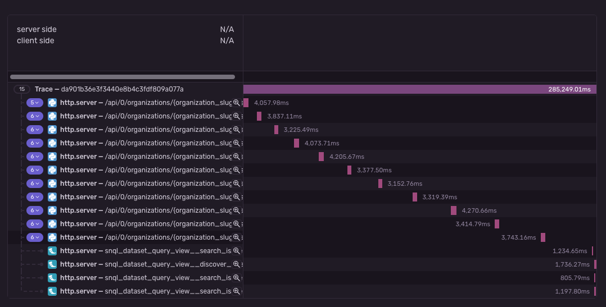
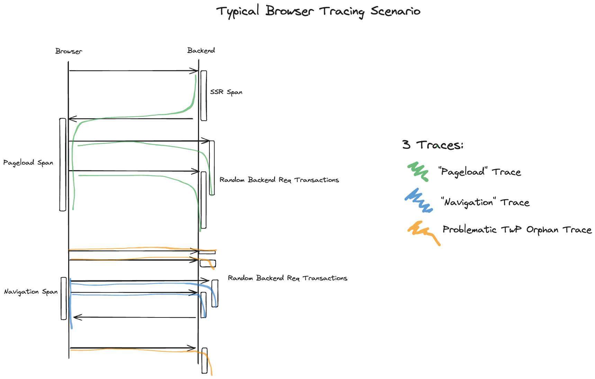

- Start Date: 2024-02-06
- RFC Type: decision
- RFC PR: https://github.com/getsentry/rfcs/pull/127
- RFC Status: draft

# Summary

This document is a proposition to improve the current informal Propagation Context spec because we have identified some shortcomings.
The currently defined behaviour leads to confusing traces.
The main idea is to remove the concept that there _always_ is a propagation context.

# Motivation

Hindsight is 20/20 and we've discovered some cases where the behaviour we intended produced sub-par results in reality.
The main problem is that propagation outside of active spans will cause unrelated spans and transactions to be correlated with each other.
This problem is amplified in browser environments where sessions are long lived and outgoing requests should be separated rather then correlated if there is a lot of time between them.

# Supporting Data

Here is an example of a problematic trace with Propagation Context in its current implementation:

We can see requests (spans) from the browser to out backend without parent.
This is fine in itself, however the individual requests should not be correlated because they neither contribute to a shared performance measurement, nor would errors being tracked in any of the requests help troubleshoot errors in the other request.

But how do these requests end up being correlated?
See the following illustration aiming to illustrate what's happening:

In this typical Browser Tracing Scenario we see that we get three traces:

- The green trace represents a "pageload" trace.
- The blue trace represents a "navigation" trace.
- The orange trace is the problematic one.

The problematic orphan trace comes from random user interactions on the page (or other other mechanisms like periodic intervals), kicking off requests to the backend.
Since there was no span active when these request started, they are attached to the Propagation Context living in the ambient scope.

The desired behaviour would be to not have the requests of the orange trace be correlated at all.

Side note: This problem can also be mapped to a purely server-side scenario.
E.g: HTTP server running uninistrumented periodic jobs outside of requests.

# Proposal

We currently require scopes in the SDK to always have a Propagation Context.
The concrete proposal for this RFC is to remove this ambient Propagation Context.

Removing the ambient Propagation Context will cause propagations (e.g. requests) that happen outside of active spans to start their own trace.

Relevant to the case: This would also solve an issue with our new scope and isolation scope model, that the Propagation Context on the active scope would always stomp on the Propagation Context on the active isolation scope, even though the isolation scope is canonically the better place to store the propagation context.

# Drawbacks

Why should we not do this? What are the drawbacks of this RFC or a particular option if
multiple options are presented.

This RFC does not give alternatives, however, we can mention here that "sessions" and therefore propagation session IDs are planned which will solve the case of events happening "untraced".
