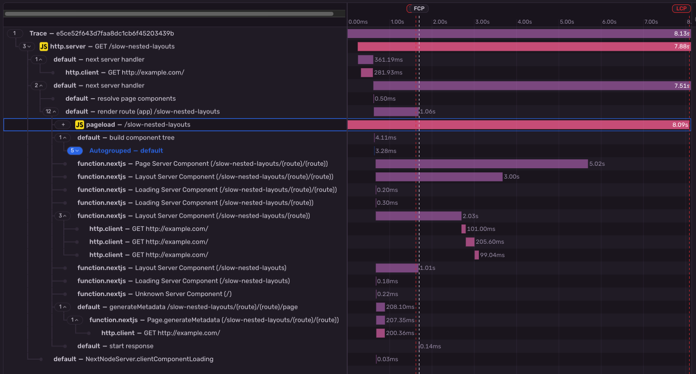

- Start Date: 2024-07-12
- RFC Type: informational
- RFC PR: https://github.com/getsentry/rfcs/pull/138
- RFC Status: draft

# Summary

The hierarchy between Pageload Spans and SSR Spans is currently very confusing.
SSR Spans are the ancestors of Pageload Spans, even though in a real-world scenario the Pageload is always the first thing that happens.
This document discusses how this came to be and how it could be improved.

# Motivation

Today SSR traces look as follows:

The server is the root of the trace and the Pageload Span is attached to some span part of the server transaction.
This is the case because the client SDK loads when the page is served and loaded on the end-user's browser.

If we look closely, the trace looks weird though.
The pageload span starts before the trace root even started.
The reason for this is because we are using browser timings for when the initial page request started as the start timestamp for the pageload span.

UX-wise it would be ideal, if the SSR span were a child of the "request" span, which is a child of the "pageload" span.
That way, we are displaying things in the actual order they're happening.

# Options Considered

We can solve this two ways:

- Flipping the order in the SDKs
- Flipping the order in Sentry

None of the options considered are entirely straight forward.

## Flipping the order in the SDKs

The way this would work is for the server SDK to generate an ID that will be used for two things:

- Optimistically use this ID for the `parent_span_id` of the SSR Span.
- Make the Browser SDK use this ID as the `span_id` for the "request" span.

The ID would need to be transferred from the server to the client in some way.
For this we could hijack the existing `baggage` meta tag implementations.

The drawbacks of flipping the order in the SDK is that we would make the data incorrect:
By optimistically setting the `parent_span_id` of the SSR Span, we may run into situations where we unintentionally orphan that span, for example when somebody requests the page with a non-browser client that will never run the Browser SDK.
Span orphaning could however be mitigated, if we let the SDK set an additional attribute that informs Sentry about the fact that the `parent_span_id` on the SSR transaction is optimistic (e.g. `sentry.has_optimistic_parent_span_id`).

An additional drawback is that we would have to implement transmitting the optimistic span ID in all of Sentry's backend SDKs.

## Flipping the order in Sentry

As it stands, to host this logic in Sentry itself, there are two approaches to consider: Flipping at ingestion-time, and flipping at read time.

A potential downside to consider in any case is that the order should probably also be flipped in other places than just the trace view, which makes flipping the order in Sentry less attractive in general.

### Flipping at ingestion-time

Flipping at ingestion time is generally hard because you basically don't know when your trace is complete enough to make the swapping decision.
We would have to buffer transactions/spans until we have both and only then can we start writing, since data in Clickhouse is immutable.
Since it is non-deterministic whether both transactions will even be sent, there also would need to be some sort of timeout making this approach even flakier.
The cost of having to buffer in addition to the potential complexity makes "flipping at ingestion-time" probably nonviable.

### Flipping at read-time

Flipping at read time is hard because you would need all the spans of the entire trace to make an informed flipping decision. It is not enough to just look at transaction hierarchy.

Flipping the order when querying (ie. when loading the trace view or even purely having custom logic in the UI) might be another viable option.
We should have all the information available. We need to know whether a transaction has `op: pageload` and we need the root of the trace.
Then the order of the two simply needs to be flipped.

The potentially hard part is attaching the trace root to the request span of the pageload transaction.
