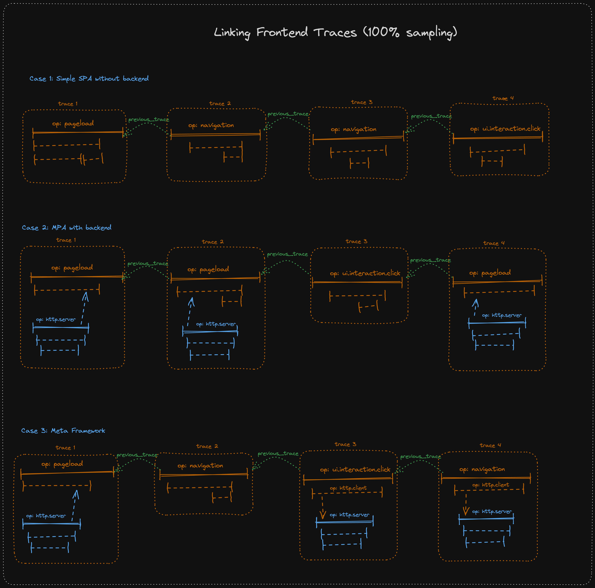
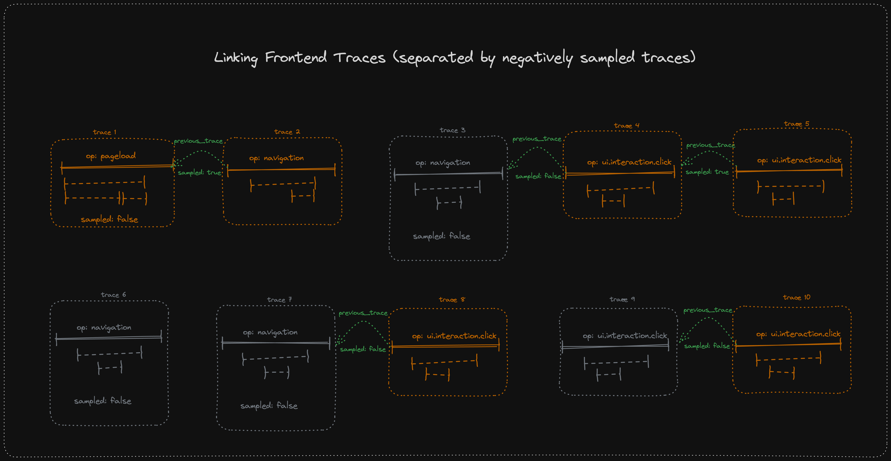

- Start Date: 2024-11-08
- RFC Type: feature 
- RFC PR: [#141](https://github.com/getsentry/rfcs/pull/141)
- RFC Status: draft

# Summary

This RFC introduces the ability to link and connect traces in Sentry. The required changes involve SDKs, Ingest, Search and Storage, Backend as well as product teams.
The goal of this initiative is to be able to link multiple traces together so that the Sentry product can show what happened before a specific trace while preserving the integrity of individual traces.
This RFC proposes to use [Span Links](#preferred-span-links) as a vehicle for specifying relationships between spans across multiple traces. It also discusses other options considered, as well as concrete use cases for this feature.

# Motivation

At the time of writing this RFC, Sentry (the product as well as SDKs) cannot connect multiple traces to deliver a "bigger picture" of what happened before (or after) a specific trace. 
A trace is therefore the highest level of connecting signals (errors, traces, profiles, etc.).
The notable exception is Session Replay, where we are indeed able to provide this bigger picture.
Replay is an opt-in, additional product.

This RFC proposes a method of achieving linkage between (and within) traces in the entire Sentry product, to satisfy a number of currently sub-optimally solved use cases.

## Frontend Traces and User Journeys

The most important application of linking traces are frontend applications. We would like to better display a user journey (session) to make debugging of issues easier as developers get more context on what happened before a specific issue. 
Today, we are limited to the duration of one trace (id), which is handled differently and kept alive for different times across our various SDKs. 

A concrete example are our [JavaScript Browser SDKs](https://develop.sentry.dev/sdk/platform-specifics/javascript-sdks/browser-tracing/#tracing-model) which by default keep a trace alive as long as users
are on the same page or (URL) route. This trace model was a compromise in which we accepted that a trace would consist of multiple trace root spans (transactions) but provides more context. Long-lived traces, with multiple trace root spans, are generally discouraged by tracing models like OpenTelemetry.

Another example of a suboptimal trace model is the one used in most mobile SDKs. In these SDKs, traces are mostly started via idle transactions, meaning transactions start a fixed point but end automatically after a specific period of inactivity (i.e. no child spans being added). Errors occurring while no transaction is active are associated with a "fallback" `traceId` stored on the global SDK scope that stays the same until the SDK is again initialized. The consequence is that potentially hundreds of unrelated events are associated with the same fallback trace as [outlined](https://github.com/getsentry/rfcs/blob/rfc/mobile-tracing-without-performance-v-2/text/0136-mobile-tracing-without-performance-v-2.md) in a previous attempt to improve this behavior.

## Related: Queues, Async and Batch Operations

Somewhat related, we also face situations in which child spans are not started and finished within the time span of their parent span. While generally supported by OpenTelemetry, such traces pose the question of  A concrete example for this is that we [currently recommend](https://docs.sentry.io/platforms/javascript/guides/node/tracing/instrumentation/custom-instrumentation/queues-module/) users to create one trace for a producer-consumer (Queue) cycle, where the spans from the consumer likely start after the producer spans finished. OpenTelemetry in fact [recommends](https://opentelemetry.io/docs/concepts/signals/traces/#span-links) to start separate traces for the consumer, producer or more generally async operations and to link these traces via a span link. Other related use cases are batch processes where one initiator trace triggers a large number of batch processes. Otel also recommends to link these spans instead in favour of grouping them under one trace.

## Additional Use Cases

In addition, besides inter-trace links, we might also be interested in linking spans within one trace, for example to link spans that are related to each other but not in a direct (parent-child or linear) hierarchy. While this is not the main objective of the RFC, our proposed solution would also facilitate this linkage. Some concrete examples (but out of scope):
- (Async) data flow operations (e.g. RxJS pipes) where we would be able to link individual operations.
- Websocket spans where we could link individual web socket messages
- Background data syncs on mobile that you can't directly link to a specific transaction, but it's useful to know that they happened during a transaction. Now, the mobile SDKs put these spans on the transaction bound to the scope.
- More generally, whenever we want to establish a causal relationship between spans that cannot or should not be achieved via a hard hierarchical relationship (traceId or parent spanId)

# Primary, Concrete Goals of achieving linked traces

Once this RFC is accepted, we have settled on all important details needed to implement linked traces.
This means, we have all the necessary information to support the following concrete goals

Product:
- The product is able to handle span links; in a first step at least span links linking to a previous trace (identified by the `'sentry.link.type': 'previous_trace'` [attribute](#preferred-span-links)). It's important to note though that span links are more universal and can define inter- and intra-trace span relationships. We should support links more generally eventually.
- Concrete UI suggestion: Users can navigate between previous/next traces via backwards/forwards buttons in the trace view whenever a next or previous trace is found for the current trace
- Additional UX and UI adjustments are welcomed and up for discussion and decision by product teams
- Given that breadcrumbs will likely be phased out for tracing, trace links are a replacement to show any kind of "previous trace or transaction" information.

Client Infra/Storage:
- SDKs add support for adding links to spans
- We can ingest and store span links
- We can query previous and next traces for a given root span in a given trace.
- Frontend SDKs can automatically add span links so that the current trace root span links back to the previous trace root span


## Secondary goals

- We will shorten the lifetime of frontend traces because we're now able to link to the previous trace instead. This is something we'll do but it's a follow-up and can only be addressed once the primary goals are achieved. 

## Out of scope/Non-Goals

- Querying across linked traces: Given the "linked list" nature of one root span linking back to its previous root span, we accept that obtaining a complete list is an expensive query operation. Therefore, we consider use cases that require a complete list of all linked traces out of scope to start with. We can address this as a follow-up if technically possible but we're aware that this is likely a sub-optimal data structure for such queries. Any storage or ingest decisions to make establishing the complete picture easier (doubly-linked lists, indexes, etc) are encouraged but up to individual teams to decide upon.
- Linking traces started during the rendering of statically generated HTML pages and specific pageload transactions. A span link is ideal here because we don't want the hard link of a trace id. However, a casual link would still increase context and completeness. We might do it but not at this point as it's a follow-up item where span links are a prerequisite.

# Background

This section provides background information of important concepts for this RFC

## OpenTelemetry Span Links

OpenTelemetry introduced the concept of span links to establish causal relationships between individual spans. Such links can be established by

- passing a `links` property to the Otel `startSpan` methods 
- calling `span.addLink(s)` on the span that should link to another span

This also means, that one span can link to multiple other spans. 

Span links are defined in the `Link` interface, which contains the `spanContext` of the span to link to, as well as a set of attributes that describe the link.

Span links are supported by all OpenTelemetry platforms we currently use (or plan on using) for our SDKs: [JavaScript (Node)](https://opentelemetry.io/docs/languages/js/instrumentation/#span-links), [Python](https://opentelemetry.io/docs/languages/python/instrumentation/#adding-links), [Elixir](https://opentelemetry.io/docs/languages/erlang/instrumentation/#linking-the-new-span) and [Java](https://opentelemetry.io/docs/languages/java/api-components/#span).


In an OTLP span export, span links are serialized as follows:

```json
// output was shortened to important fields
{
  "resourceSpans": [
    {
      "scopeSpans": [
        {
          "spans": [
            {
              "traceId": "627a2885119dcc8184fae7eef09438cb",
              "spanId": "ec53f20e4318380d",
              "links": [ // <-- link
                {
                  "attributes": [ // <-- link attributes
                    {
                      "key": "sentry.link.type",
                      "value": {
                        "stringValue": "parent"
                      }
                    }
                  ],
                  // span and trace linked to (from span.spanContext()): 
                  "spanId": "6c71fc6b09b8b716", 
                  "traceId": "627a2885119dcc8184fae7eef09438cb",
                  "traceFlags": 1, // 1: positively sampled; 0: negatively sampled
                  // additional data
                  "traceState": {"foo": "bar"},
                  "droppedAttributesCount": 1
                }
              ],
              "droppedLinksCount": 0
            },
            {
              "traceId": "627a2885119dcc8184fae7eef09438cb",
              "spanId": "6c71fc6b09b8b716",
              "parentSpanId": "13d4cb0933154c29",
              "name": "span-links-txn",
              "links": [],
              "droppedLinksCount": 0
            }
          ]
        }
      ]
    }
  ]
}
```


## Current Session Models in Sentry SDKs

Sentry SDKs do actually send session data, in fact even two types of sessions. However, neither of the two sessions are used and associated with a trace. 

- SDK error sessions: SDKs currently send a session that counts and describes the error status of such a session. Depending on the error, the session is marked as crashed, abnormal or healthy, which is information that powers our Release (Health) product. These sessions are fundamentally flawed though because (at least in Browser JS) they only last as long as the currently loaded page. Every soft or hard navigation causes the session to be ended and a new one to be started. 
- Replay Session: Frontend SDKs persist a replayId in the browser's `sessionStorage` which (even though the name does not suggest it) more accurately models a session than the SDKs' error sessions. We cannot have a hard dependency on this session as Replay is an extra product by Sentry, meaning this replayId is not always reliably set. However, the model of persisting the replay id can be used as a blueprint for how we could persist the last traceId. 

Upon decision from Leadership as well as from it being noted in Sentry's Goal Hierarchy, we will not associate spans or traces via any of these sessions. Instead, the sessions will stay as-is and we will link traces in a "linked list"-style approach as described in this RFC. Still, at some point in the future, we might do so, and the solution in this RFC shouldn't block linking traces and spans to sessions.

# Supporting Data

Sentry users would like to get as much insight as possible when inspecting (errors or performance) issues. Right now, with the notable exception of Session Replay, we can only provide answers as to what happened before an error occurred up to the point when a trace was started. If we can link from the current to the previous trace, we can significantly widen the insight into the entire user journey, which is often crucial to understand why and how a specific issue occurred. 

Given that almost half of the events sent to Sentry can be attributed solely to events sent from Sentry's frontend JavaScript or mobile SDKs, a significant portion of sent events would directly benefit from better linkage between events. Considering that frontend applications almost always have a backend, events sent from backend SDKs would implicitly also benefit from a better tracing model. Wins all around!

While linked traces themselves are not identical to user sessions, we're aware that users have been asking for some kind of connectedness in various forms on GitHub ([example 1](https://github.com/getsentry/sentry/issues/82325), [example 2](https://github.com/getsentry/sentry/issues/72929)) as well as via Sales/Solution Engineers. Typically, in a frontend application context, users would expect Sentry to show them a user _session_. In such cases we explain that Sentry [does track sessions](#current-session-models-in-sentry-sdks), albeit in a flawed way. Right now, we cannot answer questions like, what happened in a previous trace that might have had an impact on the trace with an error. With linked traces, we can.

Looking at other observability providers, they have support for user sessions

- Datadog's browser RUM SDK [tracks a user session](https://github.com/DataDog/browser-sdk/blob/main/packages/core/src/domain/session/sessionManager.ts) via the browser's `sessionStorage` for [up to 15 minutes](https://docs.datadoghq.com/real_user_monitoring/browser/data_collected/).
- Honeycomb.io supports a [session id](https://docs.honeycomb.io/send-data/javascript-browser/honeycomb-distribution/) which is not persisted in storage.
- [Logrocket sessions](https://docs.logrocket.com/docs/what-defines-a-session) can span multiple tabs and have a lifetime of 30 minutes, with some further heuristics for closing tabs

Again, linked traces are not identical to sessions but they can also help answer questions that sessions could answer.

## Implications of Long-lived traces

As mentioned [above](#frontend-traces-and-user-journeys), our current long-lived traces in Browser JS have some negative implications on the Sentry UX:

- Multiple root spans (transactions): Our product can (and should) handle multiple root spans. However, there are some rough edges which are hard to solve from a UI/UX perspective. Our Trace explorer gives traces a name, for instance. If multiple root spans exist, we can only use a heuristic for which span name to use for the "trace name". Furthermore, multiple root spans contradict the conventional concept of a trace, where a trace should only consist of one root span.
- Trace Duration: As soon as a trace spans more than one root span or multiple events, the duration of the trace itself becomes meaningless. While we strongly recommend to generally avoid deducing information from the trace duration, we could improve the current situation by sending less long-lived traces
- Context: While long lived traces do potentially provide more context, given they could include spans or events that happened before an error, they can sometimes contain "too much" context. For instance, very long-running traces in web applications without navigations would contain close to the entire user journey. This makes it harder to understand cause-effect relationships within a trace.
- UI/UX of the trace view: Long running traces are not ideally displayed in the trace view, given the x-axis would span a large time frame. This makes it necessary for users to zoom in and pan around much more than for single-root span traces.
- Sampling and quota increase: If a trace is sampled positively, all transactions within this trace will be sampled positively. This also means that while the positively sampled trace is ongoing, we'd always propagate the positive sampling decision via the `sentry-trace` header to downstream services on outgoing requests. Assuming these services are configured to only sample already sampled traces, we'd send more events on an org-wide basis than if we rolled the dice more often (like in short-lived traces). This [increases quota usage](https://github.com/getsentry/sentry-ruby/issues/2318) for our customers without them necessarily being aware of it. 
 
If we can link traces, we can ultimately shorten individual trace lengths and remove most of these disadvantages again.

To be clear, the Sentry product will always need to support long-lived/multiple root span traces. While we can remove them from SDKs supporting this model, older SDK versions will stick around and users can also manually create long-lived traces.

# Options Considered

## [Preferred] Span Links

We propose to add links on a span level, as defined and specified by [OpenTelemetry](https://opentelemetry.io/docs/concepts/signals/traces/#span-links). In addition to linking to span ids, a span link also holds meta information about the link, collected via attributes. We'll make use of these attributes by annotating our created span links with a `sentry.link.type` attribute which we can later use in the product to query for linked traces.

Importantly, span links can only link to other _spans_. We will not support linking a span to an error or other Sentry events.

### SDK APIs

To support adding span links, SDKs need to expose at least an `addLink` method on their respective `Span` interface. For completeness with OpenTelemetry, ideally they also expose `addLinks`:

```TypeScript
interface Span {
  // return value can differ depending on platform
  addLink(link: Link): this;
  addLinks(links: Link[]): this;
}
```

Furthermore, when starting spans (via `startSpan` functions), links can also be passed into the span start options:

```TypeScript
function startSpan(options: StartSpanOptions);

interface StartSpanOptions: {
  //... other options (name, attributes, etc)
  links?: Link[];
}
```

SDKs should follow the OpenTelemetry spec for the [`Link` interface](https://github.com/open-telemetry/opentelemetry-js/blob/main/api/src/trace/link.ts) as defined by the platform. Non-Otel SDKs should orient themselves on Otel, resulting in the following interface:

```typescript
interface Link {
  // contains the SpanContext of the span to link to
  context: SpanContext;
  // key-value pair with primitive values
  attributes?: Attributes;
}


// see https://github.com/open-telemetry/opentelemetry-js/blob/main/api/src/trace/span_context.ts
// or interface of respective platform
interface SpanContext {
  traceId: string,
  spanId: string,
  traceFlags: number,
}

type Attributes = Record<string, AttributeValues>
type AttributeValues = string | boolean | number | Array<string> | Array<boolean> | Array<number>
```

Note: On some platforms, the Otel `Link` interface exposes other optional properties, for example `droppedAttributesCount` and `traceState`. POtel SDKs should support passing in this property as defined by the API but can choose to ignore it when serializing the span link to Sentry envelopes, or simply serialize it, too.  In [JS for example](https://github.com/open-telemetry/opentelemetry-js/blob/main/api/src/trace/link.ts), the `droppedAttributeCount` can be passed, while [Python](https://github.com/open-telemetry/opentelemetry-python/blob/main/opentelemetry-api/src/opentelemetry/trace/span.py#L120) does not permit it. 
Non-Otel SDKs are free to ignore these properties.

Note II: POtel SDKs today already have to expose `addLink(s)` APIs, however we simply disregard the added links when serializing Otel spans to transaction event envelopes. Furthermore, for platform agnostic APIs, the non-POtel browser SDKs today also expose these methods. They simply no-op at the moment.

#### Usage Example

Adding span links should be possible at span start time, as well as when holding a reference to the span:

```typescript
// 1st trace starts
const pageloadSpan = startInactiveSpan(...)

// 2nd trace starts
const navigation1Span = startInactiveSpan({
  name: '/users', 
  links: [{
    context: pageloadSpan.spanContext(), 
    attributes: {
      'sentry.link.type': 'previous_trace'
    }
  }]
});

// 3rd trace starts
const navigation2Span = startSpan({name: '/users/:id'}, (span) => {
  span.addLink({
    context: navigation1Span.spanContext(), 
    attributes: {
      'sentry.link.type': 'previous_trace'
    }
  })
})
```

In this example, by adding span links, we can link from the last navigation trace all the way back to the initial pageload trace. By passing the `'sentry.link.type': 'previous_trace'` attribute, we can identify the link as a previous trace link in Sentry and display the spans accordingly. 

#### SDKs relying on Transactions

Adding span links should behave identically regardless of links being added to a root/segment (transaction) or child spans. For SDKs still having public APIs around transactions, their respective `Transaction` interface and `startTransaction` function(s) should support the same APIs. 

#### Storing links and previous traces

SDKs are free to chose whatever storage mechanism makes sense to store span links themselves as well as to hold references to a previous span. This is considered an implementation detail and out of scope for this RFC.

### Envelope Item Payload Changes

Span trees are serialized to transaction event envelopes in all Sentry SDKs. Therefore, the envelope item needs to accommodate span links in its payload.

We propose to store span links in the `trace` context if the root span has links, similarly to how we serialize root span attributes today:

```typescript
// event envelope item
{
  type: "transaction";
  transaction: string;
  contexts: {
    trace: {
      span_id: string;
      parent_span_id: string;
      trace_id: string;
      // new field for links:
      links?: Array<{
        "span_id": string,
        "trace_id": string, 
        sampled?: boolean, // traceFlags from Otel converted to boolean
        attributes?: Record<string, AttributeValue>,
        // + potentially more fields 1:1 from Otel. e.g. (traceState, droppedAttributesCount)
      }>
      // ...
    }
  }
  // ...
}
```

For links stored in child spans, SDKs should serialize them to `spans[i].links`:

```typescript
// event envelope item
{
  type: "transaction";
  transaction: string;
  spans: Array<{
    span_id: string;
    parent_span_id: string;
    trace_id: string;
    // new field for links:
    links?: Array<{
      "span_id": string,
      "trace_id": string,
      sampled?: boolean,
      attributes?: Record<string, AttributeValue>,
    }>
    // ...
  }>
  // ...
}
```

This means that the serialized links objects should always contain:

- `span_id: string` - id of the span to link to
- `trace_id: string` - trace id of the span to link to
- `sampled: boolean` - required if sampling decision of the span to link to (corresponds to `traceFlags` in Otel span context converted to `boolean`) is available
- `attributes:` - required if attributes were added to the link

Optionally, they can contain further fields like `traceState` or `droppedAttributesCount` which will be largely ignored unless we find a use case for them.

### Setting `previous_trace` span links

We can link traces by defining span links on the root spans of respective frontend traces. The general idea is to store the span context of the previous root span in a a storage mechanism of choice (e.g. `sessionStorage` in the browser) and read/write to it when necessary:

Therefore, on root span start:
  * Check if there is a previous span context stored
    * If yes, add the span link with the `'sentry.link.type': 'previous_trace'` attribute
  * Store the root span context as the previous root span in a storage mechanism of choice (e.g. `sessionStorage` in the browser)

SDKs are free to implement heuristics around how long a previous trace span context should be considered (max time) and store additional necessary data.

This means that the last-started root span will be denote the previous trace. In situations, where multiple root spans are started in parallel, the last started span "wins". However, the multiple root spans aspect of this should play a negligible role in Sentry SDKs, given our SDKs don't allow for this by default and it would require significant manual user setup. We acknowledge though that this could lead to potentially confusing relationships. 

The following diagram shows optimal examples with a `tracesSampleRate` of `1.0`, meaning every span tree is positively sampled, sent to Sentry and therefore connected via a span link: 



As one can see from the diagram, `previous_trace` span links are only necessary on frontend SDKs today. For traces started on the backend (like in Case 2), the trace links are on `pageload` transactions which are **not** the head-of-trace transactions. Our product should still be able to link the traces correctly in the trace view.

### Dealing with negatively sampled traces

In many cases, with lower sample rates, we will not be able to provide a full trace link chain, due to some or many traces being negatively sampled. However, sampled root spans should still include a link to the previous, negatively sampled root span. The `traceFlags` on the `spanContext()` will carry the information that the previous trace root span was negatively sampled. This helps our product to hint that there _would have been_ a previous trace but it was negatively sampled. 



It's worth noting that we will not link to the previous positively sampled trace if a negatively sampled trace is in-between (see Traces 2-4 in the diagram). Furthermore, we will not show _how many_ traces were negatively sampled in between two trace chains; only that there was at least one trace in between (see Trace 5-8). 

There are some ideas how we could show multiple negatively sampled spans as well as how we could connect traces with gaps due to sampling. For now, we'll disregard this because there's no concrete use case, yet. However, given spans can have multiple links and links can have attributes, we could add this information later on, if we deem it necessary.

### Ingest / Relay

Relay should forward the span links in the format that is required for further processing and storage. 
Importantly, we must not require span links to be defined. They are completely optional.

As a further requirement, Relay needs to handle passing along span links in the root span as well as in any child span (see [envelope payload](#envelope-item-payload-changes)).

We will specify the expected type and structure of the `links` array and its contents in Relay, so that we can discard malformed payloads. 
This further includes specifying the type of the `sentry.link.type` attribute value to be a string.

### Storage

We need to adapt our events table to support storing span links in our current event storage. Furthermore, we need to take span links into account for the EAP storage architecture.

Our storage system needs to handle storing span links on root spans (i.e. today's `transaction` event) as well as on child spans or EAP spans in the future. 

Furthermore, for `previous_trace` span links, we need to set up an index or a lookup table that enables us to query the **next trace**. More specifically, we need to be able to support a query like:Given a transaction (span) `t`, list transactions (spans) that have span links with the attribute `sentry.link.type === "previous_trace"` to  `t`.

### Advantages

- Span links allow us to link from one span to multiple other spans
- Due to attributes, we can define various types of span links (`'sentry.link.type': 'previous_trace'`)
- Span links are an established concept in OpenTelemetry
- We already expose `addLink(s)` APIs in POtel SDKs which currently are non-functional. Adding functionality increases our interop with Otel.

### Drawbacks

- Implementing span links requires a lot of of changes across SDKs, ingest, SnS. Also there are product changes required to make use of links. 

### Implementation plan: 

For an MVP and to validate that trace links work, we'll introduce span links on today's transaction events. In a future step, we'll ensure that this also works on our EAP storage system.

The rough MVP implementation order:

1. Ensure Storage can store along span links in `transaction` events today. If not, make necessary changes. Create index/lookup table so that we can query the "next" trace of a given root span/transaction.
2. Ensure Relay can forward `transaction` events with span links. If not, make necessary changes. Specify types, expected payload structure and discard malformed links.
3. Implement PoC in SDK, most probably the JS SDK, to send `transaction` envelopes with span links for previous traces
4. Add previous and next trace buttons to trace view.

In this order, 1 and 2 have potential overlap. 3 and 4 can happen in parallel, depending on prioritization, available data and capacity.  

Once trace chains consisting of previous and next traces can be shown in the UI based on `transaction` event envelopes, we'll move forward with adding general span link and `previous_trace` span link support to EAP.

## [Alternative] Previous Trace Id

A slightly simpler but less powerful approach to span links would be to specifically store a "previous trace id" attribute on the current root span and serialize it as such in the event envelope item.
Setting such a previous trace id could happen on `startSpan()` calls or by calling `span.setAttribute()` at any time. 

While this might seem simpler at first glance, it has a some drawbacks:
- Spans can only have a 1:1 relationship, either with a `traceId` or a `traceId-spanId` value. Span links support a 1:N relationship, where one span can link to multiple other spans in- or outside its trace
- Span links are an established concept in OpenTelemetry. With Sentry increasingly adapting Otel standards, as well as creating an OTLP endpoint in the future, we should embrace Otel-suggested solutions rather than building our own.
- Attributes are not indexed in our current data storage solution, meaning queries like getting the "next" instead of previous traces are likely impossible or (best case) require the same level of indexing as span links require to show next traces.
- POtel SDKs, as well as the browser JS SDKs, already expose span link APIs but they currently no-op and are not sent to Sentry. This is currently very opaque behavior and potentially confusing to users familiar with Otel APIs concepts.

# Answered Questions

- **Can we do this with our current event storage? Are we blocked on EAP?**

  We will certainly need to adapt our current event storage but it is possible to do this without being blocked on EAP. We'll separately also need to adjust the planned span schema for EAP but this is not a blocker but a follow-up task after the MVP implementation.


- **How would we handle errors outside of an active span?**

  Errors happening while no span is active, should (as currently is the case in JS Browser SDKs) attach to the last created trace. Therefore, they will store all required trace information of the last started trace in their `trace` context.

- **Should we (try to) keep sampling decisions consistent for subsequent (frontend) traces? IOW: If we sample the initial trace, should all subsequent traces be force-sampled as well?**

  As of today, Sentry's client sampling and server/dynamic sampling logic is trace-based. There's a strong case to _not_ sample consistently _across_ traces. We have specific biases to sample individual traces more in DS to get more samples of “interesting” spans. If we didn’t send these traces at all because in a previous trace we made a negative sampling decision, users would loose a lot of interesting data. 
  
  This is in-line with the EPD summit decision to focus on handling incomplete traces, just a level "higher".

  Furthermore, things get much more complicated if we take into account that users don’t only sample uniformly via a `tracesSampleRate` but also arbitrarily via `tracesSampler` APIs. In the latter case, by enforcing a consistent sampling decision on the first trace, we could end up with significantly more or less traces (potentially none) than with today’s trace-based sampling strategy. 

  Even if we were to sample consistently, for example across frontend transaction, we could never (due to technical/browser limitations) sample all transactions/traces perfectly. Concretely, we cannot propagate a sampling decision in multi-page applications across individual page requests. We can still partially connect the frontend transactions, and establish the trace relationship, but consistent sampling is impossible. 

- [Further internal concerns and answers](https://www.notion.so/sentry/Addressing-Concerns-RE-linked-traces-14b8b10e4b5d80b68a4cc9352c8a3d00)