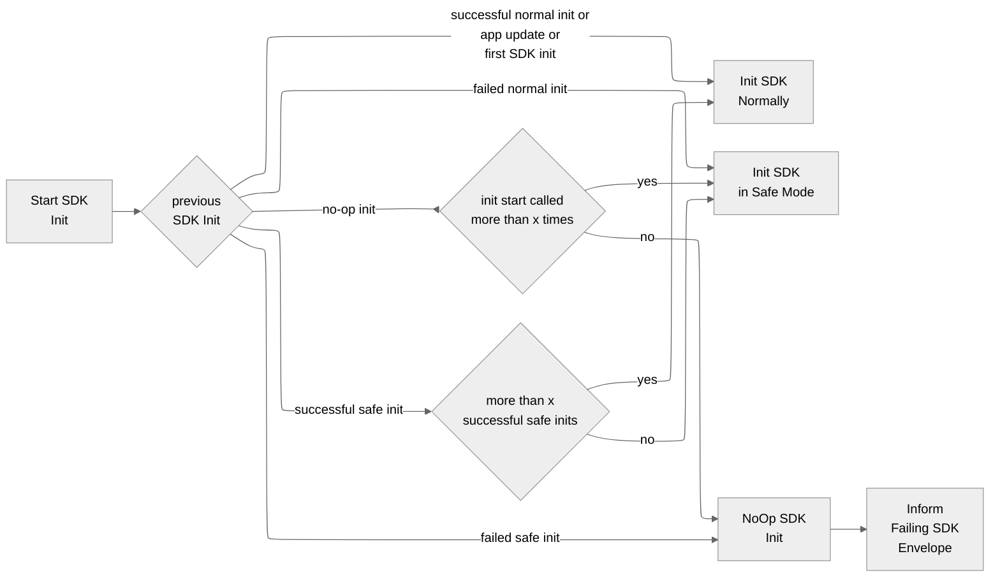

- Start Date: 2024-11-12
- RFC Type: feature
- RFC PR: https://github.com/getsentry/rfcs/pull/143
- RFC Status: draft

# Summary

This RFC aims to find strategies to minimize the damage of a crashing Sentry SDK in production, especially during the application start and when the Sentry SDK fails to send crash reports.

# Motivation

Our customers use Sentry to ship confidently. They lose trust in Sentry if our SDKs continuously crash their apps, especially during app start, making the application unusable. The worst-case scenario is when our SDK fails to send a crash report, and we're unaware. Our QA process should prevent that, but you can never reduce that risk to 0.00%. These fatal incidents are hazardous, mainly for applications with a slow release cycle, such as mobile apps, because customers can't deploy a hotfix within hours. A continuous Sentry SDK crash will again make it to our customers. When it does, we must have strategies to minimize the damage.

# Background

The Cocoa SDK had an incident in July/August 2024 that continuously crashed our customers' apps in production without sending crash reports to Sentry. We only knew about the issue when customers reported that they stopped receiving data for their newest release and shared crash reports from AppStoreConnect with us.

Why didn't the [SDK crash detection](https://github.com/getsentry/sentry/tree/master/src/sentry/utils/sdk_crashes) help us to identify the issue? For those who do not know, the SDK crash detection allows us to view SDK crashes in Sentry. It checks every ingested event in the processing pipeline for a potential SDK crash. When detecting one, it only keeps the most essential data due to PII and copies the crash event to dedicated Sentry projects. The SDK crash detection helps fix crashing SDK bugs. Still, it only works when the SDK crash events make it to Sentry, which wasn't the case in the abovementioned incident.

To identify and minimize the damage of such incidents, we need to develop extra strategies. To get there, we have to solve three different problems:

1. [**A: Detecting a continuously crashing SDK**](#a-detecting-continuous-sdk-crashes): First, we need to know when our SDKS continuously crash our customers.
2. [**B: Minimizing the damage of a continuously crashing SDK**](b-minimizing-the-damage): It's better to have no data than crashes and no data.
3. [**C: Knowing when and why the SDK is continuously crashing**](#c-knowing-when-the-sdk-is-disabled): After minimizing the damage, we still need to fix the root cause. We can only do that if we're aware and have some data to fix the problem.

We're going to look at each one of the problems in an extra section below. But before we do, we must look at related topics impacting the ideal solution.

## Other topics

### App Start Crash Detection <a name="app-start-crash-detection"></a>

The native SDKs, Cocoa and Android, have an app start crash detection logic: The SDK init waits synchronously for up to 5 seconds to flush out events if the app crashes within 2 seconds after the SDK init.

### Hybrid SDKs

Hybrid SDKs, such as React-Native and Flutter, make things more complicated, because we have different SDKs running in parallel in the same app. It can happen that the hybrid SDK crashes during its initialization but the native SDK doesn't.

### Crashing While Writing a Crash Report

Crashing while writing a crash report is terrible but not as fatal as continuously crashing an application. As the SDKs should only write crash reports when the application is already crashing, the damage is missing data, which doesn't impact the stability of the SDK. As the main focus of this RFC is to find strategies to minimize the damage of a continuous crashing SDK, this scenario is out of the scope of this RFC. Still, an [idea](#idea-2) exists to address this problem at the bottom of the RFC.

## Out of Scope

We want to focus on continuous SDK crashes, and the following points are out of the scope of this RFC:

1. Detecting SDK bugs such as missing data or broken functionality.
2. Implementing some health checks for parts of the SDK, such as integrations.

# Recommended Approach

The recommended approach solves the three problems mentioned [above](#background):

1. [A: Detecting a continuously crashing SDK](#a-detecting-continuous-sdk-crashes) with [Checkpoints](#option-a1).
2. [B: Minimizing the damage of a continuously crashing SDK](b-minimizing-the-damage) with [Safe Mode](#option-b1) and [NoOp Init](#option-b2).
3. [C: Knowing when and why the SDK is continuously crashing](#c-knowing-when-the-sdk-is-disabled) with [Failing SDK Envelope](#option-c1) and [Retry Logic](#option-c2).

After detecting a potential SDK crash via [checkpoints](#option-a1), the SDK switches to a [safe SDK mode](#option-b1), a bare minimum SDK with only essential features. When the SDK initialization fails in the safe mode, the SDK makes the initialization a [NoOp (no operation)](#option-b2), communicating this to a [failing SDK envelope](#option-c1). When in fail-safe mode, the SDK adds a yet-to-be-defined field in the SDK context so that we and our users know when it is active. To minimize the risk of staying incorrectly in the NoOp mode, the SDK implements a [retry logic](#option-c2), which switches to the safe mode after being initialized x times in the NoOp mode. The same applies to the safe mode. The SDK switches back to a normal initialization after being initalized x times in the safe mode. While the retry mode will yield further crashes in the worst-case scenario, it ensures our users still receive some SDK crashes in the App Store Connect and the Google Play Console, which is essential for fixing the root cause. We accept this tradeoff over completely flying blind. We might use the [stacktrace detection](#option-a3) in addition to the checkpoints on platforms that allow it.



# Problems to Solve

This section looks at the three different problems we need to solve:

1. [Detecting Continuous SDK Crashes](#a-detecting-continuous-sdk-crashes)
2. [Minimizing the Damage](#b-minimizing-the-damage)
3. [Knowing When the SDK is Disabled](#c-knowing-when-the-sdk-is-disabled)

## A: Detecting Continuous SDK Crashes <a name="a-detecting-continuous-sdk-crashes"></a>

First, we need to know when our SDKs continuously crash our customers. Only then can we act accordingly. We categorize crashes into four different time categories:


1. **Before SDK Init:** When a crash occurs before the user calls the SDK init method.
2. **During SDK Init:** When a crash occurs during the SDK initialization, which can either be caused by the SDK or async by user code.
3. **Shortly After SDK Init:** When a crash occurs shortly after the SDK initialization, which again can be caused either by the SDK or by user code. These crashes are a bit more complicated to detect because it's hard to differentiate between a crash in the SDK or the user's code.
4. **After SDK Init:** When a crash occurs some time after the SDK init.

Now, let's have a look at the different scenarios for a continuously crashing SDK with different severities before we look at the potential solutions.

### Continuous Crash Scenarios

As mentioned in the [motivation](#motivation), minimizing the damage caused by continuous SDK crashes during the app start is the highest priority. These SDK crashes either occur during the SDK init or shortly after. Potential solutions must cover the first two scenarios below. Covering scenario 3 is still important, but we can delay it a bit:

#### Scenario 1: Worst Case - SDK Continuously Crashing During App Start No Crash Reports <a name="continuous-crash-scenario-1"></a>

The worst case scenario is a continuously crashing SDK during app start that cannot send crash events to Sentry. The reason for this could be a crash in the SDK initialization code or while sending a crash report or other data. The app is in a death spiral, meaning it continuously crashes during the app start and is unusable.

Finding a strategy to escape the death spiral is vital because not only does it crash our users, but we stay in the dark and must rely on them to report the problem. This scenario is painful for our users because it takes time to realize what is crashing their app, as they must use other tools such as App Store Connect or the Google Play Store to identify the root cause. Once they identify the root cause, they must publish a new release, which can take several hours or even days. Finally, they must rely on their users to update their apps to fix the issue. Some users might lose trust in Sentry even if this only happens once.

#### Scenario 2: Almost Worst Case - SDK Continuously Crashing During App Start Can Send Crash Reports <a name="continuous-crash-scenario-2"></a>

Almost as bad as scenario 1. The SDK crashes continuously during app start but can still send crashes to Sentry. Now, the SDK crash detection can identify this and alarm us, and our users see in Sentry that the Sentry SDK is crashing their app. Our users rely on Sentry to notify them but must immediately release a hotfix. There is still damage, but they most likely still trust Sentry because we informed them about the problem. Some users might again lose trust in Sentry.

#### Scenario 3: SDK Continuously Crashing Shortly After SDK Init <a name="continuous-crash-scenario-3"></a>

Finally, a bad-case scenario is our SDK crashing continuously shortly after the app start. The app might be unusable as it constantly crashes at a specific area, or only certain features stop working. The Sentry SDK should still be able to send a crash report, so the SDK crash detection should surface this, and our users can see the crashes in their data. If the SDK can't send a crash report, this scenario can either turn into scenario 1, where sending a crash report continuously crashes, or the SDK can't send crash reports, which is also bad but out of the scope of this RFC. Similar to scenario 2, our users must release a hotfix, and they could lose trust, but it is better than [scenario 1](#continuous-crash-scenario-1).

#### Scenario 4: SDK Continuously Crashing After SDK Init

Similar to [scenario 3](#continuous-crash-scenario-3), but the SDK crash happens after the SDK init. 

### Potential False Positives

There are crashing scenarios that could look like the Sentry SDK is causing the crash, but it's the user's application code. We need to keep these scenarios in mind, but we can only ignore some of these and inform our users via documentation how to prevent them:

#### Scenario 1: User's Application Crashes Before SDK Initialization

The user's application crashes before the initialization of the Sentry SDK. We can only educate our users about the importance of initializing the Sentry SDK as early as possible. We can't disable the SDK, as it never initializes.

#### Scenario 2: User's Application Crashes Async During SDK Initialization

The user's application crashes async during the initialization of the Sentry SDK. It could be that the Sentry SDK can send a crash report to Sentry or not. When the SDK detects a crash during its initialization, it switches to the SDK Safe Mode, which runs the SDK with the essential SDK features. If the SDK fails to finish its initialization and can't send a crash report to Sentry, it doesn't make a difference if the SDK is enabled or disabled.

#### Scenario 3: User's Application Crashes Shortly After SDK Initialization

The user's application crashes shortly after the SDK initialization. We have to ensure that we're not wrongly disabling the Sentry SDK. Still, suppose we detect that the app continuously crashes after x seconds of the Sentry SDK initialization. In that case, switching to the SDK Safe Mode might be acceptable to minimize the risk of the Sentry SDK being the root cause. Furthermore, our users will mainly be interested in the crash events, not other data such as performance or session replay.

#### Scenario 4: User's Application Crashes After SDK Initialization

This happens frequently, and we must ensure that the SDK correctly ignores this scenario.

### Option A1: [Preferred] Checkpoints <a name="option-a1"></a>

The SDK uses two checkpoints to identify if it can start successfully. The first checkpoint is the **start init**, which marks that the SDK started initialization. The second checkpoint is the **success init** checkpoint. This checkpoint marks that the SDK could successfully initialize. Every time the SDK initializes, it validates the checkpoints from the previous SDK initialization. Therefore, the SDK must persist the checkpoint information across SDK initializations. Based on which checkpoints were successfully persisted, the SDK can decide if it was initialized successfully on a previous run.

The specification is written in the [Gherkin syntax](https://cucumber.io/docs/gherkin/reference/) and might not work for all edge cases yet, as it can be complicated to get it right. We'll figure out the exact details once we decide to implement it, but it should cover the main scenarios. The spec uses marker files for the checkpoints, which might be replaced by key-value storage depending on the platform. You can read more about that after the specification.

```Gherkin
Scenario: App version inits the first time
    Given there is no start init marker file for the app version
    And there is no success init marker file for the app version
    When the SDK inits
    Then the SDK creates a start init marker file for the app version

Scenario: App version inits the first time with successful init
    Given there is no start init marker file for the app version
    And there is no success init marker file for the app version
    When the SDK reaches the successful init checkpoint
    Then the SDK creates a success init marker file for the app version

Scenario: SDK version inits successfully second time with previous successful init
    Given there is a start init marker file for the app version
    And there is a success init marker file for the app version
    When the SDK inits
    Then it deletes the success init marker file for the app version
    When the SDK reaches the successful init checkpoint
    Then the SDK creates a success init marker file for the app version

Scenario: App version inits with failure second time with previous successful init
    Given there is a start init marker file for the app version
    And there is a success init marker file for the app version
    When the SDK inits
    Then it deletes success init marker file for the app version
    When the SDK crashes before reaching the successful init checkpoint
    Then the SDK can't create a success init marker file for the app version

Scenario: App version inits with previous failed init
    Given there is a start init marker file for the app version
    And there is no success init marker file for the app version
    When the SDK inits
    Then it determines a failed init

Scenario: New App version inits with previous failed init
    Given there is a start init marker file for a previous app version
    And there is no success init marker file for the previous app version
    And there is no success init marker file for the current app version
    When the new app version inits
    Then the SDK deletes marker files from the previous app version
    And the SDK creates a start init marker file for the current app version
```

As we must access checkpoint information during the application launch, we must choose an efficient way to read and write this information to not slow down our users' apps. Depending on the platform, we can use marker files, key-value stores such as [UserDefaults](https://developer.apple.com/documentation/foundation/userdefaults) on Apple or [SharedPreferences](https://developer.android.com/reference/android/content/SharedPreferences) on Android or System APIs like [ApplicationExitInfo on Android](https://developer.android.com/reference/android/app/ApplicationExitInfo). Marker files are more efficient than reading file contents because, for these, the OS only needs to check the file's existence, which is usually a system metadata look-up. We still need to determine which approach is the most efficient.

#### Continuous Crashing Scenarios <a name="option-a1-scenarios"></a>

Notes on [continuous crashing scenarios](#continuous-crash-scenarios):

| Scenario | Covered | Notes |
| --- | --- | --- |
| 1. Worst Case - SDK Continuously Crashing During App Start No Crash Reports | ✅ - yes |  |
| 2. Almost Worst Case - SDK Continuously Crashing During App Start Can Send Crash Reports | ✅ - yes |  |
| 3. SDK Continuously Crashing Shortly After SDK Init | ⛔️ - no | But the [app start crash detection](#app-start-crash-detection) will try to flush out the crash report. We're still crashing our users, but we're at least aware via the [SDK crash detection](#option-a2). |
| 4. SDK Continuously Crashing After SDK Init | ⛔️ - no | No, but the SDK can send the crash report and we can fix the problem. |

Notes on [potential false positives](#potential-false-positives):

| Scenario | Covered | Notes |
| --- | --- | --- |
| 1. User's Application Crashes Before SDK Initialization | ⛔️ - no | No option can cover this. |
| 2. User's Application Crashes Async During SDK Initialization | ⛔️ - no | The SDK would incorrectly detect a failed init. |
| 3. User's Application Crashes Shortly After SDK Initialization | ✅ - yes | The SDK correctly ignores this scenario. |
| 4. User's Application Crashes After SDK Initialization | ✅ - yes | The SDK correctly ignores this scenario. |

#### Pros <a name="option-a1-pros"></a>

1. It can detect if the SDK crashes during its initialization for any technical setup and when the crash handlers can't capture the crash.
2. SDKs could use checkpoints to identify the failure of other critical actions, such as writing a crash report.
3. It works when the SDK is offline.
4. It can be implemented solely in the SDKs, and doesn't require any changes on the backend.

#### Cons <a name="option-a1-cons"></a>

1. It requires extra disk I/O and negatively impacts the SDK startup time.
2. It could incorrectly disable the SDK when the app crashes async during the initialization of the Sentry SDK.
3. Once the SDK is disabled, the SDK stays disabled until it retries.
4. It could incorrectly disable the SDK when the user's app manipulates the SDK's marker files.
5. It won't work when there is no disk space left.
6. The logic could get complex for hybrid SDKs.

### Option A2: SDK Crash Detection <a name="option-a2"></a>

We have already used the SDK crash detection to surface continuous SDK crashes after its initialization. This only works when the SDK can send a crash report, which happens on the server.

#### Continuous Crashing Scenarios <a name="option-a2-scenarios"></a>

Notes on [continuous crashing scenarios](#continuous-crash-scenarios):

| Scenario | Covered | Notes |
| --- | --- | --- |
| 1. Worst Case - SDK Continuously Crashing During App Start No Crash Reports | ⛔️ - no | The SDK crash detection needs crash reports to work. |
| 2. Almost Worst Case - SDK Continuously Crashing During App Start Can Send Crash Reports | ✅ - yes |  |
| 3. SDK Continuously Crashing Shortly After SDK Init | ✅ - yes |  |
| 4. SDK Continuously Crashing After SDK Init | ✅ - yes |  |

Notes on [potential false positives](#potential-false-positives):

| Scenario | Covered | Notes |
| --- | --- | --- |
| 1. User's Application Crashes Before SDK Initialization | ⛔️ - no | No option can cover this. |
| 2. User's Application Crashes Async During SDK Initialization | ✅ - yes | The SDK crash detection correctly ignores this scenario. |
| 3. User's Application Crashes Shortly After SDK Initialization | ✅ - yes | The SDK correctly ignores this scenario. |
| 4. User's Application Crashes After SDK Initialization | ✅ - yes | The SDK correctly ignores this scenario. |

#### Pros <a name="option-a2-pros"></a>

1. It already exists.
2. It correctly ignores all potential false positives.
3. It works for all SDK crash scenarios when the SDK can send a crash report.

#### Cons <a name="option-a2-cons"></a>

1. It doesn't work for SDK init crashes.
2. It doesn't only works for single tenants or self-hosted.
3. It runs on the server, so it's delayed, and we need extra functionality to communicate the failing SDK info to the SDKs.
4. It doesn't work offline.

### Option A3: Stacktrace Detection <a name="option-a3"></a>

Before sending a crash report, the SDK identifies an SDK crash by looking at the topmost frames of the crashing thread. If the topmost frames stem from the SDK itself, it disables itself. The [SDK crash detection](https://github.com/getsentry/sentry/tree/master/src/sentry/utils/sdk_crashes) already uses this approach in the event processing pipeline.

#### Continuous Crashing Scenarios <a name="option-a3-continuous-crashing-scenarios"></a>

Notes on [continuous crashing scenarios](#continuous-crash-scenarios):

| Scenario | Covered | Notes |
| --- | --- | --- |
| 1. Worst Case - SDK Continuously Crashing During App Start No Crash Reports | ⛔️ - no | The stacktrace detection needs crash reports to work. |
| 2. Almost Worst Case - SDK Continuously Crashing During App Start Can Send Crash Reports | ✅ - yes |  |
| 3. SDK Continuously Crashing Shortly After SDK Init | ✅ - yes |  |
| 4. SDK Continuously Crashing After SDK Init | ✅ - yes |  |

Notes on [potential false positives](#potential-false-positives):

| Scenario | Covered | Notes |
| --- | --- | --- |
| 1. User's Application Crashes Before SDK Initialization | ⛔️ - no | No option can cover this. |
| 2. User's Application Crashes Async During SDK Initialization | ✅ - yes | The stacktrace detection correctly ignores this scenario. |
| 3. User's Application Crashes Shortly After SDK Initialization | ✅ - yes | The stacktrace detection correctly ignores this scenario. |
| 4. User's Application Crashes After SDK Initialization | ✅ - yes | The stacktrace detection correctly ignores this scenario. |


#### Pros <a name="option-a3-pros"></a>

1. It requires little to no extra overhead.
2. It can ignore async app crashes during SDK initialization.
3. It is the most reliable option to detect if the SDK crashes.

#### Cons <a name="option-a3-cons"></a>

1. __Doesn't work with static linking:__ This approach doesn’t work with static linking, as the Sentry SDKs end up in the same binary as the main app. As we don’t have symbolication in release builds, we can’t reliably detect if the memory address stems from the Sentry SDK or the app. We might be able to compare addresses with known addresses of specific methods or classes, but this won’t work reliably. As with iOS, many apps use static linking, so we must use an alternative approach.
2. __Doesn't work for obfuscated code:__ For obfuscated code, detecting if a frame in the stacktrace stems from the Sentry SDK or the app can be difficult or even impossible.
3. __Wrongly disabling the SDK:__ We frequently see wrongly reported SDK crashes in the SDK crash detection. As SDKs use bytecode manipulation, swizzling, or monkey patching, the stacktraces sometimes contain Sentry frames in the crashing thread, but the root cause isn't Sentry but the user's code.
4. It doesn't work when the SDK crashes during or before sending the crash report.
5. It doesn't work when the SDK crashes before installing the crash handlers.

## B: Minimizing the Damage <a name="b-minimizing-the-damage"></a>

### Option B1: SDK Safe Mode  <a name="option-b1"></a>

Similar to Windows Safe Mode, our SDKs use a special safe mode that only runs the bare minimum SDK features; if the SDK detects it continuously crashes, it initializes in the safe mode. The SDK only enables crash handlers, session tracking, and functionality that enriches the scope, but it doesn't enable tracing, profiling, session replay, and automatic breadcrumbs. We still need to define the exact feature set, which can vary per SDK. SDKs must clearly mark that data stems from the safe mode so that users and we are aware.

To avoid being stuck in the Safe Mode, the SDK always switches back to normal mode after an app update, or after the SDK initializes successfully in safe mode for x times.

#### Pros <a name="option-b1-pros"></a>

1. The SDK still works for crashes if there is a critical bug in most areas of the SDK. For example, if a bug in session replay continuously crashes the app shortly after SDK initialization, the SDK will still report crashes.

#### Cons <a name="option-b1-cons"></a>

1. If the crash occurs in the safe mode, the SDK causes an extra crash before disabling itself.

### Option B2: NoOp SDK Init <a name="option-b2"></a>

The SDK makes the SDK init a NoOp (no operation) when it detects a continuous crash with one of the options of [A](#options-for-detecting-sdk-crashes), which most likely is going to be  [Option A1](#option-a1), as [Option A2](#option-a2) runs on the server and [Option A3](#option-a3) doesn't work with static linking. This is the last resort and we should try to avoid this as much as we can, but it's better to have no data than crashes and no data. To minimize the risk of staying wrongly in NoOp mode and to avoid flying completely blind on the root cause, the SDK keeps track of how often the SDK was started in NoOp mode and after x times it retries to initialize.

#### Pros <a name="option-b2-pros"></a>

1. We stop crashing our users.

#### Cons <a name="option-b2-cons"></a>

1. We stop sending data due to a false positive.

### Option B3: [Discarded] Remote Kill Switch <a name="option-b3"></a>

> 🚫 **Discard reason:** It makes sense to consider this option once we implement a remote config for all SDKs, but it's too much effort as a standalone feature. 🚫

There might be scenarios where the SDK can’t detect it’s crashing. We might be able to detect via the SDK crash detection that the SDK causes many crashes, and we could manually or, based on some criteria, disable the SDK. We could also allow our customers to disable the SDK remotely if they see many crashes in the Google Play Console or App Store Connect.

The remote kill switch has to be strictly tied to SDK versions. When the SDK gets an update, it ignores the killswitch from the previous SDK version.

#### Pros <a name="option-b3-pros"></a>

1. It works for continuous SDK crashes after the SDK is initalized.
2. We could reenable the SDK if we disable it by mistake.
3. We can disable the SDKs only for specific customers.
4. We could allow customers to disable the SDK themselves.
5. We could extend the logic to only disable specific integrations of the SDK.
6. We can use this logic to disable the SDK if it causes other severe issues, such as breaking the UI in the app.

#### Cons <a name="option-b3-cons"></a>

1. When the SDK is in a critical state and potentially causing crashes, the last thing we want to do is to make a web request.
2. It doesn't work for continuous SDK crashes during SDK init.
3. It doesn't work offline.
4. It requires manual action. We need to monitor our SDK crashes and input from customers continuously.
5. It requires infrastructure changes.

### Option B4: [Discarded] Bundling SDK versions at the same time  <a name="option-b4"></a>

> 🚫 **Discard reason:** It has too many significant cons. 🚫

The SDK ships with two different SDK versions. It has a wrapper for the user and then delegates the actual method calls to the duplicated SDK code. If the SDK detects it’s crashing often, it uses the fallback SDK version.

No notes on [crashing scenarios](#crashing-scenarios), because we can discard this option as it has two many significant cons.

#### Pros <a name="option-b4-pros"></a>

1. When the SDK crashes, it can still function with the fallback SDK version.

#### Cons <a name="option-b4-cons"></a>

1. Roughly doubles the size of the SDK.
2. It requires an extra package.
3. Only a subset of customers might use this, and only high-quality aware customers might accept the tradeoff of a double-sized SDK. In fact, most high-quality aware customers most likely care about app size and will use the stable release channel.

## C: Knowing When the SDK is Disabled <a name="c-knowing-when-the-sdk-is-disabled"></a>

### Option C1: Failing SDK Envelope <a name="option-c1"></a>

To notify Sentry about a failing SDK, the SDK must send a new envelope item type. There is a slight chance that the SDK can send a crash report of the SDK failure on a previous run before disabling itself. Therefore, the envelope must contain the SDK version and some meta-data, such as the DSN, userID, and device model, to find related crash reports.

To drastically minimize the risk of causing more damage, we must keep this logic as simple as possible, and it should hardly ever change. The HTTP request must not use other parts of the SDK, such as client, hub, or transport. As the SDKs must only send this request once, it might be acceptable to skip rate limiting, as the request load should be the same as session init updates, which the infrastructure can handle. We still need to figure out the details with the ingest team.

#### Pros <a name="option-c1-pros"></a>

1. We know when a SDK disables itself.

#### Cons <a name="option-c1-cons"></a>

1. Potential risk of crashing while performing this action.
2. It requires extra infrastructure.
3. When the SDK can't send crash reports on a previous run, we don't know why the SDK disabled itself.

### Option C2: SDK Retry Logic <a name="option-c2"></a>

When the SDK either operates in Safe Mode or NoOp Mode, it retries to go back to normal or safe mode after running x times in Safe Mode or NoOp Mode.

#### Pros <a name="option-c2-pros"></a>

1. We don't fly completely blind when the SDK is in NoOp Mode.
2. We reduce the risk of falsely staying in the NoOp or Safe Mode.

#### Cons <a name="option-c2-cons"></a>

1. The SDK might cause extra crashes, which could confuse users.

### Option C3: Anomaly Detection <a name="option-c3"></a>

The backend detects anomalies in our customers' session data. If there is a significant drop, we can assume that the SDK works in NoOp mode. The logic has to correctly detect debug and staging releases and take sampling into account.

#### Pros <a name="option-c3-pros"></a>

1. No SDK changes are needed, so it works even for old SDK versions.
2. This would be a useful feature for our customers even without this RFC.

#### Cons <a name="option-c3-cons"></a>

1. Requires backend changes.
2. It doesn't work when the SDK starts to crash for a new release for all users, as the backend won't know that there is a new release to expect data from unless users manually create the release.

# Other Ideas to Increase Reliability

This section contains other valuable ideas for increasing SDK reliability that came up during discussions but are out of the scope of this RFC.

## Idea 1: Out of process crash detection <a name="idea-1"></a>

The SDK launches an extra process to monitor and detect a crash in the user’s application. The main advantage is that when the SDK running in the extra process crashes, it doesn’t impact the user’s application process. While this seems appealing, it’s not possible on iOS and Android when writing this, and therefore, we can discard this option.

## Idea 2: Detecting Crashing While Writing a Crash Report <a name="idea-2"></a>

We could detect crashing while writing a crash report by writing a minimal crash report with only bare-bone information and then a full crash report with more details. If the bare-bone crash report misses its counterpart, the complete crash report, we know something is broken.

This has other benefits, too. For example, it would help improve the watchdog termination detection algorithm of the Cocoa SDK.

## Idea 3: Educate Users <a name="idea-3"></a>

Our users could have avoided the [incident mentioned above](#background) by using a staged rollout. While we can't expect all users to use a staged rollout, we could explain actions to increase stability in a section in our docs, helping our users to ship more confidently. We can explain how they can use Sentry in a staged rollout to identify other severe problems, including continuous crashes of any type.

# FAQ

**1. Why do we make the SDK init a NoOp instead of trying to detect which integration is causing the crash?**

We want to keep the logic as simple as possible to reduce the risk of bugs, and it could be that we disable the wrong integration, which would cause more unnecessary crashes.

**2. Why do we focus mostly on crashes during and after SDK init?**

As described in the [motivation](#motivation), continuous SDK crashes during the app start are more critical because they cause the most friction by making the application unusable.

**3. Do we allow users to opt-out of this feature?**

Yes, we can add a flag to the SDK to opt-out of this feature.

**4. Do we allow a configuration for number of retries for our users?**

No, a configuration adds complexity and we must avoid it. We only allow to enable or disable the feature.

# Drawbacks

Why should we not do this? What are the drawbacks of this RFC or a particular option if
multiple options are presented:

1. False positives: Potentially wrongly disabling the SDK.
2. Introducing new crashes with the new logic.


# Unresolved questions

- How do we test and rollout the new logic?
- Should we surface the info of a failing SDK information to the user?
- How does the failing SDK envelope look like? Is it OK to skip rate limiting?