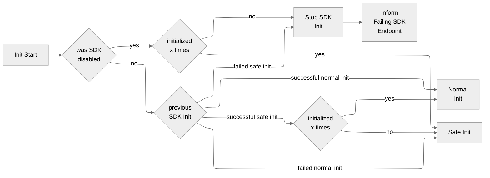

- Start Date: 2024-11-12
- RFC Type: feature
- RFC PR: https://github.com/getsentry/rfcs/pull/143
- RFC Status: draft

# Summary

This RFC aims to find strategies to minimize the damage of crashing SDKs in production.

This RFC is currently heavily under construction. Please don't review it yet.

# Motivation

Our customers use Sentry to ship confidently. They lose trust in Sentry if our SDKs continuously crash their apps, which our QA process should prevent, but you can never reduce that risk to 0.00%. Such fatal incidents are hazardous, mainly for applications with a slow release cycle, such as mobile apps, because customers can't deploy a hotfix within minutes or hours. A repeated Sentry SDK crash will again make it to our customers. When it does, we need to have strategies to minimize the damage.

# Background

The Cocoa SDK had an incident in July/August 2024 that continuously crashed our customers' apps in production without sending crash reports to Sentry. We only knew about the issue when customers reported that they stopped receiving data for their newest release and shared crash reports from AppStoreConnect with us.

Why didn't the [SDK crash detection](https://github.com/getsentry/sentry/tree/master/src/sentry/utils/sdk_crashes) help us to identify the issue? For those who do not know, the SDK crash detection allows us to view SDK crashes in Sentry. It checks every ingested event in the processing pipeline for a potential SDK crash. When detecting one, it only keeps the most essential data due to PII and copies the crash event to dedicated Sentry projects. The SDK crash detection helps fix crashing SDK bugs. Still, it only works when the SDK crash events make it to Sentry, which wasn't the case in the abovementioned incident.

Therefore, we need extra strategies to identify such incidents without help from our customers, and we need to minimize the damage. Actually, we need to solve three different problems:

1. **Detecting a continuously crashing SDK:** First, we need to know when our SDKS continuously crash our customers. Only then can we act accordingly.
2. **Minimizing the damage of a continuously crashing SDK:** Once we know an SDK is constantly crashing, we must do something to reduce the damage. It's better to have no data than crashes and no data.
3. **Knowing when the SDK is continuously crashing:** When we know our SDK crashes continuously and we minimize the damage, we still need to fix the root cause. We can only do that if we're aware, so we can't simply skip initializing a continuously crashing SDK and do nothing. We need some data to find out how we can fix the problem.

We're going to look at each one of the problems in an extra section below. But before we do, we still need to look at related topics impacting the ideal solution.

## Other topics

We must keep the following topics in mind when designing the optimal solution.

### App Start Crash Detection

The native SDKs, Cocoa and Android, have an app start crash detection logic: The SDK init waits synchronously for up to 5 seconds to flush out events if the app crashes within 2 seconds after the SDK init. We can combine it with the proposed solution to identify if the SDK is potentially crashing shortly after its initialization.

### Hybrid SDKs

Hybrid SDKs, such as React-Native and Flutter, make things more complicated, because we have different SDKs running in parallel in the same app. It can happen that the hybrid SDK crashes during its initialization but the native SDK doesn't. We must keep this in mind when designing the solution.

### Crashing While Writing a Crash Report

Crashing while writing a crash report is terrible but not as fatal as continuously crashing an application. As the SDKs should only write crash reports when the application is already crashing, the damage is missing data. We could detect crashing while writing a crash report by writing a minimal crash report with only bare-bone information and then a full crash report with more details. If the bare-bone crash report misses its counterpart, the complete crash report, we know something is broken.
This would help improve the watchdog termination detection algorithm of the Cocoa SDK.

TODO: Explain that this is out of scope for this RFC.

# Recommended Approach

TODO: We use a combination of the following options. We use the SDK crash detection for detecting if a SDK continuously crashes after its initialization. We implement the checkpoints to detect if the SDK crashes during its initialization. When it does the SDK switches to the SDK safe mode. If the SDK continuous to crash it disables itself. If not, it stays in the SDK safe mode. For both the SDK uses the failing SDK endpoint to send information. When the SDK is disabled, it keeps track of how often the SDK was started. If it was started x times, it retries to initialize again. If it does, it goes back to normal. The same applies for the SDK safe mode.




On platforms where we can check the stacktrace to find out if the crash is caused by the SDK, we use the stacktrace detection in addition to the checkpoints. Furthermore, we should switch to out of process crash detection when it's available.

TODO: Define a rollout strategy, maybe behind a feature flag.

# A: Detecting Continuous SDK Crashes

First, we need to know when our SDKS continuously crash our customers. Only then can we act accordingly. Let's have a look at the different scenarios for a continuously crashing SDK with different severities before we look at the potential solutions.

## Continuous Crash Scenarios

There are different scenarios for a continuously crashing SDK with different severities. Potential solutions must cover the first two scenarios. Covering scenario 3 is still important, but we can delay it a bit:

### Scenario 1: Worst Case - SDK Crashing During App Start No Crash Reports

The worst case scenario is a continuously crashing SDK during app start that cannot send crash events to Sentry. The reason for this could be a crash in the SDK initialization code or while sending a crash report or other data. The app is in a death spiral, meaning it continuously crashes during the app start and is unusable. Finding a strategy to escape the death spiral is vital because not only does it crash our users, but we stay in the dark and must rely on them to report the problem. This scenario is painful for our users because it takes time to realize what is crashing their app, as they must use other tools such as App Store Connect or the Google Play Store to identify the root cause. Once they identify the root cause, they must publish a new release, which can take several hours or even days. Finally, they must rely on their users to update their apps to fix the issue. Some users might lose trust in Sentry if this only happens once.

### Scenario 2: Almost Worst Case - SDK Crashing During App Start Can Send Crash Reports

Almost as bad as scenario 1, the SDK crashes continuously during app start but can still send crashes to Sentry. Now, the SDK crash detection can identify this and alarm us, and our users see in Sentry that the Sentry SDK is crashing their app. Our users rely on Sentry to notify them but must immediately release a hotfix. There is still damage, but they most likely still trust Sentry because we informed them about the problem. Some users might again lose trust in Sentry.

### Scenario 3: SDK Crashing Shortly SDK Init

Finally, a bad-case scenario is our SDK crashing continuously at some point after the app start. The app might be unusable as it constantly crashes at a specific area, or only certain features stop working. The Sentry SDK should still be able to send a crash report, so the SDK crash detection should surface this, and our users can see the crashes in their data. If the SDK can't send a crash report, this scenario can either turn into scenario 1, where sending a crash report continuously crashes, or the SDK can't send crash reports, which is also bad but out of the scope of this RFC.  Similar to scenario 2, our users must release a hotfix, and they could lose trust, but it is better than scenario 1.

## Potential False Positives

There are crashing scenarios that could look like the Sentry SDK is causing the crash, but it's the user's application code. We need to keep these scenarios in mind, but we can only ignore some of these and inform our users via documentation how to prevent them:

### Scenario 1: User's Application Crashes Before SDK Initialization

The user's application crashes before the initialization of the Sentry SDK. We can only educate our users about the importance of initializing the Sentry SDK as early as possible. We can't disable the SDK, as it never initializes.

### Scenario 2: User's Application Crashes Async During SDK Initialization

The user's application crashes async during the initialization of the Sentry SDK. It could be that the Sentry SDK can send a crash report to Sentry or not. When the SDK detects a crash during its initialization, it switches to the SDK Safe Mode, which runs the SDK with the essential SDK features. If the SDK fails to finish its initialization and can't send a crash report to Sentry, it doesn't make a difference if the SDK is enabled or disabled.

### Scenario 3: User's Application Crashes Shortly After SDK Initialization

The most likely scenario is the user's application crashes shortly after the SDK initialization. We have to ensure that we're not wrongly disabling the Sentry SDK. Still, suppose we detect that the app continuously crashes after x seconds of the Sentry SDK initialization. In that case, switching to the SDK Safe Mode might be acceptable to minimize the risk of the Sentry SDK being the root cause. Furthermore, our users will mainly be interested in the crash events, not other data such as performance or session replay.

## Option A1: [Preferred] Checkpoints <a name="option-a1"></a>

TODO: Identify if info.plist and such is better than marker files.

The SDK stores checkpoints via marker files to disk to identify if it completes SDK initialization. When it doesn't, the SDK knows it most likely causes problems. The SDKs should use marker files because checking the file's existence is significantly more performant than reading its contents.

The SDK implements a retry logic to minimize the risk of wrongly disabling itself. When the app launched x times, the SDK retries if it can launch successfully. If it does, it goes back to normal. If it doesn't, it exponentially increases the number of app launches until it retries.

The specification is written in the [Gherkin syntax](https://cucumber.io/docs/gherkin/reference/). The specification might not work for all edge cases yet, as it can be complicated to get it right. We'll figure out the exact details once we decide to implement it, but it should cover the main scenarios.

TODO: Update the scenarios.

```Gherkin
Scenario: SDK version inits the first time
    Given there is no launch marker file for the SDK version
    And there is no success init marker file for the SDK version
    When the SDK inits
    Then the SDK creates a launch marker file for the SDK version

Scenario: SDK version inits the first time with successful init
    Given there is no launch marker file for the SDK version
    And there is no success init marker file for the SDK version
    When the SDK reaches the successful init checkpoint
    Then the SDK creates a success init marker file for the SDK version

Scenario: SDK version inits the first time with failed init
    Given there is no launch marker file for the SDK version
    And there is no success init marker file for the SDK version
    When the SDK crashes before reaching the successful init checkpoint
    Then the SDK can't create a success init marker file for the SDK version
    And the SDK doesn't disable itself

Scenario: SDK version inits successfully second time with previous successful init
    Given there is a launch marker file for the SDK version
    And there is a success init marker file for the SDK version
    When the SDK inits
    Then it deletes the success init marker file for the SDK version
    When the SDK reaches the successful init checkpoint
    Then the SDK creates a success init marker file for the SDK version

Scenario: SDK version inits with failure second time with previous successful init
    Given there is a launch marker file for the SDK version
    And there is a success init marker file for the SDK version
    When the SDK inits
    Then it deletes success init marker file for the SDK version
    When the SDK crashes before reaching the successful init checkpoint
    Then the SDK can't create a success init marker file for the SDK version

Scenario: SDK version inits with previous failed init
    Given there is a launch marker file for the SDK version
    And there is no success init marker file for the SDK version
    When the SDK inits
    Then it disables itself

Scenario: New SDK version inits with previous failed init
    Given there is a launch marker file for a previous SDK version
    And there is no success init marker file for the previous SDK version
    And there is no success init marker file for the current SDK version
    When the new SDK version inits
    Then the SDK deletes marker files from the previous SDK version
    And the SDK creates a launch marker file for the current SDK version
```

### Crashing Scenarios [WIP: Outdated] <a name="option-a1-crashing-scenarios"></a>

Notes on [crashing scenarios](#crashing-scenarios):

| Scenario | Covered | Notes |
| --- | --- | --- |
| 1.1. | ✅ - yes |  |
| 1.2. | ✅ - yes |  |
| 2.1. | ⛔️ - no | |
| 2.2. | ⛔️ - no | But it could be detected via the SDK crash detection. |
| 3.1. | ✅ - yes | But it could be that it disables itself incorrectly, as the app is actually crashing. |
| 3.2. | ✅ - yes | same as 3.1. |
| 4. | ✅ - yes | The SDK correctly ignores this scenario. |
| 6.1. | ⛔️ - no | The SDK could incorrectly disable itself. |
| 6.2. | ⛔️ - no | same as 6.1. |
| 6.3. | ⛔️ - no | same as 6.1. |
| 7. | ✅ - yes | The SDK correctly ignores this scenario. |
| 8.1. | ✅ - yes | The native SDKs could implement the checkpoints for the initializing the hybrid SDKs. |
| 8.2. | ⛔️ - no | When the checkpoint logic of the hybrid and the native SDKs is flawed it won't work. |

### Pros <a name="option-a1-pros"></a>

1. It can detect if the SDK crashes during its initialization for any technical setup and when the crash handlers can't capture the crash.
2. SDKs could use checkpoints to identify the failure of other critical actions, such as writing a crash report.
3. It works when the SDK is offline.
4. It can be implemented solely in the SDKs, and doesn't require any changes on the backend.

### Cons <a name="option-a1-cons"></a>

1. It requires extra disk I/O and negatively impacts the SDK startup time.
2. It could incorrectly disable the SDK when the app crashes async during the initialization of the Sentry SDK.
3. Once the SDK is disabled, the SDK stays disabled until it retries.
4. It could incorrectly disable the SDK when the user's app manipulates the SDK's marker files.
5. It won't work when there is no disk space left.
6. The logic could get complex for hybrid SDKs.

## Option A2: SDK Crash Detection <a name="option-a2"></a>

TODO: Explain that we already use the SDK crash detection to detect if a SDK continuously crashes after its initialization. This only works when the SDK can send a crash report to Sentry. Still, we have to manually check the data. We could use alerts on new releases to know when we have to check the data.

## Option A3: Stacktrace Detection <a name="option-a3"></a>

Before sending a crash report, the SDK identifies an SDK crash by looking at the topmost frames of the crashing thread. If the topmost frames stem from the SDK itself, it disables itself. The [SDK crash detection](https://github.com/getsentry/sentry/tree/master/src/sentry/utils/sdk_crashes) already uses this approach in the event processing pipeline.

### Crashing Scenarios [WIP: Outdated] <a name="option-a3-crashing-scenarios"></a>

Notes on [crashing scenarios](#crashing-scenarios):

| Scenario | Covered | Notes |
| --- | --- | --- |
| 1.1. | ⛔️ - no | It doesn't work when the SDK crashes before parsing and sending the crash report. |
| 1.2. | ✅ - yes | |
| 2.1. | ⛔️ - no | same as 1.1. |
| 2.2. | ✅ - yes | |
| 3.1. | ⛔️ - no | same as 1.1. |
| 3.2. | ✅ - yes | |
| 4. | ⛔️ - no |  |
| 5. | ✅ - yes |  |
| 6.1. | ✅ - yes | It wouldn't disable the SDK. |
| 6.2. | ✅ - yes | same as 5.1. |
| 6.3. | ✅ - yes | same as 5.1. |
| 7. | ✅ - yes | The SDK correctly ignores this scenario. |
| 8.1. | ✅ - yes | The native SDKs can send a crash report of the hybrid SDKs. |
| 8.2. | ⛔️ - no |  |

### Pros <a name="option-a3-pros"></a>

1. It requires little to no extra overhead.
2. It can ignore async app crashes during SDK initialization.
3. It is the most reliable option to detect if the SDK crashes.

### Cons <a name="option-a3-cons"></a>

1. __Doesn't work with static linking:__ This approach doesn’t work with static linking, as the Sentry SDKs end up in the same binary as the main app. As we don’t have symbolication in release builds, we can’t reliably detect if the memory address stems from the Sentry SDK or the app. We might be able to compare addresses with known addresses of specific methods or classes, but this won’t work reliably. As with iOS, many apps use static linking, so we must use an alternative approach.
2. __Doesn't work for obfuscated code:__ For obfuscated code, detecting if a frame in the stacktrace stems from the Sentry SDK or the app can be difficult or even impossible.
3. __Wrongly disabling the SDK:__ We frequently see wrongly reported SDK crashes in the SDK crash detection. As SDKs use bytecode manipulation, swizzling, or monkey patching, the stacktraces sometimes contain Sentry frames in the crashing thread, but the root cause isn't Sentry but the user's code.
4. It doesn't work when the SDK crashes during or before sending the crash report.
5. It doesn't work when the SDK crashes before installing the crash handlers.

# B: Minimizing the Damage

## Option B1: SDK Safe Mode  <a name="option-b1"></a>

Like Windows Safe Mode, our SDKs have a bare minimum SDK; if the SDK detects it continuously crashes, it initializes in the safe mode. The SDK only enables crash handlers, session tracking, and functionality that enriches the scope, but it doesn't enable tracing, profiling, session replay, and automatic breadcrumbs. We still need to define the exact feature set, which can vary per SDK. SDKs must clearly mark that data stems from the safe mode so that users and we are aware.

To avoid being stuck in the Safe Mode, the SDK always switches back to normal mode for an app update and when the SDK initializes successfully x times.

### Pros <a name="option-b1-pros"></a>

1. The SDK still works for crashes if there is a critical bug in most areas of the SDK. For example, if a bug in session replay continuously crashes the app shortly after SDK initialization, the SDK will still report crashes.

### Cons <a name="option-b1-cons"></a>

1. If the crash occurs in the safe mode, the SDK causes an extra crash before disabling itself.

## Option B2: Disabling the SDK <a name="option-b2"></a>

The SDK disables itself when it detects a continuous crash with one of the options of [A](#options-for-detecting-sdk-crashes). It keeps track of how often the SDK was started and after x times it retries to initialize again.

TODO: Explain that disabling the SDK is the last resort and that we should try to avoid it at all costs. If we disable it, we are blind and so are our users. If a SDK keeps crashing, users still see data in App Store Connect and Google Play Console. It's bad, but at least we know what's happening and how to fix it. Completely disabling the SDK makes it hard us to identify the root cause. Therefore, we must use the SDK safe mode first and then disable the SDK. What also helps is to retry the SDK initialization every x times to minimize the risk of wrongly disabling the SDK, and to have potential SDK crashes in the App Store Connect and Google Play Console.

## Option B3: [Discarded] Remote Kill Switch <a name="option-b3"></a>

There might be scenarios where the SDK can’t detect it’s crashing. We might be able to detect via the SDK crash detection that the SDK causes many crashes, and we could manually or, based on some criteria, disable the SDK. We could also allow our customers to disable the SDK remotely if they see many crashes in the Google Play Console or App Store Connect.

The remote kill switch has to be strictly tied to SDK versions. When the SDK gets an update, it ignores the killswitch from the previous SDK version.

### Pros <a name="option-b3-pros"></a>

1. It works for continuous SDK crashes after the SDK is initalized.
2. We could reenable the SDK if we disable it by mistake.
3. We can disable the SDKs only for specific customers.
4. We could allow customers to disable the SDK themselves.
5. We could extend the logic to only disable specific integrations of the SDK.
6. We can use this logic to disable the SDK if it causes other severe issues, such as breaking the UI in the app.

### Cons <a name="option-b3-cons"></a>

1. When the SDK is in a critical state and potentially causing crashes, the last thing we want to do is a web request.
2. It doesn't work for continuous SDK crashes during SDK init.
3. It doesn't work offline.
4. It requires manual action. We need to monitor our SDK crashes and input from customers continuously.
5. It requires infrastructure changes.

## Option B4: Bundling SDK versions at the same time  <a name="option-b4"></a>

The SDK ships with two different SDK versions. It has a wrapper for the user and then delegates the actual method calls to the duplicated SDK code. If the SDK detects it’s crashing often, it uses the fallback SDK version.

No notes on [crashing scenarios](#crashing-scenarios), because we can discard this option as it has two many significant cons.

### Pros <a name="option-b4-pros"></a>

1. When the SDK crashes, it can still function with the fallback SDK version.

### Cons <a name="option-b4-cons"></a>

1. Roughly doubles the size of the SDK.
2. It requires an extra package.
3. Only a subset of customers might use this, and only high-quality aware customers might accept the tradeoff of a double-sized SDK. In fact, most high-quality aware customers most likely care about app size and will use the stable release channel.

# C: Knowing When the SDK is Disabled

## Option C1: Failing SDK Endpoint <a name="option-c1"></a>

Add a unique endpoint for sending a simple HTTP request with only the SDK version and a bit of meta-data, such as the DSN, to notify Sentry about failed SDKs. We must keep this logic as simple as possible, and it should hardly ever change to drastically minimize the risk of causing more damage. The HTTP request must not use other parts of the SDK, such as client, hub, or transport. The SDKs must only send this request once. As we can’t have any logic running, such as rate-limiting or client reports, it’s good to have a specific endpoint for this to reduce the potential impact on the rest of the infrastructure.

### Pros <a name="option-c1-pros"></a>

1. We know when a SDK disables itself.

### Cons <a name="option-c1-cons"></a>

1. Potential risk of crashing while performing this action.
2. It requires extra infrastructure.
3. We don't know why the SDK disabled itself.

## Option C2: Anomaly Detection <a name="option-c2"></a>

The backend detects anomalies in our customers' session data. If there is a significant drop, we can assume that the SDK crashes and disable it with a remote killswitch. The logic has to correctly detect debug and staging releases and take sampling into account.

### Pros <a name="option-c2-pros"></a>

1. No SDK changes are needed, so it works even for old SDK versions.
2. This would be a useful feature for our customers even if we don’t link it to a remote killswitch.

### Cons <a name="option-c2-cons"></a>

1. Requires backend changes.
2. It only works in combination with a remote killswitch.
3. This doesn’t work for SDK init crashes.

## Option C3: Out of process crash detection <a name="option-c3"></a>

### Pros <a name="option-c3-pros"></a>

The SDK launches an extra process to monitor and detect a crash in the user’s application. The main advantage is that when the SDK running in the extra process crashes, it doesn’t impact the user’s application process. While this seems appealing, it’s not possible on iOS and Android when writing this, and therefore, we can discard this option.

### Cons <a name="option-c3-cons"></a>

# Drawbacks

Why should we not do this? What are the drawbacks of this RFC or a particular option if
multiple options are presented:

1. False positives: Potentially wrongly disabling the SDK.
2. Introducing new crashes with the new logic.

# Unresolved questions

- How does [checkpoints](#option-a1) work with the new start up crash detection logic?
