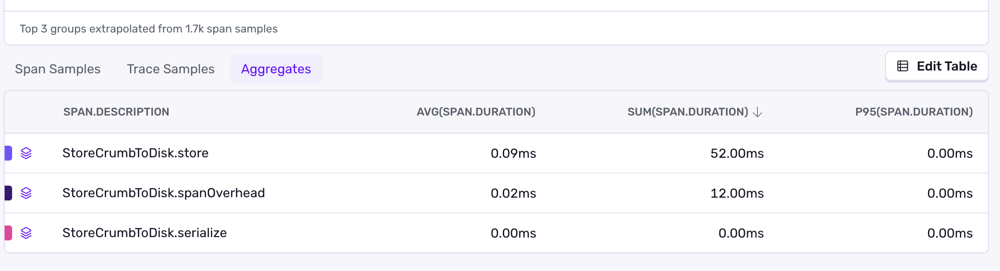

- Start Date: 2025-09-24
- RFC Type: feature
- RFC PR: https://github.com/getsentry/rfcs/pull/148
- RFC Status: In Progress
- RFC Author: @philipphofmann
- RFC Approver: @AbhiPrasad

# Summary

This RFC aims to develop a strategy for SDKs to prevent the loss of logs when an application terminates abnormally, such as a crash or watchdog termination.

# Decision

We decided to go with [Option A - FIFO Queue With Async IO](#a---fifo-queue-with-async-io), because the other options all had some knockout criteria. This option is the basis for adding a more detailed spec to the BatchProcessor in the [develop docs](https://develop.sentry.dev/sdk/telemetry/spans/batch-processor/).

# Motivation

Understanding the sequence of events leading up to an abnormal termination is crucial for diagnosing and resolving the underlying issue. Users currently rely on breadcrumbs to reconstruct this timeline. Since we want logs to serve as the primary debugging tool and eventual replacement for breadcrumbs, users must be able to rely on logs reaching Sentry reliably, even when the application terminates abnormally.

# Background

The Cocoa and Java SDKs implement scope observers that continuously synchronize scope data to their respective crash handling backends (SentryCrash for Cocoa, sentry-native for Java). The scope observers store the information in C memory, so when a crash occurs, the crash handlers can access that information [async safe](https://man7.org/linux/man-pages/man7/signal-safety.7.html) and write it to disk.
For watchdog terminations, both SDKs persist scope data directly to disk since the crash handling backends cannot capture these terminations. The Cocoa SDK performs disk writes synchronously on the calling thread, while the Java SDK uses a dedicated background thread due to Android's strict mode restrictions on main thread disk I/O. Both implementations use file handles to minimize I/O overhead, with thread safety guaranteed by the scope's existing synchronization mechanisms.

Links to some implementations:

* Java: [PersistingScopeObserver](https://github.com/getsentry/sentry-java/blob/main/sentry/src/main/java/io/sentry/cache/PersistingScopeObserver.java)
* Java: [NdkScopeObserver](https://github.com/getsentry/sentry-java/blob/d21770841d84eddba0636e2082c029db2a158457/sentry-android-ndk/src/main/java/io/sentry/android/ndk/NdkScopeObserver.java)
* Cocoa: [SentryCrashScopeObserver](https://github.com/getsentry/sentry-cocoa/blob/d8ceea3a0ce99c0dd499d3b9472c87aaf0713d3c/Sources/Sentry/SentryCrashScopeObserver.m)
* Cocoa: [SentryWatchdogTerminationScopeObserver](https://github.com/getsentry/sentry-cocoa/blob/main/Sources/Sentry/SentryWatchdogTerminationScopeObserver.m)

## Requirements

1. The solution MUST NOT lose any log messages in the event of a crash.

```swift
logger.trace("Starting database connection")

// The above log must show up in Sentry
SentrySDK.crash()
```

1. The solution SHOULD minimize the loss of log messages for watchdog terminations. This MAY vary based on the platform. If the platforms allows it, SDKs SHOULD try to not loose any logs for watchdog terminations.
2. The solution MUST NOT block the main thread.
3. The solution MUST be thread-safe.
4. The solution MUST work for hybrid SDKs.
5. The solution SHOULD NOT depend on or interfere with the offline caching of envelopes, meaning once we tackle the cache overflow problem with priority queues or whatever, little or no changes SHOULD be required for this solution.
6. The solution MAY also work for spans and other future telemetry data.

# Options Considered

## A - FIFO Queue With Async IO

The existing [BatchProcessor](https://develop.sentry.dev/sdk/telemetry/spans/batch-processor/) minimizes the number of HTTP requests that SDKs make to Sentry for logs and currently stores the logs in memory. When a crash happens, all these logs are lost.

With this option, the BatchProcessor stores its logs in a thread-safe FIFO queue, residing in an async-safe memory space, allowing the crash reporter to write them to disk when a crash occurs. Furthermore, the BatchProcessor stores logs asynchronously into a file, allowing it to recover after an abnormal termination, for which the crash handler can't run. The BatchProcessor MUST store the logs immidiately to disk after adding them to the FIFO queue. It MUST NOT use a timeout as it does for flushing the logs to Sentry to minimize data loss in case of a watchdog termination.

When the BatchProcessor receives a log, it performs the following steps

1. Put the log into the FIFO queue on the calling thread.
2. On a background thread, serialize the next log of the FIFO queue and store it in the `batch-processor-cache-file`.
3. Remove the log from the FIFO queue.
4. If the queue isn’t empty, go to step 2.

The FIFO queue has a `max-logs-count` of 64 logs. When the FIFO queue exceeds `max-logs-count` log items, the BatchProcessor MUST drop logs and record client reports with the category `queue_overflow` for every dropped log. SDKs MAY choose a different `max-logs-count` value, if needed.

When a crash occurs, the SDKs write the logs in the FIFO queue to the `log-crash-recover-file`  and send these logs on the next SDK launch. To avoid sending duplicated logs, the SDKs MUST deduplicate the logs from the `log-crash-recover-file` and `batch-processor-cache-file` based on the logID after a crash before sending them. It's worth noting that logs don't have an ID yet, and we MUST extend the protocol for this.

For the Cocoa SDK, the crash-safe memory space structure MUST be C memory, because Swift and Objective-C aren’t async-safe. For Java, it’s Java memory, because the JVM allows you to store logs in memory or on disk when a crash occurs. This solution also works for watchdog terminations, as the BatchProcessor MUST check on SDK launch if there are logs in the `batch-processor-cache-file` and send these.

The BatchProcessor MUST keep two `batch-processor-cache-files`. When it sends the logs from `batch-processor-cache-file`, it renames it to `batch-processor-cache-file-to-flush` and creates a new `batch-processor-cache-file` to avoid losing logs if a crash occurs when flushing the logs. To avoid sending duplicate logs if the app crashes in between storing the envelope and deleting the cache file, the BatchProcessor MUST first store the envelope to the same folder as the BatchProcessor files. After deleting the `batch-processor-cache-file-to-flush`, SDKs MUST move the envelope to the envelope cache folder. As moving files can be done atomic, SDKs avoid sending duplicated logs in the described scenario. We're going to add a more detailed explanation once we add this concept to the develop docs. These are the flushing steps:

1. Rename `batch-processor-cache-file` to `batch-processor-cache-file-to-flush`.
2. Create a new `batch-processor-cache-file`
3. Store new logs to `batch-processor-cache-file`
4. Load logs into memory from the `batch-processor-cache-file-to-flush`
5. Store the logs in memory into an envelope into the batch processor directory, which MUST be the same folder as the other BatchProcessor files, and name it `batch-processor-cache-envelope-to-flush`.
6. Delete all logs from `batch-processor-cache-file-to-flush`
7. Move the `batch-processor-cache-envelope-to-flush` to the envelopes cache folder.

The BatchProcessor maintains its logic of batching multiple logs together into a single envelope to avoid multiple HTTP requests.

Hybrid SDKs pass every span down to the native SDKs, which will put every log in their BatchProcessor and its cache when logs are ready for sending, meaning after they go through beforeLog, integrations, processors, etc.

### Pros

1. Not blocking the main thread.
2. Only native mobile SDKs need to implement this approach, and hybrid SDKs don’t.

### Cons

1. Not a 100% guarantee to drop any logs for watchdog terminations, because when a watchdog termination occurs the SDK looses all logs in the FIFO queue.
2. A slight synchronization overhead is required for storing logs in the crash-safe data structure.
3. The solution adds a slight serialization overhead when passing logs layers, such as React-Native to Java, or Swift/Objective-C to C.


## ~~B - Store Logs on Calling Thread~~

> **⛔ Dismissed because it blocks the main thread, and on Android, that’s a red flag because of strict mode.**


The logs implementation already has the https://develop.sentry.dev/sdk/telemetry/spans/batch-processor/, which minimizes the number of HTTP requests SDKs make to the backend for logs. Currently, the BatchProcessor keeps the serialized logs in memory and flushes them out in batches.

With this option, the BatchProcessor stores the serialized logs on the calling thread to disk. The DiskBatchProcessor keeps the timeout logic to ensure the delay of sending logs to Sentry is minimal.

For efficiency, the BatchProcessor MUST use file handles or file streams when writing logs to disk. For thread safety, the BatchProcessor uses a single file for the main thread, eliminating the need for synchronization. All other threads share one other file with synchronization. We accept the overhead of synchronization for all other threads, because it’s acceptable to block non-main threads slightly. Furthermore, we don’t want to keep one file handle per thread, because some operating systems have a limit on the number of open file handles, and each file handle consumes resources.

When the BatchProcessor flushes either because the timeout expires or the logs exceed a yet-to-be-defined size limit, the BatchProcessor starts new files for both the main thread and other threads, and only deletes the old files once the logs are stored as an envelope to disk to ensure logs don’t get lost when a crash occurs.

When the DiskBatchProcessor initializes, it checks if there are logs from a previous launch stored and flushes them.

When the user closes the SDK, the BatchProcessor flushes the logs stored on disk.

### File IO Overhead on an iPhone 12

This test used transactions to measure the overhead of the existing storing of breadcrumbs to disk via an [NSFileHandle on the Cocoa SDK](https://github.com/getsentry/sentry-cocoa/blob/8cf2d438359420b985edc968081d5df3ca037a9a/Sources/Sentry/Processors/SentryWatchdogTerminationBreadcrumbProcessor.m#L40-L49). The test was conducted using the iOS-Swift app, with a local release build that excluded the debugger.

```objectivec
- (void)addSerializedBreadcrumb:(NSDictionary *)crumb
{
    SENTRY_LOG_DEBUG(@"Adding breadcrumb: %@", crumb);

    id<SentrySpan> transaction = [SentrySDKInternal startTransactionWithName:@"StoreCrumbToDisk" operation:@"crumb"];

    id<SentrySpan> serializeCrumbSpan = [transaction startChildWithOperation:@"serialize" description:@"StoreCrumbToDisk.serialize"];
    NSData *_Nullable jsonData = [SentrySerialization dataWithJSONObject:crumb];
    [serializeCrumbSpan finish];

    id<SentrySpan> spanOverhead = [transaction startChildWithOperation:@"serialize" description:@"StoreCrumbToDisk.spanOverhead"];
    [spanOverhead finish];

    if (jsonData == nil) {
        SENTRY_LOG_ERROR(@"Error serializing breadcrumb to JSON");
        return;
    }

    id<SentrySpan> storeCrumbSpan = [transaction startChildWithOperation:@"file.io" description:@"StoreCrumbToDisk.store"];
    [self storeBreadcrumb:SENTRY_UNWRAP_NULLABLE(NSData, jsonData)];
    [storeCrumbSpan finish];

    [transaction finish];
}
```



The result shows that storing breadcrumbs to disk takes less than 0.1ms on average. What’s weird, though, is that the serialized span appears to be faster than the span overhead span, which is basically a span started and finished immediately.

Nevertheless, this overhead is small and may be acceptable for the assurance that no logs are lost. It’s worth investigating the overhead for storing logs to disk on different iPhones and Android devices.

### Pros

1. The SDKs always send logs for crashes and watchdog terminations.

### Cons

1. It adds slight IO overhead on the main thread for every single log.
2. On [Android](https://developer.android.com/reference/android/os/StrictMode), this will trigger strict mode warnings, which is a know out criteria.


## ~~C - Store Logs Async~~

> ⛔ **Dismissed because of con 1 and requirement 1.**


Similar to [~~A - Store Logs on Calling Thread~~ ](https://www.notion.so/A-Store-Logs-on-Calling-Thread-26a8b10e4b5d803b9bc1fba4deba15f5?pvs=21) the BatchProcessor, but it always stores logs to disk on a background thread. The most significant advantage over a solely in-memory BatchProcessor is that when a crash or watchdog termination occurs, almost all logs are recovered. 

 
### Pros

1. The SDKs don’t block the main thread.
2. The SDKs can recover almost all logs in the event of a crash or watchdog termination.
3. Easy to implement.

### Cons

1. When a crash or watchdog termination occurs, some logs may be missing. On Cocoa, users rely on breadcrumbs for investigating watchdog terminations. If some logs are missing, users may be reluctant to migrate from breadcrumbs to logs.

## ~~D - CrashReporter Sync~~

> ⛔ **Dismissed because of con 1.** ⛔

The mobile SDKs already sync scope data and breadcrumbs across multiple layers into C memory for SentryCrash and sentry-native. When the crash reporter generates a crash report, it includes this data from the C memory in the report. This solution does the same for logs. When a crash occurs, the SDKs store the logs in C memory and save them to a file. On the next launch, they recover the logs.

We must use C memory because, in specific edge cases, we can’t access Objective-C or Java memory due to asynchronous safety concerns. Doing so can break other signal handlers, which is undesirable. We already broke this principle to make transactions and SR for crashes work, which works most of the time, but not for all types of crashes.

### Pros

1. The SDK doesn’t block the main thread with file IO operations.
2. The SDK sends logs for crashes.

### Cons

1. The SDKs lose numerous logs for watchdog terminations.

## ~~E - OnCrash Hook~~

> ⛔ **Dismissed because of con 1.** ⛔


Similar to how we already make transactions and SR work for crashes, we could add a hook that tries to serialize the in-memory logs in Java / Swift to disk when a crash occurs. This works for most of the crashes, but not all.

### Pros

1. Easy to implement.
2. No extra overhead for the main thread.

### Cons

1. The SDKs lose numerous logs for watchdog terminations.
2. Doesn’t work for all types of crashes.
3. We violate async safety for signal handlers, but we already do that for transactions and SR for crashes.


# Useful resources

On Cocoa, we can get inspired by [CacheAdvance](https://github.com/dfed/CacheAdvance), which is an open source lib storing anything implementing Swift Codable to disk using file handles. The solution isn’t thread-safe.

