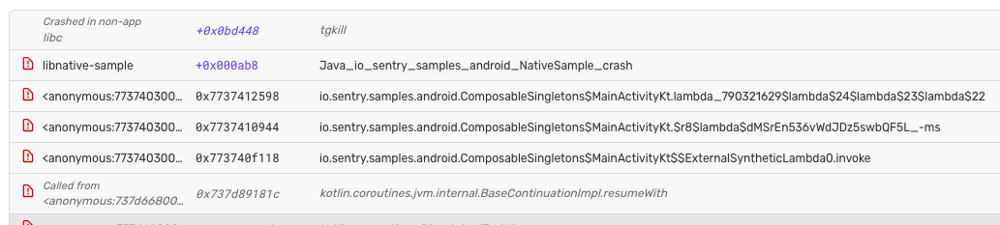
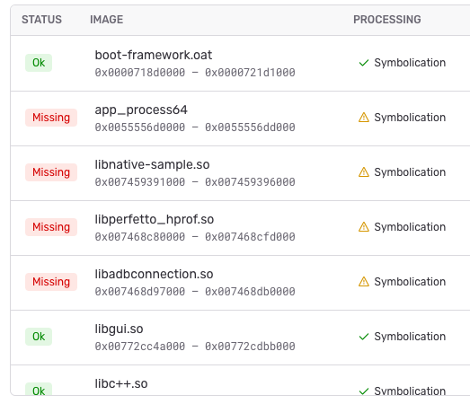

- Start Date: 2026-02-27
- RFC Type: feature
- RFC PR: https://github.com/getsentry/rfcs/pull/152
- RFC Status: draft
- RFC Author: @supervacuus
- RFC Approver: 

# Summary

This RFC proposes adding a typed `symbolication` object to stack frames so SDKs and symbolicator can describe which enrichments were performed and by whom. This avoids wasted symbolicator work, prevents false-positive "missing debug symbols" errors in the UI, and gives SDKs a first-class way to indicate that a frame's symbol and its associated module/image should be treated at face value rather than considered missing.

The design is stage-aware from the start: SDKs can claim only `symbols` and still leave other enrichments open to backend processing, or they can use a flat shorthand meaning "all enrichments relevant to this frame's effective platform." Platform-specific processing expands that shorthand to long form as early as possible. For native, those enrichments are `symbols`, `demangling`, `source_context`, and `location`. The first end-to-end implementation only needs to honor `symbols`, but the full stage set is part of the initial design. Most SDKs will not annotate frames at all; omitting `symbolication` preserves current behavior, where frames are sent through the existing pipeline, and symbolicator does its normal processing.

# Motivation

When an SDK symbolicates a native stack frame on the client (e.g., because the debug symbols are available locally but not on the server), the backend currently has no way to know this. Processing and symbolicator still attempt to symbolicate every native frame. This leads to two concrete problems:

1. **Wasted resources:** Symbolicator attempts symbolication for frames that are already fully resolved, consuming resources unnecessarily. This may be an operational non-issue; it is included for completeness.

2. **Incorrect and misleading UI errors:** When symbolicator cannot find debug symbols for an already-symbolicated frame, it sets `symbolicator_status: "missing"` and surfaces an error telling the user to upload the debug symbols for the associated module. In most cases, this is **by design**: users typically do not want to add symbol tables or debug information to their deployment artifacts and usually release a stripped artifact and separately upload debug information once per release to Sentry. In such a setup, the client cannot symbolicate anyway, and a `missing` status is sensible feedback. However, there are situations where the opposite is true: the symbols exist only on the client device (e.g., system libraries on end-user devices), and there is no realistic chance of collecting them upfront. The user sees a broken-looking stack trace and a confusing call to action that doesn't apply. 

This problem is not theoretical. It already manifests today in at least two concrete scenarios:

- **Tombstone / native crash reporting**: Native SDKs that symbolicate system library frames on-device before sending the event. The backend cannot distinguish these from unsymbolicated frames and flags them as broken since it cannot find any symbol information in its stores. On Android in particular, we usually have both situations: native user libraries will be packaged stripped and `Symbolicator` must resolve associated frames (i.e., the UI warning is sensible if symbol/debug-info is missing), but system and framework libraries usually will be symbolicated on-device and `Symbolicator` won't have access to data to further enrich the stack frame. In that case, the UI error is misleading and inactionable to the user.
- **.NET SDK**: The .NET SDK resolves function names, file paths, and line numbers locally using portable PDB metadata. When these frames arrive at the backend, symbolicator still attempts to process them. Because the user hasn't uploaded PDB files to Sentry (the SDK already handled this), every frame returns `symbolicator_status: "missing"` and the UI shows a misleading symbolication error banner. This is tracked in [getsentry/sentry#97054](https://github.com/getsentry/sentry/issues/97054).




# Background

## How `symbolicator_status` works today

After symbolicator processes an event, each native frame receives a `symbolicator_status` stored in `frame.data`. The status values include:

- `"symbolicated"`: symbolicator successfully resolved the frame.
- `"missing"`: symbolicator could not find the required debug symbols.
- `"unknown"`: symbolicator could not process the frame for other reasons.

This status is set exclusively by the backend during processing. It currently cannot be influenced by SDKs.

Relevant code: [`sentry/lang/native/processing.py`](https://github.com/getsentry/sentry/blob/422487ea4acad23710cd1fe5392a5b684e09c2e4/src/sentry/lang/native/processing.py#L129-L131)

## The `platform` field's dual role

Each stack frame carries a `platform` property (defaulting to the event's platform if unset). This single field currently controls **two distinct behaviors**:

1. **Symbolication strategy**: The `platform` value determines which symbolication pipeline handles the frame: native symbolication, source map resolution, ProGuard deobfuscation, etc.
1. **UI rendering**: The same `platform` value also determines how the frame is displayed in the Sentry UI, where platforms have different frame renderers (e.g., showing module paths vs. file paths, different address formatting, etc.).

This coupling means there is no way to say "render this frame as a native frame, but don't attempt to symbolicate it." Any approach that changes `platform` (e.g., setting it to a no-op value to skip symbolication) would also alter how the frame is rendered in the UI, which is undesirable. This dual role is relevant to the alternatives considered below, particularly for proposals that suggest decoupling the symbolication decision from `platform`.

## Existing workarounds

### Hard-coded exceptions in the monolith

A `FIXME` in `processing.py` adds a special case for .NET, which previously had no debug images but can now send fully symbolicated events from the SDK. This was added to prevent false symbolication errors when .NET started sending debug images. The `FIXME` tag indicates this was not considered the right long-term approach.

Notably, the .NET SDK has since evolved to **send debug images** (with `type: "pe_dotnet"`), because this enables symbolicator to fetch source context via the Microsoft symbol server and SourceLink. Once debug images are present, however, the FIXME's original precondition ("no debug images -> skip") no longer triggers. Symbolicator now sees debug images, attempts to resolve symbols for *all* frames, including user-code frames that the SDK already symbolicated locally, and marks them as `"missing"` because the PDB was never uploaded. This is exactly the scenario reported in [getsentry/sentry#97054](https://github.com/getsentry/sentry/issues/97054): the FIXME handled the old .NET world correctly, but the SDK outgrew the workaround.

Relevant code: [`processing.py` L149-L158](https://github.com/getsentry/sentry/blob/422487ea4acad23710cd1fe5392a5b684e09c2e4/src/sentry/lang/native/processing.py#L149-L158)

See also: [getsentry/sentry#46955](https://github.com/getsentry/sentry/issues/46955): "Remove error banner for non-app symbols"

### Third-party library detection

There is a `is_known_third_party()` check that suppresses missing-symbol errors for recognized system libraries (e.g., iOS system frameworks). This is a denylist approach and does not scale to arbitrary platforms or deployments.

### Passing `symbolicator_status` from the SDK

In theory, an SDK could set `symbolicator_status` directly on the frame's `data` dict. Since `data` is part of the stacktrace `Frame` and falls into relay's untyped "other" catch-all ([`relay-event-schema/.../stacktrace.rs` L200-202](https://github.com/getsentry/relay/blob/55c59cf75d3c35bbbb66df14072d147eca056bd7/relay-event-schema/src/protocol/stacktrace.rs#L200-L202)), it could technically be forwarded (currently it is not, because the catch-all does not have `retain = true`). However, using untyped catch-all fields for regular SDK usage is explicitly frowned upon and for good reason.

## Scope

This RFC focuses on the **stack trace display and symbolication** aspect of the problem. Specifically: how can an SDK tell the backend that a frame, or particular parts of its enrichment, are already authoritative on the client and should not be treated as missing? It is also assumed that any solution to misattributing "missing symbols" should also rectify the attribution of associated modules in the debug-meta as missing.

The following concerns are explicitly **out of scope** for this RFC:

- **UI rendering decisions**: Whether and how the UI distinguishes client-symbolicated frames from server-symbolicated frames is a product decision. The proposed design provides stage-level provenance that enables this distinction, but this RFC does not prescribe UI behavior.
- **Decoupling symbolication strategy from `platform`**: The proposed design's extensibility via a future `as` field provides a potential path for decoupling the symbolication pipeline selection from the `platform` field ([raised](https://github.com/getsentry/rfcs/pull/152#issuecomment-3991710125) by [@Dav1dde](https://github.com/Dav1dde)), but this is not part of this proposal.

## Affected components

This is a cross-cutting concern that touches:

- **SDKs**: All native code handling SDKs (sentry-native, sentry-java/Android NDK, sentry-dotnet, (maybe sentry-cocoa), and downstream dependants + any future SDK performing client-side native symbolication).
- **Relay**: The frame schema needs to gain a new typed field.
- **Processing (monolith)**: `sentry/lang/native/processing.py` needs to pass the `symbolication` object through to symbolicator.
- **Symbolicator**: Needs to honor the normalized `symbolication` annotation: for the first implementation, skip server-side symbol resolution for client-owned `symbols` while leaving other stages open unless they are also claimed.
- **UI**: Should stop showing misleading "missing symbols" errors for frames that are intentionally client-symbolicated.

# Proposed Design

Add a typed `symbolication` object to each stack frame that records **who** handled a given enrichment stage and the **outcome**. Both SDKs and symbolicator write to the same schema, making it a unified annotation format. This serves as both a **control mechanism** and a **diagnostic record**.

Originally [proposed](https://github.com/getsentry/rfcs/pull/152#discussion_r2916151048) by [@jjbayer](https://github.com/jjbayer) and [confirmed](https://github.com/getsentry/rfcs/pull/152#discussion_r2921167424) as intended primarily for control with diagnostic as a secondary benefit.

## Initial scope

The design is stage-based from the start. The canonical shape is the long form:

```json
{
  "symbolication": {
    "symbols": {
      "by": "client",
      "status": "success"
    }
  }
}
```

Each stage entry uses the same minimal shape:

- **`by`**: Identifies who performed that stage. An enum of `"client"` (SDK) or `"symbolicator"` (backend).
- **`status`**: The outcome. An enum of `"success"`, `"failed"`, `"missing"`, or `"unknown"`.

For native, the enrichments relevant to the platform are:

- `symbols`
- `demangling`
- `source_context`
- `location`

`location` is the abstract stage name. In native symbolicator / native-processing terminology, this corresponds to concrete fields such as `filename`, `abs_path`, and `lineno`.

The full native stage set is part of the initial design and schema. The initial implementation honors only `symbols` end-to-end and drops unsupported stages until they are implemented.

For compactness, SDKs may also send a flat shorthand:

```json
{
  "symbolication": {
    "by": "client",
    "status": "success"
  }
}
```

For a given frame, this shorthand means: **all enrichments relevant to the frame's effective platform share the same provenance and outcome**. Because Relay generally does not know the platform-specific stage set, it cannot reliably expand the shorthand on its own. The platform-specific processing module interprets shorthand because it already matches on the platform. Shorthand should be normalized to long form as early as possible; downstream components should then reason only about the normalized long form.

## Control semantics

After normalization, symbolicator interprets the long form per stage.

For the first implementation, the only stage that must be honored end-to-end is `symbols`. When symbolicator encounters

```json
"symbolication": {
  "symbols": {
    "by": "client",
    "status": "success"
  }
}
```

it treats symbol resolution for that frame as already authoritative on the client side:

- **Symbol resolution** is skipped. The client-provided `function` and `symbol`, if present, are not overwritten.
- The frame is not reported as `"missing"` if the corresponding debug file is unavailable.
- The associated module/image should not be attributed as missing solely because server-side symbol resolution was skipped.
- Other enrichments remain open by default: demangling, source context, and location continue to follow current behavior unless and until the corresponding stage is also claimed in the normalized long form.

Whether symbolicator performs a debug file lookup for a client-symbolicated frame is an implementation detail. If nothing remains to add, a debug file lookup can be skipped; this is a performance concern, not a correctness requirement. Any other value, including non-success values or unknown stage annotations, falls back to the current behavior. Unsupported stages are dropped during normalization until they are implemented end-to-end.

For frames without a `symbolication` object (the default), symbolicator proceeds as it does today. After symbolicator processes a frame, it writes its result into the corresponding stage entry, for example:

```json
{
  "symbolication": {
    "symbols": {
      "by": "symbolicator",
      "status": "success"
    }
  }
}
```

The same per-stage structure extends to `demangling`, `source_context`, and `location`; the initial implementation simply does not honor them end-to-end yet.

## Examples

**Shorthand normalization for a native frame**

SDK input:

```json
{
  "platform": "native",
  "function": "pthread_create",
  "package": "/apex/com.android.runtime/lib64/bionic/libc.so",
  "symbolication": {
    "by": "client",
    "status": "success"
  }
}
```

After native processing normalizes the shorthand:

```json
{
  "platform": "native",
  "function": "pthread_create",
  "package": "/apex/com.android.runtime/lib64/bionic/libc.so",
  "symbolication": {
    "symbols": {
      "by": "client",
      "status": "success"
    },
    "demangling": {
      "by": "client",
      "status": "success"
    },
    "source_context": {
      "by": "client",
      "status": "success"
    },
    "location": {
      "by": "client",
      "status": "success"
    }
  }
}
```

For "native", the processing module defines that stage set. In the initial rollout, unsupported expanded stages are dropped before the frame is forwarded downstream.

**Selective long form: client symbols only**

SDK input:

```json
{
  "function": "MyApp::run",
  "instruction_addr": "0x7f1234",
  "symbolication": {
    "symbols": {
      "by": "client",
      "status": "success"
    }
  }
}
```

After symbolicator adds location and source context:

```json
{
  "function": "MyApp::run",
  "instruction_addr": "0x7f1234",
  "filename": "Program.cs",
  "abs_path": "/src/Program.cs",
  "lineno": 42,
  "pre_context": ["..."],
  "context_line": "throw new InvalidOperationException();",
  "post_context": ["..."],
  "symbolication": {
    "symbols": {
      "by": "client",
      "status": "success"
    },
    "location": {
      "by": "symbolicator",
      "status": "success"
    },
    "source_context": {
      "by": "symbolicator",
      "status": "success"
    }
  }
}
```

## Future extensions

The object structure is designed to accommodate future needs without schema-breaking changes:

- **`previous_attempts`**: A list of prior symbolication attempts, enabling diagnostic audit trails (e.g., `[{"by": "client", "status": "failed", "reason": "unknown_image"}]`).
- **`as`**: A symbolication strategy hint (e.g., `"native"`, `"js"`, `"jvm"`, `"none"`), which could decouple the symbolication decision from the `platform` field (see [@Dav1dde](https://github.com/Dav1dde)'s [proposal](https://github.com/getsentry/rfcs/pull/152#issuecomment-3991710125)).
- **`reason`**: A free-form or enumerated explanation of a failure.

These are not part of the initial implementation.

## Changes required

- **relay-event-schema**: Add a typed `symbolication` object to `Frame` that supports per-stage subobjects such as `symbols`, `demangling`, `source_context`, and `location`. Each stage entry uses `by: enum("client", "symbolicator")` and `status: enum("success", "failed", "missing", "unknown")`. The schema accepts a flat `{ by, status }` shorthand, but its expansion is platform-specific.
- **SDKs**: Use long form when only some enrichments are client-owned. Use the flat shorthand only when all enrichments relevant to the frame's effective platform share the same provenance and outcome.
- **processing.py**: The platform-specific processing module interprets shorthand, because it already knows the frame's effective platform. It should normalize shorthand to long form as early as possible. For native, shorthand expands to `symbols`, `demangling`, `source_context`, and `location`. Early implementations drop unsupported expanded stages until they are implemented end-to-end. The normalized `symbolication` object is then passed through to symbolicator. As an optimization, processing could skip sending fully satisfied frames to symbolicator.
- **symbolicator**: Consume the normalized long form; symbolicator does not need to know about shorthand. In the first implementation, honor `symbolication.symbols.by == "client" && symbolication.symbols.status == "success"` by not overriding client-provided symbols and not reporting frames as `"missing"` for client-owned successful symbol resolution. Continue applying demangling, source context, and location enrichment for stages not claimed by the client. Write results into the `symbolication` object instead of (or in addition to) the current `symbolicator_status` field in `frame.data`. During migration, symbolicator can double-write into both fields ([suggested](https://github.com/getsentry/rfcs/pull/152#discussion_r2920693398) by [@jjbayer](https://github.com/jjbayer)).
- **UI**: Read the normalized long form, in particular the `symbols` stage, for missing-symbol display. The UI can distinguish client vs. server symbolication if desired and can also make use of additional stage provenance.

## Design rationale

This approach was chosen over the alternatives described in Alternatives Considered below. In particular, a simple boolean flag (Alternative A) would have been sufficient for the immediate use case. The key design choice here is that stage-specific ownership is part of the protocol from the start, even if the first implementation only consumes the `symbols` stage end-to-end. That makes it explicit that "client provided symbols" is not the same thing as "skip all later enrichment," while still keeping the initial implementation small.

### Pros

- Unified format for both SDK and backend symbolication status: no ambiguity about who did what.
- Makes the important semantic distinction explicit from the start: client-provided symbols do not automatically disable all later backend enrichments.
- Serves as both a control mechanism and a diagnostic/audit trail. Surfacing the origin of symbolication can be [beneficial for debugging absent symbols](https://github.com/getsentry/rfcs/pull/152#discussion_r2926046072).
- Future-proof: extensible to multiple attempts, failure reasons, and new symbolication sources without schema-breaking changes.
- Subsumes `symbolicator_status` and could eventually replace it, reducing redundancy.
- Could later accommodate [@Dav1dde](https://github.com/Dav1dde)'s [proposal](https://github.com/getsentry/rfcs/pull/152#issuecomment-3991710125) to decouple symbolication strategy from `platform` via an `as` field.
- From an SDK perspective, the initial effort is still small: either use the shorthand for fully client-owned frames or populate only the stages that are actually client-owned. The richer semantics are handled server-side.

### Cons

- Larger schema change than a simple boolean, trading a more complete protocol for a broader surface area.
- Overlaps with existing `symbolicator_status` in `frame.data`: migration path and backward compatibility need careful planning.
- The dual role (control + diagnostic) may conflate concerns: the decision to skip symbolication and the record of what happened are conceptually distinct, and coupling them in one object may complicate future changes to either.

# Alternatives Considered

The following alternatives were evaluated during the design process. While each has merit, the `symbolication` object approach was selected for its balance of minimal initial scope with future extensibility.

## Alternative A: New typed frame attribute: `symbolicated`

Add a new boolean field `symbolicated` (or similar, can be renamed on the server to `client_symbolicated`, analog to `in_app` -> `client_in_app`) to the frame schema in relay. When set to `true`, processing skips symbolication for that frame and treats it as already resolved. We might also make this an enum to give the client finer-grained control over the level of frame enrichment, but there is no immediate use case for that.

The proposed design keeps the client-side encoding relatively small while providing a natural extension point for future needs.

**Changes required:**

- **relay-event-schema**: Add `symbolicated: bool` to `Frame` (typed, not catch-all).
- **SDKs**: Set `symbolicated: true` on frames the SDK has symbolicated.
- **processing.py**: Check `symbolicated` early in frame handling; if `true`, set `symbolicator_status` to `"symbolicated"` (or a new value like `"client_symbolicated"`) and skip further processing.
- **UI**: No changes needed if we reuse `"symbolicated"` status. If we introduce a new status value, the UI may want to render it distinctly. But we might be able to remove special cases.

### Pros

- Clean, explicit, typed, and no abuse of catch-all fields.
- Can be adopted incrementally by different SDKs.
- Clear contract between SDK and backend.
- Minimal risk of side effects on existing flows.
- Allows removal of special-case(s) in UI.
- Smallest possible schema change.

### Cons

- Requires a relay schema change.
- New attribute that all parts of the pipeline need to be aware of.
- Does not record *who* symbolicated or *what happened*: a one-way SDK->backend signal with no diagnostic value.
- Does not unify the existing `symbolicator_status` with the new SDK signal; the two remain separate concepts.

## Alternative B: Infer from existing frame data (heuristic)

If a frame already has a resolved `function` name (and optionally `filename`, `lineno`) when it arrives from the SDK, processing could skip symbolication. The logic would be: "if the raw frame has a symbol name, don't attempt to re-symbolicate."

**Changes required:**

- **processing.py**: Add a check early in frame handling: if `function` is already present and non-empty, skip symbolication and mark as symbolicated.

### Pros

- No SDK changes required. Works immediately with existing data.
- No schema changes in relay.
- Simplest possible implementation.

### Cons

- Fragile heuristic: a frame might have a `function` from partial client symbolication but still benefit from server-side enrichment (source context, inline frames, demangling).
- Risk of breaking existing workflows where the backend intentionally re-symbolicates client-provided function names (e.g., to add source context or correct demangling).
- Doesn't distinguish between "SDK intentionally symbolicated this" and "SDK sent a partial/best-guess symbol name."
- The .NET `FIXME` is a concrete example of this approach's fragility: a server-side heuristic that worked initially but silently broke when the SDK evolved to send debug images (see Background). Any new heuristic is susceptible to the same drift.

## Alternative C: Allow SDKs to set `symbolicator_status` directly

Let SDKs explicitly set `symbolicator_status: "symbolicated"` (or a new value) in `frame.data`. Relay would need to explicitly allow this field from SDKs rather than treating it as backend-only.

**Testing has shown that SDK-set values in `frame.data.symbolicator_status` are discarded** (which was also [confirmed](https://github.com/getsentry/rfcs/pull/152#discussion_r2916112223) by [@jjbayer](https://github.com/jjbayer)). This means Alternative C is not viable without changes to relay.

**Changes required (if pursued despite the above):**

- **relay-event-schema**: Make `symbolicator_status` a recognized field that SDKs may set, and ensure it is not stripped during ingestion.
- **processing.py**: Check if `symbolicator_status` is already set before overwriting it with symbolicator's result.
- **SDKs**: Set `data.symbolicator_status` on symbolicated frames.

### Pros

- Reuses existing infrastructure: no new field needed.
- Processing already checks this field; minimal backend changes.

### Cons

- Blurs the line between SDK-set and backend-set status, making debugging harder.
- Using catch-all fields for regular SDK usage is not desirable.
- If the field is later moved or renamed during a schema cleanup, SDK behavior breaks silently.
- Tested and confirmed not to work today: SDK-set values are discarded/overwritten in the backend.


# Related Issues and Prior Art

- [getsentry/sentry#97054](https://github.com/getsentry/sentry/issues/97054): "UI shows symbolication error without indication of what to do about it" (.NET scenario)
- [getsentry/sentry#46955](https://github.com/getsentry/sentry/issues/46955): "Remove error banner for non-app symbols"
- `FIXME(swatinem)` in [`processing.py` L149-158](https://github.com/getsentry/sentry/blob/422487ea4acad23710cd1fe5392a5b684e09c2e4/src/sentry/lang/native/processing.py#L149-L158): Hard-coded .NET exception
- `is_known_third_party()` in [`processing.py`](https://github.com/getsentry/sentry/blob/422487ea4acad23710cd1fe5392a5b684e09c2e4/src/sentry/lang/native/processing.py) - Denylist-based workaround
- Relay frame schema catch-all: [`relay-event-schema/.../stacktrace.rs` L200-202](https://github.com/getsentry/relay/blob/55c59cf75d3c35bbbb66df14072d147eca056bd7/relay-event-schema/src/protocol/stacktrace.rs#L200-L202)
